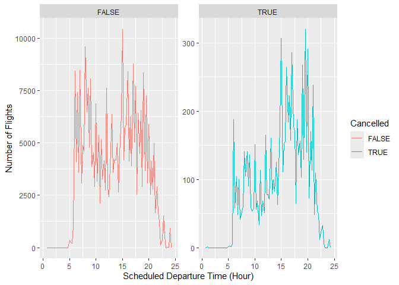
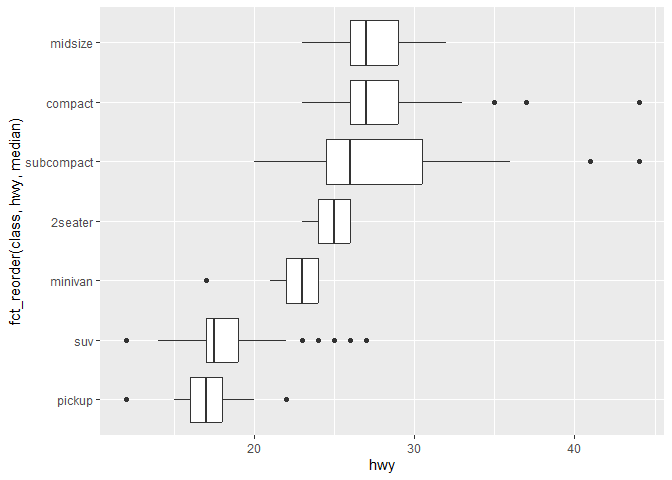

# Chapter 10, Exploratory Data Analysis


``` r
library(tidyverse)
```

    ── Attaching core tidyverse packages ──────────────────────── tidyverse 2.0.0 ──
    ✔ dplyr     1.1.4     ✔ readr     2.1.5
    ✔ forcats   1.0.0     ✔ stringr   1.5.1
    ✔ ggplot2   3.5.2     ✔ tibble    3.3.0
    ✔ lubridate 1.9.4     ✔ tidyr     1.3.1
    ✔ purrr     1.0.4     
    ── Conflicts ────────────────────────────────────────── tidyverse_conflicts() ──
    ✖ dplyr::filter() masks stats::filter()
    ✖ dplyr::lag()    masks stats::lag()
    ℹ Use the conflicted package (<http://conflicted.r-lib.org/>) to force all conflicts to become errors

# Variation

``` r
ggplot(diamonds, aes(x = carat)) +
  geom_histogram(binwidth = 0.5)
```


# Typical Values

``` r
smaller <- diamonds |> 
  filter(carat < 3)

ggplot(smaller, aes(x = carat)) +
  geom_histogram(binwidth = 0.01)
```


# Unusual Values

``` r
ggplot(diamonds, aes(x = y)) + 
  geom_histogram(binwidth = 0.5)
```


``` r
ggplot(diamonds, aes(x = y)) + 
  geom_histogram(binwidth = 0.5) +
  coord_cartesian(ylim = c(0, 50))
```


coord_cartesian() also has an xlim() argument for when you need to zoom
into the x-axis. ggplot2 also has xlim() and ylim() functions that work
slightly differently: they throw away the data outside the limits.

``` r
unusual <- diamonds |> 
  filter(y < 3 | y > 20) |> 
  select(price, x, y, z) |>
  arrange(y)
unusual
```

    # A tibble: 9 × 4
      price     x     y     z
      <int> <dbl> <dbl> <dbl>
    1  5139  0      0    0   
    2  6381  0      0    0   
    3 12800  0      0    0   
    4 15686  0      0    0   
    5 18034  0      0    0   
    6  2130  0      0    0   
    7  2130  0      0    0   
    8  2075  5.15  31.8  5.12
    9 12210  8.09  58.9  8.06

# Exercises pt 1 of 5

1.  x (length), y (width), z(depth)

``` r
ggplot(diamonds, aes(x = z)) + 
  geom_histogram(binwidth = 0.1) 
```


The x and y measurements have similar distibutions while the z variable
is skewed towards smaller depth values. The length and width values are
larger than the depth which aligns with the shape of a diamond.

2.  

``` r
ggplot(diamonds, aes(x = price)) + 
  geom_histogram(binwidth = 500)
```


``` r
ggplot(diamonds, aes(x = price)) + 
  geom_histogram(binwidth = 50)
```


The majority of diamonds are found in the lower price range creating a
skew to the right towards higher values.

3.  

``` r
diamonds %>%
  count(carat) %>%
  filter(carat == 0.99 | carat == 1.00)
```

    # A tibble: 2 × 2
      carat     n
      <dbl> <int>
    1  0.99    23
    2  1     1558

There are more 1 carat diamonds because whole carats are a standard in
diamond advertising?

4.  coord_cartesian() adjusts the view without removing data,
    maintaining the same bin counts x and ylin() filter out data outside
    the set range which can alter the shape of your histogram. If
    binwidth is not set, a defeault is selected which may not display
    the desired patterns. Zooming to half a bar with xlim() may exclude
    bins and break the visual.

# Unusual Values

You can use the if_else() function to replace unusual values with NA:

``` r
diamonds2 <- diamonds |> 
  mutate(y = if_else(y < 3 | y > 20, NA, y))

ggplot(diamonds2, aes(x = x, y = y)) + 
  geom_point()
```

    Warning: Removed 9 rows containing missing values or values outside the scale range
    (`geom_point()`).


``` r
ggplot(diamonds2, aes(x = x, y = y)) + 
  geom_point(na.rm = TRUE)
```


``` r
nycflights13::flights |> 
  mutate(
    cancelled = is.na(dep_time),
    sched_hour = sched_dep_time %/% 100,
    sched_min = sched_dep_time %% 100,
    sched_dep_time = sched_hour + (sched_min / 60)
  ) |> 
  ggplot(aes(x = sched_dep_time)) + 
  geom_freqpoly(aes(color = cancelled), binwidth = 1/4)
```


# Exercises pt 2 of 5

1.  Histograms contain continous quantitative data and will exclude
    missing values from the plot while bar charts display categorical
    data meaning they can display missing data as “NA” or “missing” .
2.  This function removes any missing values marked as NA
3.  

``` r
library(nycflights13)

flights |> 
  mutate(
    cancelled = is.na(dep_time),
    sched_hour = sched_dep_time %/% 100,
    sched_min = sched_dep_time %% 100,
    sched_dep_time = sched_hour + (sched_min / 60)
  ) |> 
  ggplot(aes(x = sched_dep_time)) + 
  geom_freqpoly(aes(color = cancelled), binwidth = 1/4) +
  facet_wrap(~cancelled, scales = "free_y") +  # Try "free_y", "free", or "fixed"
  labs(
    x = "Scheduled Departure Time (Hour)",
    y = "Number of Flights",
    color = "Cancelled"
  )
```



# A Categorical and Numerical Variable

``` r
ggplot(diamonds, aes(x = price)) + 
  geom_freqpoly(aes(color = cut), binwidth = 500, linewidth = 0.75)
```


``` r
ggplot(diamonds, aes(x = price, y = after_stat(density))) + 
  geom_freqpoly(aes(color = cut), binwidth = 500, linewidth = 0.75)
```


``` r
ggplot(diamonds, aes(x = cut, y = price)) +
  geom_boxplot()
```


``` r
ggplot(mpg, aes(x = class, y = hwy)) +
  geom_boxplot()
```


we can reorder class based on the median value of hwy:

``` r
ggplot(mpg, aes(x = fct_reorder(class, hwy, median), y = hwy)) +
  geom_boxplot()
```


``` r
ggplot(mpg, aes(x = hwy, y = fct_reorder(class, hwy, median))) +
  geom_boxplot()
```



# Exercises pt 3 of 5

1.  

``` r
flights |>
  mutate(
    sched_dep_time = sched_dep_time %/% 100 + (sched_dep_time %% 100) / 60,
    cancelled = is.na(dep_time)
  ) |>
  ggplot(aes(x = sched_dep_time, y = fct_reorder(factor(cancelled), sched_dep_time, median))) +
  geom_boxplot()
```


2.  The carat of a diamond offers a good positive correlation with price
    making it a good predictor of price.

``` r
ggplot(diamonds, aes(x = carat, y = price)) +
  geom_point(alpha = 0.1) +
  geom_smooth(method = lm) 
```

    `geom_smooth()` using formula = 'y ~ x'


``` r
ggplot(diamonds, aes(x = carat, y = cut)) +
  geom_boxplot()
```


There is a negative correlation between carat and cut meaning a higher
carat is not equal to a better quality diamond. 3.

``` r
ggplot(diamonds, aes(x = carat, y = cut)) +
  geom_boxplot() + 
  coord_flip()
```


This version makes the trend between cut and carat more visible. 4.

``` r
library(lvplot)
ggplot(diamonds, aes(x = cut, y = price)) +
  geom_lv()  
```


A small number of diamonds are extremely expensiv but ideal and premuim
cuts have more consistent pricing. 5.

``` r
ggplot(diamonds, aes(x = cut, y = price)) +
  geom_violin()
```


``` r
ggplot(diamonds, aes(x = price)) +
  geom_histogram(binwidth = 500) +
  facet_wrap(~ cut)
```


``` r
ggplot(diamonds, aes(x = price, color = cut)) +
  geom_freqpoly(binwidth = 500)
```


``` r
ggplot(diamonds, aes(x = price, color = cut)) +
  geom_density()
```


The violin plot is good for easy comparisons between distribution shapes
but doesn’t display the count The histogram shows the number of diamonds
(count) but is not great for easy comparison of trends The frequency
polygon has all lines on one plot making for an easier comparision but
there is some overlap which can disrupt interpretation The density plot
show distribution shape clearly but doesn’t display the counts.

6.  geom_beeswarm() Arranges points side-by-side in a compact,
    non-overlapping layout. geom_quasirandom() Adds jitter using
    structured patterns

# Two Categorical Variables

``` r
ggplot(diamonds, aes(x = cut, y = color)) +
  geom_count()
```


The size of each circle in the plot displays how many observations
occurred at each combination of values.

``` r
diamonds |> 
  count(color, cut) |>  
  ggplot(aes(x = color, y = cut)) +
  geom_tile(aes(fill = n))
```


# Exercises pt 4 of 5

1.  

``` r
diamonds |>
  count(color, cut) |>
  group_by(color) |>
  mutate(prop_within_color = n / sum(n)) |>
  ggplot(aes(x = color, y = cut)) +
  geom_tile(aes(fill = prop_within_color)) +
  scale_fill_gradient(low = "white", high = "steelblue") 
```


2.  

``` r
segment_counts <- diamonds |>
  count(color, cut) |>
  arrange(color, desc(n))

segment_counts
```

    # A tibble: 35 × 3
       color cut           n
       <ord> <ord>     <int>
     1 D     Ideal      2834
     2 D     Premium    1603
     3 D     Very Good  1513
     4 D     Good        662
     5 D     Fair        163
     6 E     Ideal      3903
     7 E     Very Good  2400
     8 E     Premium    2337
     9 E     Good        933
    10 E     Fair        224
    # ℹ 25 more rows

``` r
diamonds |>
  ggplot(aes(x = color, fill = cut)) +
  geom_bar(position = "fill") 
```


You can see how common each cut is between colors and the distribution
of cuts across colors. 3.

``` r
flights |>
  group_by(dest, month) |>
  summarise(avg_delay = mean(dep_delay, na.rm = TRUE), .groups = "drop") |>
  ggplot(aes(x = factor(month), y = dest, fill = avg_delay)) +
  geom_tile(color = "white") +
  scale_fill_gradient(low = "lightyellow", high = "firebrick", na.value = "grey90") +
  labs(
    x = "Month",
    y = "Destination",
    fill = "Avg Delay (min)"
  ) +
  theme_minimal(base_size = 13) +
  theme(axis.text.y = element_text(size = 6))
```


There are too many destinations which then overlap making it hard to
read. Filtering to specific destinations or airlines could improve the
readability.

# Two Numerical Variables

``` r
ggplot(smaller, aes(x = carat, y = price)) +
  geom_point()
```


``` r
ggplot(smaller, aes(x = carat, y = price)) + 
  geom_point(alpha = 1 / 100)
```


``` r
ggplot(smaller, aes(x = carat, y = price)) +
  geom_bin2d()
```


``` r
# install.packages("hexbin")
ggplot(smaller, aes(x = carat, y = price)) +
  geom_hex()
```


``` r
ggplot(smaller, aes(x = carat, y = price)) + 
  geom_boxplot(aes(group = cut_width(carat, 0.1)))
```


# Exercises pt 5 of 5

1.  

``` r
ggplot(diamonds, aes(x = price, color = cut_width(carat, 0.25))) +
  geom_freqpoly(binwidth = 500)
```


``` r
ggplot(diamonds, aes(x = price, color = cut_number(carat, 5))) +
  geom_freqpoly(binwidth = 500)
```


cut_width() shows how price varies across fixed carat ranges
cut_number() allows has less overlap in the cut range 2.

``` r
ggplot(diamonds, aes(x = carat, color = cut_width(price, width = 2000))) +
  geom_freqpoly(binwidth = 0.1)
```


3.  

``` r
diamonds |>
  mutate(size_group = case_when(
    percent_rank(carat) < 0.025 ~ "Small",
    percent_rank(carat) > 0.975 ~ "Large",
    TRUE ~ NA_character_
  )) |>
  filter(!is.na(size_group)) |>
  ggplot(aes(x = price, fill = size_group)) +
  geom_density(alpha = 0.6) +
  facet_wrap(~size_group)
```


The price of larger diamonds is broad with some small outliers while the
price of small diamonds is peaked at lower prices. 4.

``` r
ggplot(diamonds, aes(x = carat, y = price, color = cut)) +
  geom_point(alpha = 0.4, size = 1)
```


5.  A scatterplot can detect joint outliers or unsual combinations
6.  Advantages: prevents overcrowding in dense regions and balances
    sample sizes per bin Disadvantages: the bins widths are uneven which
    makes the x axis hard to read
