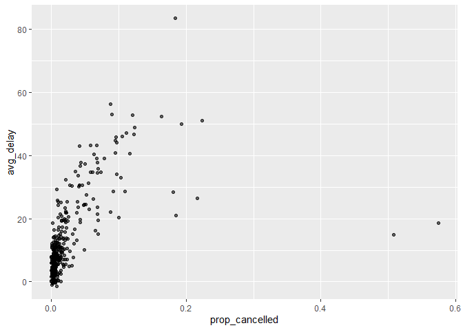

# Chapter 12, Logical Vectors


``` r
library(tidyverse)
```

    ── Attaching core tidyverse packages ──────────────────────── tidyverse 2.0.0 ──
    ✔ dplyr     1.1.4     ✔ readr     2.1.5
    ✔ forcats   1.0.0     ✔ stringr   1.5.1
    ✔ ggplot2   3.5.2     ✔ tibble    3.3.0
    ✔ lubridate 1.9.4     ✔ tidyr     1.3.1
    ✔ purrr     1.0.4     
    ── Conflicts ────────────────────────────────────────── tidyverse_conflicts() ──
    ✖ dplyr::filter() masks stats::filter()
    ✖ dplyr::lag()    masks stats::lag()
    ℹ Use the conflicted package (<http://conflicted.r-lib.org/>) to force all conflicts to become errors

``` r
library(nycflights13)

x <- c(1, 2, 3, 5, 7, 11, 13)
x * 2
```

    [1]  2  4  6 10 14 22 26

``` r
df <- tibble(x)
df |> 
  mutate(y = x * 2)
```

    # A tibble: 7 × 2
          x     y
      <dbl> <dbl>
    1     1     2
    2     2     4
    3     3     6
    4     5    10
    5     7    14
    6    11    22
    7    13    26

# Comparisons

``` r
flights |> 
  filter(dep_time > 600 & dep_time < 2000 & abs(arr_delay) < 20)
```

    # A tibble: 172,286 × 19
        year month   day dep_time sched_dep_time dep_delay arr_time sched_arr_time
       <int> <int> <int>    <int>          <int>     <dbl>    <int>          <int>
     1  2013     1     1      601            600         1      844            850
     2  2013     1     1      602            610        -8      812            820
     3  2013     1     1      602            605        -3      821            805
     4  2013     1     1      606            610        -4      858            910
     5  2013     1     1      606            610        -4      837            845
     6  2013     1     1      607            607         0      858            915
     7  2013     1     1      611            600        11      945            931
     8  2013     1     1      613            610         3      925            921
     9  2013     1     1      615            615         0      833            842
    10  2013     1     1      622            630        -8     1017           1014
    # ℹ 172,276 more rows
    # ℹ 11 more variables: arr_delay <dbl>, carrier <chr>, flight <int>,
    #   tailnum <chr>, origin <chr>, dest <chr>, air_time <dbl>, distance <dbl>,
    #   hour <dbl>, minute <dbl>, time_hour <dttm>

``` r
flights |> 
  mutate(
    daytime = dep_time > 600 & dep_time < 2000,
    approx_ontime = abs(arr_delay) < 20,
    .keep = "used"
  )
```

    # A tibble: 336,776 × 4
       dep_time arr_delay daytime approx_ontime
          <int>     <dbl> <lgl>   <lgl>        
     1      517        11 FALSE   TRUE         
     2      533        20 FALSE   FALSE        
     3      542        33 FALSE   FALSE        
     4      544       -18 FALSE   TRUE         
     5      554       -25 FALSE   FALSE        
     6      554        12 FALSE   TRUE         
     7      555        19 FALSE   TRUE         
     8      557       -14 FALSE   TRUE         
     9      557        -8 FALSE   TRUE         
    10      558         8 FALSE   TRUE         
    # ℹ 336,766 more rows

``` r
flights |> 
  mutate(
    daytime = dep_time > 600 & dep_time < 2000,
    approx_ontime = abs(arr_delay) < 20,
  ) |> 
  filter(daytime & approx_ontime)
```

    # A tibble: 172,286 × 21
        year month   day dep_time sched_dep_time dep_delay arr_time sched_arr_time
       <int> <int> <int>    <int>          <int>     <dbl>    <int>          <int>
     1  2013     1     1      601            600         1      844            850
     2  2013     1     1      602            610        -8      812            820
     3  2013     1     1      602            605        -3      821            805
     4  2013     1     1      606            610        -4      858            910
     5  2013     1     1      606            610        -4      837            845
     6  2013     1     1      607            607         0      858            915
     7  2013     1     1      611            600        11      945            931
     8  2013     1     1      613            610         3      925            921
     9  2013     1     1      615            615         0      833            842
    10  2013     1     1      622            630        -8     1017           1014
    # ℹ 172,276 more rows
    # ℹ 13 more variables: arr_delay <dbl>, carrier <chr>, flight <int>,
    #   tailnum <chr>, origin <chr>, dest <chr>, air_time <dbl>, distance <dbl>,
    #   hour <dbl>, minute <dbl>, time_hour <dttm>, daytime <lgl>,
    #   approx_ontime <lgl>

# Flotating Point Comparison

``` r
x <- c(1 / 49 * 49, sqrt(2) ^ 2)
x
```

    [1] 1 2

``` r
x == c(1, 2)
```

    [1] FALSE FALSE

``` r
print(x, digits = 16)
```

    [1] 0.9999999999999999 2.0000000000000004

``` r
near(x, c(1, 2))
```

    [1] TRUE TRUE

near() which ignores small differences

# Missing Values

``` r
NA > 5
```

    [1] NA

``` r
10 == NA
```

    [1] NA

``` r
NA == NA
```

    [1] NA

``` r
# We don't know how old Mary is
age_mary <- NA

# We don't know how old John is
age_john <- NA

# Are Mary and John the same age?
age_mary == age_john
```

    [1] NA

# is.na()

is.na(x) returns TRUE for missing values and FALSE for everything else:

``` r
is.na(c(TRUE, NA, FALSE))
```

    [1] FALSE  TRUE FALSE

``` r
is.na(c(1, NA, 3))
```

    [1] FALSE  TRUE FALSE

``` r
is.na(c("a", NA, "b"))
```

    [1] FALSE  TRUE FALSE

To find missing dep_time:

``` r
flights |> 
  filter(is.na(dep_time))
```

    # A tibble: 8,255 × 19
        year month   day dep_time sched_dep_time dep_delay arr_time sched_arr_time
       <int> <int> <int>    <int>          <int>     <dbl>    <int>          <int>
     1  2013     1     1       NA           1630        NA       NA           1815
     2  2013     1     1       NA           1935        NA       NA           2240
     3  2013     1     1       NA           1500        NA       NA           1825
     4  2013     1     1       NA            600        NA       NA            901
     5  2013     1     2       NA           1540        NA       NA           1747
     6  2013     1     2       NA           1620        NA       NA           1746
     7  2013     1     2       NA           1355        NA       NA           1459
     8  2013     1     2       NA           1420        NA       NA           1644
     9  2013     1     2       NA           1321        NA       NA           1536
    10  2013     1     2       NA           1545        NA       NA           1910
    # ℹ 8,245 more rows
    # ℹ 11 more variables: arr_delay <dbl>, carrier <chr>, flight <int>,
    #   tailnum <chr>, origin <chr>, dest <chr>, air_time <dbl>, distance <dbl>,
    #   hour <dbl>, minute <dbl>, time_hour <dttm>

``` r
flights |> 
  filter(month == 1, day == 1) |> 
  arrange(dep_time)
```

    # A tibble: 842 × 19
        year month   day dep_time sched_dep_time dep_delay arr_time sched_arr_time
       <int> <int> <int>    <int>          <int>     <dbl>    <int>          <int>
     1  2013     1     1      517            515         2      830            819
     2  2013     1     1      533            529         4      850            830
     3  2013     1     1      542            540         2      923            850
     4  2013     1     1      544            545        -1     1004           1022
     5  2013     1     1      554            600        -6      812            837
     6  2013     1     1      554            558        -4      740            728
     7  2013     1     1      555            600        -5      913            854
     8  2013     1     1      557            600        -3      709            723
     9  2013     1     1      557            600        -3      838            846
    10  2013     1     1      558            600        -2      753            745
    # ℹ 832 more rows
    # ℹ 11 more variables: arr_delay <dbl>, carrier <chr>, flight <int>,
    #   tailnum <chr>, origin <chr>, dest <chr>, air_time <dbl>, distance <dbl>,
    #   hour <dbl>, minute <dbl>, time_hour <dttm>

# Exercises pt 1 of 4

Near() comapres if two vectors of floating point numbers are equal

``` r
z <- sqrt(2)^2
near(z, 2)
```

    [1] TRUE

``` r
df <- tibble(x = c(TRUE, FALSE, NA))

df |> 
  mutate(
    and = x & NA,
    or = x | NA
  )
```

    # A tibble: 3 × 3
      x     and   or   
      <lgl> <lgl> <lgl>
    1 TRUE  NA    TRUE 
    2 FALSE FALSE NA   
    3 NA    NA    NA   

# Order of Operations

``` r
flights |> 
   filter(month == 11 | month == 12)
```

    # A tibble: 55,403 × 19
        year month   day dep_time sched_dep_time dep_delay arr_time sched_arr_time
       <int> <int> <int>    <int>          <int>     <dbl>    <int>          <int>
     1  2013    11     1        5           2359         6      352            345
     2  2013    11     1       35           2250       105      123           2356
     3  2013    11     1      455            500        -5      641            651
     4  2013    11     1      539            545        -6      856            827
     5  2013    11     1      542            545        -3      831            855
     6  2013    11     1      549            600       -11      912            923
     7  2013    11     1      550            600       -10      705            659
     8  2013    11     1      554            600        -6      659            701
     9  2013    11     1      554            600        -6      826            827
    10  2013    11     1      554            600        -6      749            751
    # ℹ 55,393 more rows
    # ℹ 11 more variables: arr_delay <dbl>, carrier <chr>, flight <int>,
    #   tailnum <chr>, origin <chr>, dest <chr>, air_time <dbl>, distance <dbl>,
    #   hour <dbl>, minute <dbl>, time_hour <dttm>

``` r
flights |> 
   filter(month == 11 | 12)
```

    # A tibble: 336,776 × 19
        year month   day dep_time sched_dep_time dep_delay arr_time sched_arr_time
       <int> <int> <int>    <int>          <int>     <dbl>    <int>          <int>
     1  2013     1     1      517            515         2      830            819
     2  2013     1     1      533            529         4      850            830
     3  2013     1     1      542            540         2      923            850
     4  2013     1     1      544            545        -1     1004           1022
     5  2013     1     1      554            600        -6      812            837
     6  2013     1     1      554            558        -4      740            728
     7  2013     1     1      555            600        -5      913            854
     8  2013     1     1      557            600        -3      709            723
     9  2013     1     1      557            600        -3      838            846
    10  2013     1     1      558            600        -2      753            745
    # ℹ 336,766 more rows
    # ℹ 11 more variables: arr_delay <dbl>, carrier <chr>, flight <int>,
    #   tailnum <chr>, origin <chr>, dest <chr>, air_time <dbl>, distance <dbl>,
    #   hour <dbl>, minute <dbl>, time_hour <dttm>

``` r
flights |> 
  mutate(
    nov = month == 11,
    final = nov | 12,
    .keep = "used"
  )
```

    # A tibble: 336,776 × 3
       month nov   final
       <int> <lgl> <lgl>
     1     1 FALSE TRUE 
     2     1 FALSE TRUE 
     3     1 FALSE TRUE 
     4     1 FALSE TRUE 
     5     1 FALSE TRUE 
     6     1 FALSE TRUE 
     7     1 FALSE TRUE 
     8     1 FALSE TRUE 
     9     1 FALSE TRUE 
    10     1 FALSE TRUE 
    # ℹ 336,766 more rows

# %in%

x %in% y returns a logical vector the same length as x that is TRUE
whenever a value in x is anywhere in y Match values from a set

``` r
1:12 %in% c(1, 5, 11)
```

     [1]  TRUE FALSE FALSE FALSE  TRUE FALSE FALSE FALSE FALSE FALSE  TRUE FALSE

``` r
letters[1:10] %in% c("a", "e", "i", "o", "u")
```

     [1]  TRUE FALSE FALSE FALSE  TRUE FALSE FALSE FALSE  TRUE FALSE

``` r
flights |> 
  filter(month %in% c(11, 12))
```

    # A tibble: 55,403 × 19
        year month   day dep_time sched_dep_time dep_delay arr_time sched_arr_time
       <int> <int> <int>    <int>          <int>     <dbl>    <int>          <int>
     1  2013    11     1        5           2359         6      352            345
     2  2013    11     1       35           2250       105      123           2356
     3  2013    11     1      455            500        -5      641            651
     4  2013    11     1      539            545        -6      856            827
     5  2013    11     1      542            545        -3      831            855
     6  2013    11     1      549            600       -11      912            923
     7  2013    11     1      550            600       -10      705            659
     8  2013    11     1      554            600        -6      659            701
     9  2013    11     1      554            600        -6      826            827
    10  2013    11     1      554            600        -6      749            751
    # ℹ 55,393 more rows
    # ℹ 11 more variables: arr_delay <dbl>, carrier <chr>, flight <int>,
    #   tailnum <chr>, origin <chr>, dest <chr>, air_time <dbl>, distance <dbl>,
    #   hour <dbl>, minute <dbl>, time_hour <dttm>

``` r
c(1, 2, NA) == NA
```

    [1] NA NA NA

``` r
c(1, 2, NA) %in% NA
```

    [1] FALSE FALSE  TRUE

``` r
flights |> 
  filter(dep_time %in% c(NA, 0800))
```

    # A tibble: 8,803 × 19
        year month   day dep_time sched_dep_time dep_delay arr_time sched_arr_time
       <int> <int> <int>    <int>          <int>     <dbl>    <int>          <int>
     1  2013     1     1      800            800         0     1022           1014
     2  2013     1     1      800            810       -10      949            955
     3  2013     1     1       NA           1630        NA       NA           1815
     4  2013     1     1       NA           1935        NA       NA           2240
     5  2013     1     1       NA           1500        NA       NA           1825
     6  2013     1     1       NA            600        NA       NA            901
     7  2013     1     2      800            810       -10     1102           1116
     8  2013     1     2       NA           1540        NA       NA           1747
     9  2013     1     2       NA           1620        NA       NA           1746
    10  2013     1     2       NA           1355        NA       NA           1459
    # ℹ 8,793 more rows
    # ℹ 11 more variables: arr_delay <dbl>, carrier <chr>, flight <int>,
    #   tailnum <chr>, origin <chr>, dest <chr>, air_time <dbl>, distance <dbl>,
    #   hour <dbl>, minute <dbl>, time_hour <dttm>

# Exercises pt 2 of 4

1.  

``` r
flights |> 
  filter(is.na(arr_delay) & !is.na(dep_delay))
```

    # A tibble: 1,175 × 19
        year month   day dep_time sched_dep_time dep_delay arr_time sched_arr_time
       <int> <int> <int>    <int>          <int>     <dbl>    <int>          <int>
     1  2013     1     1     1525           1530        -5     1934           1805
     2  2013     1     1     1528           1459        29     2002           1647
     3  2013     1     1     1740           1745        -5     2158           2020
     4  2013     1     1     1807           1738        29     2251           2103
     5  2013     1     1     1939           1840        59       29           2151
     6  2013     1     1     1952           1930        22     2358           2207
     7  2013     1     1     2016           1930        46       NA           2220
     8  2013     1     2      905            822        43     1313           1045
     9  2013     1     2     1125            925       120     1445           1146
    10  2013     1     2     1848           1840         8     2333           2151
    # ℹ 1,165 more rows
    # ℹ 11 more variables: arr_delay <dbl>, carrier <chr>, flight <int>,
    #   tailnum <chr>, origin <chr>, dest <chr>, air_time <dbl>, distance <dbl>,
    #   hour <dbl>, minute <dbl>, time_hour <dttm>

``` r
flights |> 
  filter(!is.na(arr_time) & !is.na(sched_arr_time) & is.na(arr_delay))
```

    # A tibble: 717 × 19
        year month   day dep_time sched_dep_time dep_delay arr_time sched_arr_time
       <int> <int> <int>    <int>          <int>     <dbl>    <int>          <int>
     1  2013     1     1     1525           1530        -5     1934           1805
     2  2013     1     1     1528           1459        29     2002           1647
     3  2013     1     1     1740           1745        -5     2158           2020
     4  2013     1     1     1807           1738        29     2251           2103
     5  2013     1     1     1939           1840        59       29           2151
     6  2013     1     1     1952           1930        22     2358           2207
     7  2013     1     2      905            822        43     1313           1045
     8  2013     1     2     1125            925       120     1445           1146
     9  2013     1     2     1848           1840         8     2333           2151
    10  2013     1     2     1849           1724        85     2235           1938
    # ℹ 707 more rows
    # ℹ 11 more variables: arr_delay <dbl>, carrier <chr>, flight <int>,
    #   tailnum <chr>, origin <chr>, dest <chr>, air_time <dbl>, distance <dbl>,
    #   hour <dbl>, minute <dbl>, time_hour <dttm>

2.  

``` r
flights |> 
  filter(is.na(dep_time))
```

    # A tibble: 8,255 × 19
        year month   day dep_time sched_dep_time dep_delay arr_time sched_arr_time
       <int> <int> <int>    <int>          <int>     <dbl>    <int>          <int>
     1  2013     1     1       NA           1630        NA       NA           1815
     2  2013     1     1       NA           1935        NA       NA           2240
     3  2013     1     1       NA           1500        NA       NA           1825
     4  2013     1     1       NA            600        NA       NA            901
     5  2013     1     2       NA           1540        NA       NA           1747
     6  2013     1     2       NA           1620        NA       NA           1746
     7  2013     1     2       NA           1355        NA       NA           1459
     8  2013     1     2       NA           1420        NA       NA           1644
     9  2013     1     2       NA           1321        NA       NA           1536
    10  2013     1     2       NA           1545        NA       NA           1910
    # ℹ 8,245 more rows
    # ℹ 11 more variables: arr_delay <dbl>, carrier <chr>, flight <int>,
    #   tailnum <chr>, origin <chr>, dest <chr>, air_time <dbl>, distance <dbl>,
    #   hour <dbl>, minute <dbl>, time_hour <dttm>

The arr_time, dep_delay, and arr_delay are all missing likely meaning
these are cancelled flights

3.  

``` r
daily <- flights %>%
  mutate(cancelled = is.na(dep_time)) %>%
  group_by(month, day) %>%
  summarise(
    prop_cancelled = mean(cancelled),
    avg_delay = mean(dep_delay, na.rm = TRUE)
  )
```

    `summarise()` has grouped output by 'month'. You can override using the
    `.groups` argument.

``` r
# Plot
ggplot(daily, aes(x = prop_cancelled, y = avg_delay)) +
  geom_point(alpha = 0.6)
```



There is a positive correlation between cancellations and delays with a
few outliers

# Logical Summaries

any(x) is the equivalent of \|; it’ll return TRUE if there are any
TRUE’s in x. all(x) is equivalent of &; it’ll return TRUE only if all
values of x are TRUE’s. you can make the missing values go away with
na.rm = TRUE.

``` r
flights |> 
  group_by(year, month, day) |> 
  summarize(
    all_delayed = all(dep_delay <= 60, na.rm = TRUE),
    any_long_delay = any(arr_delay >= 300, na.rm = TRUE),
    .groups = "drop"
  )
```

    # A tibble: 365 × 5
        year month   day all_delayed any_long_delay
       <int> <int> <int> <lgl>       <lgl>         
     1  2013     1     1 FALSE       TRUE          
     2  2013     1     2 FALSE       TRUE          
     3  2013     1     3 FALSE       FALSE         
     4  2013     1     4 FALSE       FALSE         
     5  2013     1     5 FALSE       TRUE          
     6  2013     1     6 FALSE       FALSE         
     7  2013     1     7 FALSE       TRUE          
     8  2013     1     8 FALSE       FALSE         
     9  2013     1     9 FALSE       TRUE          
    10  2013     1    10 FALSE       TRUE          
    # ℹ 355 more rows

# Numeric Summaries of Logical Vectors

In a logical vector in a numeric context, TRUE becomes 1 and FALSE
becomes 0

``` r
flights |> 
  group_by(year, month, day) |> 
  summarize(
    proportion_delayed = mean(dep_delay <= 60, na.rm = TRUE),
    count_long_delay = sum(arr_delay >= 300, na.rm = TRUE),
    .groups = "drop"
  )
```

    # A tibble: 365 × 5
        year month   day proportion_delayed count_long_delay
       <int> <int> <int>              <dbl>            <int>
     1  2013     1     1              0.939                3
     2  2013     1     2              0.914                3
     3  2013     1     3              0.941                0
     4  2013     1     4              0.953                0
     5  2013     1     5              0.964                1
     6  2013     1     6              0.959                0
     7  2013     1     7              0.956                1
     8  2013     1     8              0.975                0
     9  2013     1     9              0.986                1
    10  2013     1    10              0.977                2
    # ℹ 355 more rows

# Logical Subsetting

``` r
flights |> 
  filter(arr_delay > 0) |> 
  group_by(year, month, day) |> 
  summarize(
    behind = mean(arr_delay),
    n = n(),
    .groups = "drop"
  )
```

    # A tibble: 365 × 5
        year month   day behind     n
       <int> <int> <int>  <dbl> <int>
     1  2013     1     1   32.5   461
     2  2013     1     2   32.0   535
     3  2013     1     3   27.7   460
     4  2013     1     4   28.3   297
     5  2013     1     5   22.6   238
     6  2013     1     6   24.4   381
     7  2013     1     7   27.8   243
     8  2013     1     8   20.8   275
     9  2013     1     9   25.6   287
    10  2013     1    10   27.3   220
    # ℹ 355 more rows

``` r
flights |> 
  group_by(year, month, day) |> 
  summarize(
    behind = mean(arr_delay[arr_delay > 0], na.rm = TRUE),
    ahead = mean(arr_delay[arr_delay < 0], na.rm = TRUE),
    n = n(),
    .groups = "drop"
  )
```

    # A tibble: 365 × 6
        year month   day behind ahead     n
       <int> <int> <int>  <dbl> <dbl> <int>
     1  2013     1     1   32.5 -12.5   842
     2  2013     1     2   32.0 -14.3   943
     3  2013     1     3   27.7 -18.2   914
     4  2013     1     4   28.3 -17.0   915
     5  2013     1     5   22.6 -14.0   720
     6  2013     1     6   24.4 -13.6   832
     7  2013     1     7   27.8 -17.0   933
     8  2013     1     8   20.8 -14.3   899
     9  2013     1     9   25.6 -13.0   902
    10  2013     1    10   27.3 -16.4   932
    # ℹ 355 more rows

# Exercises pt 3 of 4

1.  sum(is.na(x)) counts the amount of values in x that are missing NA
    mean(is.na(x)) calculates the proportion of missing values in x

2.  prod() returns either 1 if TRUE or 0 if False and is equalivalent to
    all() for logical vectors min()returns the smallest value as well as
    1 (true) or 0 (false); it is also equivalent to all()

# if_else

If you want to use one value when a condition is TRUE and another value
when it’s FALSE “+ve” (positive) or “-ve” (negative)

``` r
x <- c(-3:3, NA)
if_else(x > 0, "+ve", "-ve")
```

    [1] "-ve" "-ve" "-ve" "-ve" "+ve" "+ve" "+ve" NA   

``` r
if_else(x > 0, "+ve", "-ve", "???")
```

    [1] "-ve" "-ve" "-ve" "-ve" "+ve" "+ve" "+ve" "???"

``` r
if_else(x < 0, -x, x)
```

    [1]  3  2  1  0  1  2  3 NA

``` r
x1 <- c(NA, 1, 2, NA)
y1 <- c(3, NA, 4, 6)
if_else(is.na(x1), y1, x1)
```

    [1] 3 1 2 6

``` r
if_else(x == 0, "0", if_else(x < 0, "-ve", "+ve"), "???")
```

    [1] "-ve" "-ve" "-ve" "0"   "+ve" "+ve" "+ve" "???"

# case_when()

takes pairs that look like condition ~ output. condition must be a
logical vector; when it’s TRUE, output will be used

``` r
x <- c(-3:3, NA)
case_when(
  x == 0   ~ "0",
  x < 0    ~ "-ve", 
  x > 0    ~ "+ve",
  is.na(x) ~ "???"
)
```

    [1] "-ve" "-ve" "-ve" "0"   "+ve" "+ve" "+ve" "???"

``` r
case_when(
  x < 0 ~ "-ve",
  x > 0 ~ "+ve"
)
```

    [1] "-ve" "-ve" "-ve" NA    "+ve" "+ve" "+ve" NA   

``` r
case_when(
  x < 0 ~ "-ve",
  x > 0 ~ "+ve",
  .default = "???"
)
```

    [1] "-ve" "-ve" "-ve" "???" "+ve" "+ve" "+ve" "???"

``` r
case_when(
  x > 0 ~ "+ve",
  x > 2 ~ "big"
)
```

    [1] NA    NA    NA    NA    "+ve" "+ve" "+ve" NA   

``` r
flights |> 
  mutate(
    status = case_when(
      is.na(arr_delay)      ~ "cancelled",
      arr_delay < -30       ~ "very early",
      arr_delay < -15       ~ "early",
      abs(arr_delay) <= 15  ~ "on time",
      arr_delay < 60        ~ "late",
      arr_delay < Inf       ~ "very late",
    ),
    .keep = "used"
  )
```

    # A tibble: 336,776 × 2
       arr_delay status 
           <dbl> <chr>  
     1        11 on time
     2        20 late   
     3        33 late   
     4       -18 early  
     5       -25 early  
     6        12 on time
     7        19 late   
     8       -14 on time
     9        -8 on time
    10         8 on time
    # ℹ 336,766 more rows

# Exercises pt 4 of 4

1.  

``` r
tibble(x = 0:20) %>%
  mutate(type = if_else(x %% 2 == 0, "even", "odd"))
```

    # A tibble: 21 × 2
           x type 
       <int> <chr>
     1     0 even 
     2     1 odd  
     3     2 even 
     4     3 odd  
     5     4 even 
     6     5 odd  
     7     6 even 
     8     7 odd  
     9     8 even 
    10     9 odd  
    # ℹ 11 more rows

2.  

``` r
x <- c("Monday", "Saturday", "Wednesday")

if_else(x %in% c("Saturday", "Sunday"), "weekend", "weekday")
```

    [1] "weekday" "weekend" "weekday"

3.  

``` r
x <- c(-3, 0, 5, -7)

abs_x <- if_else(x < 0, -x, x)
```

4.  

``` r
flights <- flights %>%
  mutate(
    is_holiday = case_when(
      month == 1  & day == 1  ~ TRUE,   # New Year's Day
      month == 7  & day == 4  ~ TRUE,   # Independence Day
      month == 11 & day == 28 ~ TRUE,   # Thanksgiving (example date)
      month == 12 & day == 25 ~ TRUE,   # Christmas
      TRUE ~ FALSE
    )
  )
```

``` r
flights <- flights %>%
  mutate(
    holiday_name = case_when(
      month == 1  & day == 1  ~ "New Year's Day",
      month == 7  & day == 4  ~ "Independence Day",
      month == 11 & day == 28 ~ "Thanksgiving",   # Note: Thanksgiving varies!
      month == 12 & day == 25 ~ "Christmas",
      TRUE ~ NA_character_
    )
  )
```
