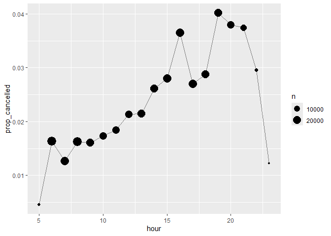
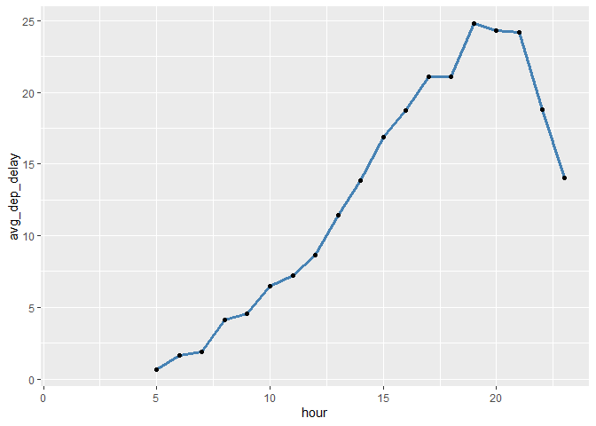
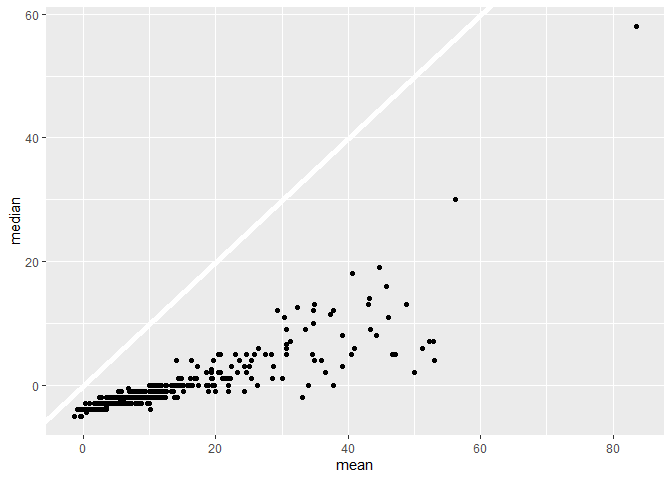
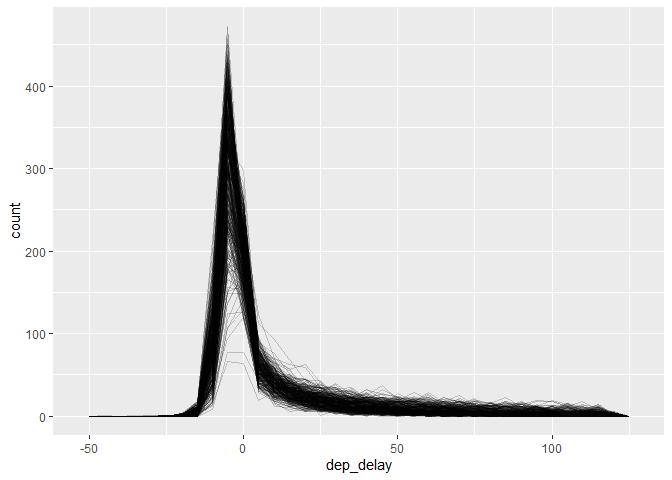

# Chapter 13, Numbers


``` r
library(tidyverse)
```

    ── Attaching core tidyverse packages ──────────────────────── tidyverse 2.0.0 ──
    ✔ dplyr     1.1.4     ✔ readr     2.1.5
    ✔ forcats   1.0.0     ✔ stringr   1.5.1
    ✔ ggplot2   3.5.2     ✔ tibble    3.3.0
    ✔ lubridate 1.9.4     ✔ tidyr     1.3.1
    ✔ purrr     1.0.4     
    ── Conflicts ────────────────────────────────────────── tidyverse_conflicts() ──
    ✖ dplyr::filter() masks stats::filter()
    ✖ dplyr::lag()    masks stats::lag()
    ℹ Use the conflicted package (<http://conflicted.r-lib.org/>) to force all conflicts to become errors

``` r
library(nycflights13)
```

# Making Numbers

Use parse_double() when you have numbers that have been written as
strings:

``` r
x <- c("1.2", "5.6", "1e3")
parse_double(x)
```

    [1]    1.2    5.6 1000.0

parse_number() when the string contains non-numeric text that you want
to ignore

``` r
x <- c("$1,234", "USD 3,513", "59%")
parse_number(x)
```

    [1] 1234 3513   59

# Counts

``` r
flights |> count(dest)
```

    # A tibble: 105 × 2
       dest      n
       <chr> <int>
     1 ABQ     254
     2 ACK     265
     3 ALB     439
     4 ANC       8
     5 ATL   17215
     6 AUS    2439
     7 AVL     275
     8 BDL     443
     9 BGR     375
    10 BHM     297
    # ℹ 95 more rows

Use sort = TRUE to see the most common values

``` r
flights |> count(dest, sort = TRUE)
```

    # A tibble: 105 × 2
       dest      n
       <chr> <int>
     1 ORD   17283
     2 ATL   17215
     3 LAX   16174
     4 BOS   15508
     5 MCO   14082
     6 CLT   14064
     7 SFO   13331
     8 FLL   12055
     9 MIA   11728
    10 DCA    9705
    # ℹ 95 more rows

``` r
flights |> 
  group_by(dest) |> 
  summarize(
    n = n(),
    delay = mean(arr_delay, na.rm = TRUE)
  )
```

    # A tibble: 105 × 3
       dest      n delay
       <chr> <int> <dbl>
     1 ABQ     254  4.38
     2 ACK     265  4.85
     3 ALB     439 14.4 
     4 ANC       8 -2.5 
     5 ATL   17215 11.3 
     6 AUS    2439  6.02
     7 AVL     275  8.00
     8 BDL     443  7.05
     9 BGR     375  8.03
    10 BHM     297 16.9 
    # ℹ 95 more rows

n_distinct(x) counts the number of distinct (unique) values of one or
more variables:

``` r
flights |> 
  group_by(dest) |> 
  summarize(carriers = n_distinct(carrier)) |> 
  arrange(desc(carriers))
```

    # A tibble: 105 × 2
       dest  carriers
       <chr>    <int>
     1 ATL          7
     2 BOS          7
     3 CLT          7
     4 ORD          7
     5 TPA          7
     6 AUS          6
     7 DCA          6
     8 DTW          6
     9 IAD          6
    10 MSP          6
    # ℹ 95 more rows

``` r
flights |> 
  group_by(tailnum) |> 
  summarize(miles = sum(distance))
```

    # A tibble: 4,044 × 2
       tailnum  miles
       <chr>    <dbl>
     1 D942DN    3418
     2 N0EGMQ  250866
     3 N10156  115966
     4 N102UW   25722
     5 N103US   24619
     6 N104UW   25157
     7 N10575  150194
     8 N105UW   23618
     9 N107US   21677
    10 N108UW   32070
    # ℹ 4,034 more rows

``` r
flights |> count(tailnum, wt = distance)
```

    # A tibble: 4,044 × 2
       tailnum      n
       <chr>    <dbl>
     1 D942DN    3418
     2 N0EGMQ  250866
     3 N10156  115966
     4 N102UW   25722
     5 N103US   24619
     6 N104UW   25157
     7 N10575  150194
     8 N105UW   23618
     9 N107US   21677
    10 N108UW   32070
    # ℹ 4,034 more rows

# Exercises pt 1 of 4

1.  Use is.na() in the count argument
2.  

``` r
flights %>%
  group_by(dest) %>%
  summarize(n = n(), .groups = "drop") %>%
  arrange(desc(n))
```

    # A tibble: 105 × 2
       dest      n
       <chr> <int>
     1 ORD   17283
     2 ATL   17215
     3 LAX   16174
     4 BOS   15508
     5 MCO   14082
     6 CLT   14064
     7 SFO   13331
     8 FLL   12055
     9 MIA   11728
    10 DCA    9705
    # ℹ 95 more rows

``` r
flights %>%
  group_by(tailnum) %>%
  summarize(n = sum(distance, na.rm = TRUE), .groups = "drop")
```

    # A tibble: 4,044 × 2
       tailnum      n
       <chr>    <dbl>
     1 D942DN    3418
     2 N0EGMQ  250866
     3 N10156  115966
     4 N102UW   25722
     5 N103US   24619
     6 N104UW   25157
     7 N10575  150194
     8 N105UW   23618
     9 N107US   21677
    10 N108UW   32070
    # ℹ 4,034 more rows

# Arithmetic and Recycling Rules

``` r
x <- c(1, 2, 10, 20)
x / 5
```

    [1] 0.2 0.4 2.0 4.0

``` r
x / c(5, 5, 5, 5)
```

    [1] 0.2 0.4 2.0 4.0

``` r
x * c(1, 2)
```

    [1]  1  4 10 40

``` r
x * c(1, 2, 3)
```

    Warning in x * c(1, 2, 3): longer object length is not a multiple of shorter
    object length

    [1]  1  4 30 20

``` r
flights |> 
  filter(month == c(1, 2))
```

    # A tibble: 25,977 × 19
        year month   day dep_time sched_dep_time dep_delay arr_time sched_arr_time
       <int> <int> <int>    <int>          <int>     <dbl>    <int>          <int>
     1  2013     1     1      517            515         2      830            819
     2  2013     1     1      542            540         2      923            850
     3  2013     1     1      554            600        -6      812            837
     4  2013     1     1      555            600        -5      913            854
     5  2013     1     1      557            600        -3      838            846
     6  2013     1     1      558            600        -2      849            851
     7  2013     1     1      558            600        -2      924            917
     8  2013     1     1      559            600        -1      941            910
     9  2013     1     1      559            600        -1      854            902
    10  2013     1     1      600            600         0      837            825
    # ℹ 25,967 more rows
    # ℹ 11 more variables: arr_delay <dbl>, carrier <chr>, flight <int>,
    #   tailnum <chr>, origin <chr>, dest <chr>, air_time <dbl>, distance <dbl>,
    #   hour <dbl>, minute <dbl>, time_hour <dttm>

# Minimum and Maximum

pmin() and pmax(), which when given two or more variables will return
the smallest or largest value in each row:

``` r
df <- tribble(
  ~x, ~y,
  1,  3,
  5,  2,
  7, NA,
)

df |> 
  mutate(
    min = pmin(x, y, na.rm = TRUE),
    max = pmax(x, y, na.rm = TRUE)
  )
```

    # A tibble: 3 × 4
          x     y   min   max
      <dbl> <dbl> <dbl> <dbl>
    1     1     3     1     3
    2     5     2     2     5
    3     7    NA     7     7

min() and max() take multiple observations and return a single value

``` r
df |> 
  mutate(
    min = min(x, y, na.rm = TRUE),
    max = max(x, y, na.rm = TRUE)
  )
```

    # A tibble: 3 × 4
          x     y   min   max
      <dbl> <dbl> <dbl> <dbl>
    1     1     3     1     7
    2     5     2     1     7
    3     7    NA     1     7

# Modular Arithmetic

%/% does integer division and %% computes the remainder:

``` r
1:10 %/% 3
```

     [1] 0 0 1 1 1 2 2 2 3 3

``` r
1:10 %% 3
```

     [1] 1 2 0 1 2 0 1 2 0 1

``` r
flights |> 
  mutate(
    hour = sched_dep_time %/% 100,
    minute = sched_dep_time %% 100,
    .keep = "used"
  )
```

    # A tibble: 336,776 × 3
       sched_dep_time  hour minute
                <int> <dbl>  <dbl>
     1            515     5     15
     2            529     5     29
     3            540     5     40
     4            545     5     45
     5            600     6      0
     6            558     5     58
     7            600     6      0
     8            600     6      0
     9            600     6      0
    10            600     6      0
    # ℹ 336,766 more rows

``` r
flights |> 
  group_by(hour = sched_dep_time %/% 100) |> 
  summarize(prop_cancelled = mean(is.na(dep_time)), n = n()) |> 
  filter(hour > 1) |> 
  ggplot(aes(x = hour, y = prop_cancelled)) +
  geom_line(color = "grey50") + 
  geom_point(aes(size = n))
```



# Rounding

Use round(x) to round a number to the nearest integer:

``` r
round(123.456)
```

    [1] 123

You can control the precision of the rounding with the second argument,
digits. round(x, digits)

``` r
round(123.456, 2)  # two digits
```

    [1] 123.46

``` r
round(123.456, 1)  # one digit
```

    [1] 123.5

``` r
round(123.456, -1) # round to nearest ten
```

    [1] 120

``` r
round(123.456, -2) # round to nearest hundred
```

    [1] 100

``` r
round(c(1.5, 2.5))
```

    [1] 2 2

``` r
x <- 123.456

floor(x)
```

    [1] 123

``` r
ceiling(x)
```

    [1] 124

``` r
# Round down to nearest two digits
floor(x / 0.01) * 0.01
```

    [1] 123.45

``` r
# Round up to nearest two digits
ceiling(x / 0.01) * 0.01
```

    [1] 123.46

``` r
# Round to nearest multiple of 4
round(x / 4) * 4
```

    [1] 124

``` r
# Round to nearest 0.25
round(x / 0.25) * 0.25
```

    [1] 123.5

# Cutting Numbers into Ranges

Use cut() to break up (aka bin) a numeric vector into discrete buckets:

``` r
x <- c(1, 2, 5, 10, 15, 20)
cut(x, breaks = c(0, 5, 10, 15, 20))
```

    [1] (0,5]   (0,5]   (0,5]   (5,10]  (10,15] (15,20]
    Levels: (0,5] (5,10] (10,15] (15,20]

``` r
cut(x, breaks = c(0, 5, 10, 100))
```

    [1] (0,5]    (0,5]    (0,5]    (5,10]   (10,100] (10,100]
    Levels: (0,5] (5,10] (10,100]

``` r
cut(x, 
  breaks = c(0, 5, 10, 15, 20), 
  labels = c("sm", "md", "lg", "xl")
)
```

    [1] sm sm sm md lg xl
    Levels: sm md lg xl

``` r
y <- c(NA, -10, 5, 10, 30)
cut(y, breaks = c(0, 5, 10, 15, 20))
```

    [1] <NA>   <NA>   (0,5]  (5,10] <NA>  
    Levels: (0,5] (5,10] (10,15] (15,20]

``` r
x <- 1:10
cumsum(x)
```

     [1]  1  3  6 10 15 21 28 36 45 55

# Exercises pt 2 of 4

1.  flights \|\> : Starts with the flights dataset

group_by(hour = sched_dep_time %/% 100) \|\> : Groups flights by
scheduled departure hour and creates new variable “hour” which
calculates scheduled departure hour divided by 100.

summarize(prop_cancelled = mean(is.na(dep_time)), n = n()) \|\> :

New variable prop_cancelled calculates the proportion of cancelled
flights and n counts the total number of flights in that hour

filter(hour \> 1) \|\> : removes flights scheduled at hour 0 or 1

ggplot(aes(x = hour, y = prop_cancelled)) : creates a plot with the
x-axis variable as hou and the y-axis as prop_cancelled

geom_line(color = “grey50”) : Adds a line showing how cancellation rates
change over the day

geom_point(aes(size = n)) : Adds points at each hour with the size of
each point reflecting the number of flights in that hour

2.  sin(), cos(), tan(), asin(), acos(), atan() They all use radians

3.  

``` r
flights %>%
  mutate(
    sched_dep_hour = sched_dep_time %/% 100,
    sched_dep_min  = sched_dep_time %% 100,
    sched_dep_time_frac = sched_dep_hour + sched_dep_min / 60
  )
```

    # A tibble: 336,776 × 22
        year month   day dep_time sched_dep_time dep_delay arr_time sched_arr_time
       <int> <int> <int>    <int>          <int>     <dbl>    <int>          <int>
     1  2013     1     1      517            515         2      830            819
     2  2013     1     1      533            529         4      850            830
     3  2013     1     1      542            540         2      923            850
     4  2013     1     1      544            545        -1     1004           1022
     5  2013     1     1      554            600        -6      812            837
     6  2013     1     1      554            558        -4      740            728
     7  2013     1     1      555            600        -5      913            854
     8  2013     1     1      557            600        -3      709            723
     9  2013     1     1      557            600        -3      838            846
    10  2013     1     1      558            600        -2      753            745
    # ℹ 336,766 more rows
    # ℹ 14 more variables: arr_delay <dbl>, carrier <chr>, flight <int>,
    #   tailnum <chr>, origin <chr>, dest <chr>, air_time <dbl>, distance <dbl>,
    #   hour <dbl>, minute <dbl>, time_hour <dttm>, sched_dep_hour <dbl>,
    #   sched_dep_min <dbl>, sched_dep_time_frac <dbl>

4.  

``` r
flights %>%
  mutate(
    dep_time_rounded = round((dep_time %/% 100) * 60 + (dep_time %% 100) / 5) * 5,
    arr_time_rounded = round((arr_time %/% 100) * 60 + (arr_time %% 100) / 5) * 5
  )
```

    # A tibble: 336,776 × 21
        year month   day dep_time sched_dep_time dep_delay arr_time sched_arr_time
       <int> <int> <int>    <int>          <int>     <dbl>    <int>          <int>
     1  2013     1     1      517            515         2      830            819
     2  2013     1     1      533            529         4      850            830
     3  2013     1     1      542            540         2      923            850
     4  2013     1     1      544            545        -1     1004           1022
     5  2013     1     1      554            600        -6      812            837
     6  2013     1     1      554            558        -4      740            728
     7  2013     1     1      555            600        -5      913            854
     8  2013     1     1      557            600        -3      709            723
     9  2013     1     1      557            600        -3      838            846
    10  2013     1     1      558            600        -2      753            745
    # ℹ 336,766 more rows
    # ℹ 13 more variables: arr_delay <dbl>, carrier <chr>, flight <int>,
    #   tailnum <chr>, origin <chr>, dest <chr>, air_time <dbl>, distance <dbl>,
    #   hour <dbl>, minute <dbl>, time_hour <dttm>, dep_time_rounded <dbl>,
    #   arr_time_rounded <dbl>

# Ranks

``` r
x <- c(1, 2, 2, 3, 4, NA)
min_rank(x)
```

    [1]  1  2  2  4  5 NA

``` r
min_rank(desc(x))
```

    [1]  5  3  3  2  1 NA

``` r
df <- tibble(x = x)
df |> 
  mutate(
    row_number = row_number(x),
    dense_rank = dense_rank(x),
    percent_rank = percent_rank(x),
    cume_dist = cume_dist(x)
  )
```

    # A tibble: 6 × 5
          x row_number dense_rank percent_rank cume_dist
      <dbl>      <int>      <int>        <dbl>     <dbl>
    1     1          1          1         0          0.2
    2     2          2          2         0.25       0.6
    3     2          3          2         0.25       0.6
    4     3          4          3         0.75       0.8
    5     4          5          4         1          1  
    6    NA         NA         NA        NA         NA  

``` r
df <- tibble(id = 1:10)

df |> 
  mutate(
    row0 = row_number() - 1,
    three_groups = row0 %% 3,
    three_in_each_group = row0 %/% 3
  )
```

    # A tibble: 10 × 4
          id  row0 three_groups three_in_each_group
       <int> <dbl>        <dbl>               <dbl>
     1     1     0            0                   0
     2     2     1            1                   0
     3     3     2            2                   0
     4     4     3            0                   1
     5     5     4            1                   1
     6     6     5            2                   1
     7     7     6            0                   2
     8     8     7            1                   2
     9     9     8            2                   2
    10    10     9            0                   3

# Offsets

``` r
x <- c(2, 5, 11, 11, 19, 35)
lag(x)
```

    [1] NA  2  5 11 11 19

``` r
lead(x)
```

    [1]  5 11 11 19 35 NA

“x - lag(x)” gives you the difference between the current and previous
value

``` r
x - lag(x)
```

    [1] NA  3  6  0  8 16

“x == lag(x)” tells you when the current value changes.

``` r
x == lag(x)
```

    [1]    NA FALSE FALSE  TRUE FALSE FALSE

# Consecutive Identifiers

``` r
events <- tibble(
  time = c(0, 1, 2, 3, 5, 10, 12, 15, 17, 19, 20, 27, 28, 30)
)
```

``` r
events <- events |> 
  mutate(
    diff = time - lag(time, default = first(time)),
    has_gap = diff >= 5
  )
events
```

    # A tibble: 14 × 3
        time  diff has_gap
       <dbl> <dbl> <lgl>  
     1     0     0 FALSE  
     2     1     1 FALSE  
     3     2     1 FALSE  
     4     3     1 FALSE  
     5     5     2 FALSE  
     6    10     5 TRUE   
     7    12     2 FALSE  
     8    15     3 FALSE  
     9    17     2 FALSE  
    10    19     2 FALSE  
    11    20     1 FALSE  
    12    27     7 TRUE   
    13    28     1 FALSE  
    14    30     2 FALSE  

``` r
events |> mutate(
  group = cumsum(has_gap)
)
```

    # A tibble: 14 × 4
        time  diff has_gap group
       <dbl> <dbl> <lgl>   <int>
     1     0     0 FALSE       0
     2     1     1 FALSE       0
     3     2     1 FALSE       0
     4     3     1 FALSE       0
     5     5     2 FALSE       0
     6    10     5 TRUE        1
     7    12     2 FALSE       1
     8    15     3 FALSE       1
     9    17     2 FALSE       1
    10    19     2 FALSE       1
    11    20     1 FALSE       1
    12    27     7 TRUE        2
    13    28     1 FALSE       2
    14    30     2 FALSE       2

``` r
df <- tibble(
  x = c("a", "a", "a", "b", "c", "c", "d", "e", "a", "a", "b", "b"),
  y = c(1, 2, 3, 2, 4, 1, 3, 9, 4, 8, 10, 199)
)
```

``` r
df |> 
  group_by(id = consecutive_id(x)) |> 
  slice_head(n = 1)
```

    # A tibble: 7 × 3
    # Groups:   id [7]
      x         y    id
      <chr> <dbl> <int>
    1 a         1     1
    2 b         2     2
    3 c         4     3
    4 d         3     4
    5 e         9     5
    6 a         4     6
    7 b        10     7

# Exercises pt 3 of 4

1.  

``` r
flights %>%
  mutate(rank = min_rank(desc(dep_delay))) %>%
  filter(rank <= 10)
```

    # A tibble: 10 × 20
        year month   day dep_time sched_dep_time dep_delay arr_time sched_arr_time
       <int> <int> <int>    <int>          <int>     <dbl>    <int>          <int>
     1  2013     1     9      641            900      1301     1242           1530
     2  2013     1    10     1121           1635      1126     1239           1810
     3  2013    12     5      756           1700       896     1058           2020
     4  2013     3    17     2321            810       911      135           1020
     5  2013     4    10     1100           1900       960     1342           2211
     6  2013     6    15     1432           1935      1137     1607           2120
     7  2013     6    27      959           1900       899     1236           2226
     8  2013     7    22      845           1600      1005     1044           1815
     9  2013     7    22     2257            759       898      121           1026
    10  2013     9    20     1139           1845      1014     1457           2210
    # ℹ 12 more variables: arr_delay <dbl>, carrier <chr>, flight <int>,
    #   tailnum <chr>, origin <chr>, dest <chr>, air_time <dbl>, distance <dbl>,
    #   hour <dbl>, minute <dbl>, time_hour <dttm>, rank <int>

2.  

``` r
flights %>%
  group_by(tailnum) %>%
  summarise(
    avg_arr_delay = mean(arr_delay, na.rm = TRUE),
    n = n()
  ) %>%
  filter(n >= 20) %>%  # exclude planes with very few flights
  arrange(desc(avg_arr_delay))
```

    # A tibble: 3,164 × 3
       tailnum avg_arr_delay     n
       <chr>           <dbl> <int>
     1 N203FR           59.1    41
     2 N645MQ           51      25
     3 N956AT           47.6    36
     4 N988AT           44.3    37
     5 N521VA           42.2    27
     6 N353AT           41.2    21
     7 N942AT           41.2    20
     8 N6716C           40.3    25
     9 N908MQ           38.5    22
    10 N657MQ           38.5    39
    # ℹ 3,154 more rows

3.  

``` r
flights %>%
  mutate(
    sched_dep_hour = sched_dep_time %/% 100,
    sched_dep_min  = sched_dep_time %% 100,
    sched_dep_time_frac = sched_dep_hour + sched_dep_min / 60
  ) %>%
  group_by(hour = floor(sched_dep_time_frac)) %>%
  summarise(avg_dep_delay = mean(dep_delay, na.rm = TRUE)) %>%
  ggplot(aes(x = hour, y = avg_dep_delay)) +
  geom_line(color = "steelblue", size = 1.2) +
  geom_point()
```

    Warning: Using `size` aesthetic for lines was deprecated in ggplot2 3.4.0.
    ℹ Please use `linewidth` instead.

    Warning: Removed 1 row containing missing values or values outside the scale range
    (`geom_line()`).

    Warning: Removed 1 row containing missing values or values outside the scale range
    (`geom_point()`).



Early morning flights have the least amount of average delays.

4.  

row_number() \< 4: Selects the first 3 rows per destination group based
on the dataset’s original order. row_number(dep_delay) \< 4 : Selects
the 3 flights with the smallest departure delays per destination.

5.  

``` r
flights |> 
  group_by(dest) |> 
  mutate(
    total_delay = sum(dep_delay, na.rm = TRUE),           
    delay_prop  = dep_delay / total_delay                
  )
```

    # A tibble: 336,776 × 21
    # Groups:   dest [105]
        year month   day dep_time sched_dep_time dep_delay arr_time sched_arr_time
       <int> <int> <int>    <int>          <int>     <dbl>    <int>          <int>
     1  2013     1     1      517            515         2      830            819
     2  2013     1     1      533            529         4      850            830
     3  2013     1     1      542            540         2      923            850
     4  2013     1     1      544            545        -1     1004           1022
     5  2013     1     1      554            600        -6      812            837
     6  2013     1     1      554            558        -4      740            728
     7  2013     1     1      555            600        -5      913            854
     8  2013     1     1      557            600        -3      709            723
     9  2013     1     1      557            600        -3      838            846
    10  2013     1     1      558            600        -2      753            745
    # ℹ 336,766 more rows
    # ℹ 13 more variables: arr_delay <dbl>, carrier <chr>, flight <int>,
    #   tailnum <chr>, origin <chr>, dest <chr>, air_time <dbl>, distance <dbl>,
    #   hour <dbl>, minute <dbl>, time_hour <dttm>, total_delay <dbl>,
    #   delay_prop <dbl>

6.  

``` r
flights |> 
  mutate(hour = dep_time %/% 100) |> 
  group_by(year, month, day, hour) |> 
  summarize(
    dep_delay = mean(dep_delay, na.rm = TRUE),
    n = n(),
    .groups = "drop"
  ) |> 
  filter(n > 5) |> 
  arrange(year, month, day, hour) |> 
  mutate(
    lag_delay = lag(dep_delay),
    delay_diff = dep_delay - lag_delay
  )
```

    # A tibble: 6,964 × 8
        year month   day  hour dep_delay     n lag_delay delay_diff
       <int> <int> <int> <dbl>     <dbl> <int>     <dbl>      <dbl>
     1  2013     1     1     5    -1.53     17    NA         NA    
     2  2013     1     1     6    -1.16     51    -1.53       0.373
     3  2013     1     1     7     1.38     37    -1.16       2.54 
     4  2013     1     1     8    14.1      64     1.38      12.7  
     5  2013     1     1     9     6.02     52    14.1       -8.09 
     6  2013     1     1    10     0.513    39     6.02      -5.51 
     7  2013     1     1    11     4.98     45     0.513      4.46 
     8  2013     1     1    12     2.14     43     4.98      -2.84 
     9  2013     1     1    13     9.17     47     2.14       7.03 
    10  2013     1     1    14     4.32     50     9.17      -4.85 
    # ℹ 6,954 more rows

7.  

``` r
flights |> 
  filter(!is.na(air_time), !is.na(dest)) |> 
  group_by(dest) |> 
  mutate(
    min_air_time = min(air_time, na.rm = TRUE),
    rel_air_time = air_time / min_air_time
  ) |> 
  ungroup() |> 
  arrange(desc(rel_air_time)) |> 
  slice_head(n = 10)
```

    # A tibble: 10 × 21
        year month   day dep_time sched_dep_time dep_delay arr_time sched_arr_time
       <int> <int> <int>    <int>          <int>     <dbl>    <int>          <int>
     1  2013     6    24     1932           1920        12     2228           2047
     2  2013     6    17     1652           1700        -8     1856           1815
     3  2013     7    23     1605           1400       125     1831           1511
     4  2013     7    23     1617           1605        12     1833           1740
     5  2013     7    23     1242           1237         5     1437           1351
     6  2013     7    23     1200           1200         0     1428           1317
     7  2013     2    17      841            840         1     1044           1003
     8  2013     7    23     1242           1245        -3     1429           1355
     9  2013     6    10     1356           1300        56     1646           1414
    10  2013     6    29      755            800        -5     1035            909
    # ℹ 13 more variables: arr_delay <dbl>, carrier <chr>, flight <int>,
    #   tailnum <chr>, origin <chr>, dest <chr>, air_time <dbl>, distance <dbl>,
    #   hour <dbl>, minute <dbl>, time_hour <dttm>, min_air_time <dbl>,
    #   rel_air_time <dbl>

8.  

``` r
multi_carrier_dests <- flights |> 
  filter(!is.na(dest), !is.na(carrier)) |> 
  distinct(dest, carrier) |> 
  count(dest) |> 
  filter(n >= 2) |> 
  pull(dest)

flights_multi <- flights |> 
  filter(dest %in% multi_carrier_dests)

flights_multi
```

    # A tibble: 325,397 × 19
        year month   day dep_time sched_dep_time dep_delay arr_time sched_arr_time
       <int> <int> <int>    <int>          <int>     <dbl>    <int>          <int>
     1  2013     1     1      517            515         2      830            819
     2  2013     1     1      533            529         4      850            830
     3  2013     1     1      542            540         2      923            850
     4  2013     1     1      544            545        -1     1004           1022
     5  2013     1     1      554            600        -6      812            837
     6  2013     1     1      554            558        -4      740            728
     7  2013     1     1      555            600        -5      913            854
     8  2013     1     1      557            600        -3      709            723
     9  2013     1     1      557            600        -3      838            846
    10  2013     1     1      558            600        -2      753            745
    # ℹ 325,387 more rows
    # ℹ 11 more variables: arr_delay <dbl>, carrier <chr>, flight <int>,
    #   tailnum <chr>, origin <chr>, dest <chr>, air_time <dbl>, distance <dbl>,
    #   hour <dbl>, minute <dbl>, time_hour <dttm>

# Center

``` r
flights |>
  group_by(year, month, day) |>
  summarize(
    mean = mean(dep_delay, na.rm = TRUE),
    median = median(dep_delay, na.rm = TRUE),
    n = n(),
    .groups = "drop"
  ) |> 
  ggplot(aes(x = mean, y = median)) + 
  geom_abline(slope = 1, intercept = 0, color = "white", linewidth = 2) +
  geom_point()
```



# Minimum, Maximum, and Quantiles

``` r
flights |>
  group_by(year, month, day) |>
  summarize(
    max = max(dep_delay, na.rm = TRUE),
    q95 = quantile(dep_delay, 0.95, na.rm = TRUE),
    .groups = "drop"
  )
```

    # A tibble: 365 × 5
        year month   day   max   q95
       <int> <int> <int> <dbl> <dbl>
     1  2013     1     1   853  70.1
     2  2013     1     2   379  85  
     3  2013     1     3   291  68  
     4  2013     1     4   288  60  
     5  2013     1     5   327  41  
     6  2013     1     6   202  51  
     7  2013     1     7   366  51.6
     8  2013     1     8   188  35.3
     9  2013     1     9  1301  27.2
    10  2013     1    10  1126  31  
    # ℹ 355 more rows

# Spread

standard deviation: sd(x) inter-quartile range: IQR()

``` r
flights |> 
  group_by(origin, dest) |> 
  summarize(
    distance_iqr = IQR(distance), 
    n = n(),
    .groups = "drop"
  ) |> 
  filter(distance_iqr > 0)
```

    # A tibble: 2 × 4
      origin dest  distance_iqr     n
      <chr>  <chr>        <dbl> <int>
    1 EWR    EGE              1   110
    2 JFK    EGE              1   103

# Distributions

``` r
flights |>
  filter(dep_delay < 120) |> 
  ggplot(aes(x = dep_delay, group = interaction(day, month))) + 
  geom_freqpoly(binwidth = 5, alpha = 1/5)
```



# Positions

``` r
flights |> 
  group_by(year, month, day) |> 
  summarize(
    first_dep = first(dep_time, na_rm = TRUE), 
    fifth_dep = nth(dep_time, 5, na_rm = TRUE),
    last_dep = last(dep_time, na_rm = TRUE)
  )
```

    `summarise()` has grouped output by 'year', 'month'. You can override using the
    `.groups` argument.

    # A tibble: 365 × 6
    # Groups:   year, month [12]
        year month   day first_dep fifth_dep last_dep
       <int> <int> <int>     <int>     <int>    <int>
     1  2013     1     1       517       554     2356
     2  2013     1     2        42       535     2354
     3  2013     1     3        32       520     2349
     4  2013     1     4        25       531     2358
     5  2013     1     5        14       534     2357
     6  2013     1     6        16       555     2355
     7  2013     1     7        49       536     2359
     8  2013     1     8       454       544     2351
     9  2013     1     9         2       524     2252
    10  2013     1    10         3       530     2320
    # ℹ 355 more rows

``` r
flights |> 
  group_by(year, month, day) |> 
  mutate(r = min_rank(sched_dep_time)) |> 
  filter(r %in% c(1, max(r)))
```

    # A tibble: 1,195 × 20
    # Groups:   year, month, day [365]
        year month   day dep_time sched_dep_time dep_delay arr_time sched_arr_time
       <int> <int> <int>    <int>          <int>     <dbl>    <int>          <int>
     1  2013     1     1      517            515         2      830            819
     2  2013     1     1     2353           2359        -6      425            445
     3  2013     1     1     2353           2359        -6      418            442
     4  2013     1     1     2356           2359        -3      425            437
     5  2013     1     2       42           2359        43      518            442
     6  2013     1     2      458            500        -2      703            650
     7  2013     1     2     2351           2359        -8      427            445
     8  2013     1     2     2354           2359        -5      413            437
     9  2013     1     3       32           2359        33      504            442
    10  2013     1     3      235           2359       156      700            437
    # ℹ 1,185 more rows
    # ℹ 12 more variables: arr_delay <dbl>, carrier <chr>, flight <int>,
    #   tailnum <chr>, origin <chr>, dest <chr>, air_time <dbl>, distance <dbl>,
    #   hour <dbl>, minute <dbl>, time_hour <dttm>, r <int>

# Exercises pt 4 of 4

1.  Mean Delay (used when delays are symmetrically distributed or when
    you want a simple overall metric), Median Delay (used for skewed
    distributions or when you want a robust central tendency),
    Percentiles, Proportion of Delayed Flights, Standard Deviation, IQR
    Use departure delay to understand airport-side issues and arrival
    delay for passenger impact plane-level data (via tail numbers)
    allows you to track delays across flights

2.  

``` r
flights %>%
  group_by(dest) %>%
  summarize(sd_air_speed = sd(air_time / distance * 60, na.rm = TRUE)) %>%
  arrange(desc(sd_air_speed))
```

    # A tibble: 105 × 2
       dest  sd_air_speed
       <chr>        <dbl>
     1 PHL           4.03
     2 ACK           2.45
     3 DCA           1.79
     4 BDL           1.70
     5 BOS           1.53
     6 IAD           1.49
     7 BWI           1.44
     8 ALB           1.29
     9 PVD           1.23
    10 SYR           1.17
    # ℹ 95 more rows
