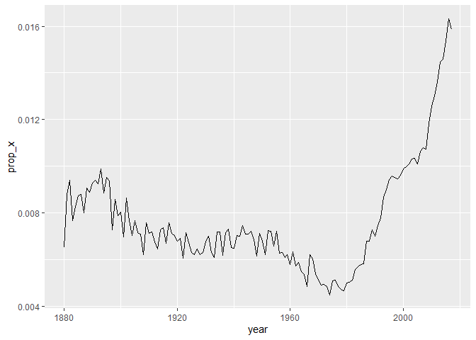

# Chapter 15, Regular Expressions


``` r
library(tidyverse)
```

    ── Attaching core tidyverse packages ──────────────────────── tidyverse 2.0.0 ──
    ✔ dplyr     1.1.4     ✔ readr     2.1.5
    ✔ forcats   1.0.0     ✔ stringr   1.5.1
    ✔ ggplot2   3.5.2     ✔ tibble    3.3.0
    ✔ lubridate 1.9.4     ✔ tidyr     1.3.1
    ✔ purrr     1.0.4     
    ── Conflicts ────────────────────────────────────────── tidyverse_conflicts() ──
    ✖ dplyr::filter() masks stats::filter()
    ✖ dplyr::lag()    masks stats::lag()
    ℹ Use the conflicted package (<http://conflicted.r-lib.org/>) to force all conflicts to become errors

``` r
library(babynames)
```

\#Pattern Basics

str_view() will show only the elements of the string vector that match,
surrounding each match with \<\>, and, where possible, highlighting the
match in blue.

``` r
str_view(fruit, "berry")
```

     [6] │ bil<berry>
     [7] │ black<berry>
    [10] │ blue<berry>
    [11] │ boysen<berry>
    [19] │ cloud<berry>
    [21] │ cran<berry>
    [29] │ elder<berry>
    [32] │ goji <berry>
    [33] │ goose<berry>
    [38] │ huckle<berry>
    [50] │ mul<berry>
    [70] │ rasp<berry>
    [73] │ salal <berry>
    [76] │ straw<berry>

``` r
str_view(c("a", "ab", "ae", "bd", "ea", "eab"), "a.")
```

    [2] │ <ab>
    [3] │ <ae>
    [6] │ e<ab>

all the fruits that contain an “a”, followed by three letters, followed
by an “e”:

``` r
str_view(fruit, "a...e")
```

     [1] │ <apple>
     [7] │ bl<ackbe>rry
    [48] │ mand<arine>
    [51] │ nect<arine>
    [62] │ pine<apple>
    [64] │ pomegr<anate>
    [70] │ r<aspbe>rry
    [73] │ sal<al be>rry

Quantifiers control how many times a pattern can match:

“?” makes a pattern optional (i.e. it matches 0 or 1 times) “+” lets a
pattern repeat (i.e. it matches at least once) “\*” lets a pattern be
optional or repeat (i.e. it matches any number of times, including 0).

``` r
# ab? matches an "a", optionally followed by a "b".
str_view(c("a", "ab", "abb"), "ab?")
```

    [1] │ <a>
    [2] │ <ab>
    [3] │ <ab>b

``` r
# ab+ matches an "a", followed by at least one "b".
str_view(c("a", "ab", "abb"), "ab+")
```

    [2] │ <ab>
    [3] │ <abb>

``` r
# ab* matches an "a", followed by any number of "b"s.
str_view(c("a", "ab", "abb"), "ab*")
```

    [1] │ <a>
    [2] │ <ab>
    [3] │ <abb>

Character classes: defined by \[ \] let you match a set of characters
e.g., \[abcd\] matches “a”, “b”, “c”, or “d”. invert the match by
starting with ^: \[^abcd\] matches anything except “a”, “b”, “c”, or “d”

``` r
str_view(words, "[aeiou]x[aeiou]")
```

    [284] │ <exa>ct
    [285] │ <exa>mple
    [288] │ <exe>rcise
    [289] │ <exi>st

``` r
str_view(words, "[^aeiou]y[^aeiou]")
```

    [836] │ <sys>tem
    [901] │ <typ>e

alternation, \|, to pick between one or more alternative patterns.

``` r
str_view(fruit, "apple|melon|nut")
```

     [1] │ <apple>
    [13] │ canary <melon>
    [20] │ coco<nut>
    [52] │ <nut>
    [62] │ pine<apple>
    [72] │ rock <melon>
    [80] │ water<melon>

``` r
str_view(fruit, "aa|ee|ii|oo|uu")
```

     [9] │ bl<oo>d orange
    [33] │ g<oo>seberry
    [47] │ lych<ee>
    [66] │ purple mangost<ee>n

# Detect Matches

str_detect() returns a logical vector that is TRUE if the pattern
matches an element of the character vector and FALSE otherwise:

``` r
str_detect(c("a", "b", "c"), "[aeiou]")
```

    [1]  TRUE FALSE FALSE

``` r
babynames |> 
  filter(str_detect(name, "x")) |> 
  count(name, wt = n, sort = TRUE)
```

    # A tibble: 974 × 2
       name            n
       <chr>       <int>
     1 Alexander  665492
     2 Alexis     399551
     3 Alex       278705
     4 Alexandra  232223
     5 Max        148787
     6 Alexa      123032
     7 Maxine     112261
     8 Alexandria  97679
     9 Maxwell     90486
    10 Jaxon       71234
    # ℹ 964 more rows

``` r
babynames |> 
  group_by(year) |> 
  summarize(prop_x = mean(str_detect(name, "x"))) |> 
  ggplot(aes(x = year, y = prop_x)) + 
  geom_line()
```



# Count Matches

str_count(): tells you how many matches there are in each string.

``` r
x <- c("apple", "banana", "pear")
str_count(x, "p")
```

    [1] 2 0 1

``` r
str_count("abababa", "aba")
```

    [1] 2

``` r
str_view("abababa", "aba")
```

    [1] │ <aba>b<aba>

``` r
babynames |> 
  count(name) |> 
  mutate(
    vowels = str_count(name, "[aeiou]"),
    consonants = str_count(name, "[^aeiou]")
  )
```

    # A tibble: 97,310 × 4
       name          n vowels consonants
       <chr>     <int>  <int>      <int>
     1 Aaban        10      2          3
     2 Aabha         5      2          3
     3 Aabid         2      2          3
     4 Aabir         1      2          3
     5 Aabriella     5      4          5
     6 Aada          1      2          2
     7 Aadam        26      2          3
     8 Aadan        11      2          3
     9 Aadarsh      17      2          5
    10 Aaden        18      2          3
    # ℹ 97,300 more rows

``` r
babynames |> 
  count(name) |> 
  mutate(
    name = str_to_lower(name),
    vowels = str_count(name, "[aeiou]"),
    consonants = str_count(name, "[^aeiou]")
  )
```

    # A tibble: 97,310 × 4
       name          n vowels consonants
       <chr>     <int>  <int>      <int>
     1 aaban        10      3          2
     2 aabha         5      3          2
     3 aabid         2      3          2
     4 aabir         1      3          2
     5 aabriella     5      5          4
     6 aada          1      3          1
     7 aadam        26      3          2
     8 aadan        11      3          2
     9 aadarsh      17      3          4
    10 aaden        18      3          2
    # ℹ 97,300 more rows

# Replace Values

str_replace() replaces the first match str_replace_all() replaces all
matches

``` r
x <- c("apple", "pear", "banana")
str_replace_all(x, "[aeiou]", "-")
```

    [1] "-ppl-"  "p--r"   "b-n-n-"

str_remove() and str_remove_all() are handy shortcuts for str_replace(x,
pattern, ““):

``` r
x <- c("apple", "pear", "banana")
str_remove_all(x, "[aeiou]")
```

    [1] "ppl" "pr"  "bnn"

# Extract Variables

``` r
df <- tribble(
  ~str,
  "<Sheryl>-F_34",
  "<Kisha>-F_45", 
  "<Brandon>-N_33",
  "<Sharon>-F_38", 
  "<Penny>-F_58",
  "<Justin>-M_41", 
  "<Patricia>-F_84", 
)
```

``` r
df |> 
  separate_wider_regex(
    str,
    patterns = c(
      "<", 
      name = "[A-Za-z]+", 
      ">-", 
      gender = ".",
      "_",
      age = "[0-9]+"
    )
  )
```

    # A tibble: 7 × 3
      name     gender age  
      <chr>    <chr>  <chr>
    1 Sheryl   F      34   
    2 Kisha    F      45   
    3 Brandon  N      33   
    4 Sharon   F      38   
    5 Penny    F      58   
    6 Justin   M      41   
    7 Patricia F      84   

# Exercises pt 1 of 2

1.  

``` r
babynames |> 
  count(name) |> 
  mutate(
    vowels = str_count(name, "[aeiouAEIOU]")) |>
  filter(vowels == max(vowels))
```

    # A tibble: 2 × 3
      name                n vowels
      <chr>           <int>  <int>
    1 Mariadelrosario     3      8
    2 Mariaguadalupe     37      8

``` r
babynames |> 
  count(name) |> 
  mutate(
    vowels = str_count(name, "[aeiouAEIOU]"),
    total_letters = nchar(name),
    vowel_prop = vowels / total_letters
  ) |> 
  filter(vowel_prop == max(vowel_prop))
```

    # A tibble: 8 × 5
      name      n vowels total_letters vowel_prop
      <chr> <int>  <int>         <int>      <dbl>
    1 Ai       40      2             2          1
    2 Aia       4      3             3          1
    3 Aoi      24      3             3          1
    4 Ea        2      2             2          1
    5 Eua       4      3             3          1
    6 Ia       19      2             2          1
    7 Ii        1      2             2          1
    8 Io       16      2             2          1

2.  

``` r
str_replace_all("a/b/c/d/e", "/", "\\\\")
```

    [1] "a\\b\\c\\d\\e"

3.  

``` r
library(stringr)

str_replace_all("Hello WORLD!", setNames(letters, LETTERS))
```

    [1] "hello world!"

4.  

``` r
tibble(str = "123-456-7890") |>
  separate_wider_regex(
    str,
    patterns = c(
      area = "\\d{3}",
      "-", 
      central = "\\d{3}",
      "-", 
      station = "\\d{4}"
    )
  )
```

    # A tibble: 1 × 3
      area  central station
      <chr> <chr>   <chr>  
    1 123   456     7890   

# Escaping

``` r
# To create the regular expression \., we need to use \\.
dot <- "\\."

# But the expression itself only contains one \
str_view(dot)
```

    [1] │ \.

``` r
# And this tells R to look for an explicit .
str_view(c("abc", "a.c", "bef"), "a\\.c")
```

    [2] │ <a.c>

``` r
x <- "a\\b"
str_view(x)
```

    [1] │ a\b

``` r
str_view(x, "\\\\")
```

    [1] │ a<\>b

``` r
str_view(x, r"{\\}")
```

    [1] │ a<\>b

``` r
str_view(c("abc", "a.c", "a*c", "a c"), "a[.]c")
```

    [2] │ <a.c>

``` r
str_view(c("abc", "a.c", "a*c", "a c"), ".[*]c")
```

    [3] │ <a*c>

# Anchors

To force a regular expression to match only the full string, anchor it
with both ^ (beginning) and \$ (end):

``` r
str_view(fruit, "^a")
```

    [1] │ <a>pple
    [2] │ <a>pricot
    [3] │ <a>vocado

``` r
str_view(fruit, "a$")
```

     [4] │ banan<a>
    [15] │ cherimoy<a>
    [30] │ feijo<a>
    [36] │ guav<a>
    [56] │ papay<a>
    [74] │ satsum<a>

``` r
str_view(fruit, "apple")
```

     [1] │ <apple>
    [62] │ pine<apple>

``` r
str_view(fruit, "^apple$")
```

    [1] │ <apple>

``` r
x <- c("summary(x)", "summarize(df)", "rowsum(x)", "sum(x)")
str_view(x, "sum")
```

    [1] │ <sum>mary(x)
    [2] │ <sum>marize(df)
    [3] │ row<sum>(x)
    [4] │ <sum>(x)

``` r
str_view(x, "\\bsum\\b")
```

    [4] │ <sum>(x)

``` r
str_view("abc", c("$", "^", "\\b"))
```

    [1] │ abc<>
    [2] │ <>abc
    [3] │ <>abc<>

``` r
str_replace_all("abc", c("$", "^", "\\b"), "--")
```

    [1] "abc--"   "--abc"   "--abc--"

# Grouping and Capturing

``` r
str_view(fruit, "(..)\\1")
```

     [4] │ b<anan>a
    [20] │ <coco>nut
    [22] │ <cucu>mber
    [41] │ <juju>be
    [56] │ <papa>ya
    [73] │ s<alal> berry

All words that start and end with the same first two letters:

``` r
str_view(words, "^(..).*\\1$")
```

    [152] │ <church>
    [217] │ <decide>
    [617] │ <photograph>
    [699] │ <require>
    [739] │ <sense>

``` r
sentences |> 
  str_replace("(\\w+) (\\w+) (\\w+)", "\\1 \\3 \\2") |> 
  str_view()
```

     [1] │ The canoe birch slid on the smooth planks.
     [2] │ Glue sheet the to the dark blue background.
     [3] │ It's to easy tell the depth of a well.
     [4] │ These a days chicken leg is a rare dish.
     [5] │ Rice often is served in round bowls.
     [6] │ The of juice lemons makes fine punch.
     [7] │ The was box thrown beside the parked truck.
     [8] │ The were hogs fed chopped corn and garbage.
     [9] │ Four of hours steady work faced us.
    [10] │ A size large in stockings is hard to sell.
    [11] │ The was boy there when the sun rose.
    [12] │ A is rod used to catch pink salmon.
    [13] │ The of source the huge river is the clear spring.
    [14] │ Kick ball the straight and follow through.
    [15] │ Help woman the get back to her feet.
    [16] │ A of pot tea helps to pass the evening.
    [17] │ Smoky lack fires flame and heat.
    [18] │ The cushion soft broke the man's fall.
    [19] │ The breeze salt came across from the sea.
    [20] │ The at girl the booth sold fifty bonds.
    ... and 700 more

# Exercises pt 2 of 2

1.  

``` r
pattern1 <- "’\\? How about"
pattern2 <- "“\\$\\^\\$“"

pattern1
```

    [1] "’\\? How about"

``` r
pattern2
```

    [1] "“\\$\\^\\$“"

2.  The only pattern that matches a : is “:” which is not created by
    these patterns
3.  

``` r
library(stringr)
words <- stringr::words
str_subset(words, "^y")
```

    [1] "year"      "yes"       "yesterday" "yet"       "you"       "young"    

``` r
str_subset(words, "^[^y]")
```

      [1] "a"           "able"        "about"       "absolute"    "accept"     
      [6] "account"     "achieve"     "across"      "act"         "active"     
     [11] "actual"      "add"         "address"     "admit"       "advertise"  
     [16] "affect"      "afford"      "after"       "afternoon"   "again"      
     [21] "against"     "age"         "agent"       "ago"         "agree"      
     [26] "air"         "all"         "allow"       "almost"      "along"      
     [31] "already"     "alright"     "also"        "although"    "always"     
     [36] "america"     "amount"      "and"         "another"     "answer"     
     [41] "any"         "apart"       "apparent"    "appear"      "apply"      
     [46] "appoint"     "approach"    "appropriate" "area"        "argue"      
     [51] "arm"         "around"      "arrange"     "art"         "as"         
     [56] "ask"         "associate"   "assume"      "at"          "attend"     
     [61] "authority"   "available"   "aware"       "away"        "awful"      
     [66] "baby"        "back"        "bad"         "bag"         "balance"    
     [71] "ball"        "bank"        "bar"         "base"        "basis"      
     [76] "be"          "bear"        "beat"        "beauty"      "because"    
     [81] "become"      "bed"         "before"      "begin"       "behind"     
     [86] "believe"     "benefit"     "best"        "bet"         "between"    
     [91] "big"         "bill"        "birth"       "bit"         "black"      
     [96] "bloke"       "blood"       "blow"        "blue"        "board"      
    [101] "boat"        "body"        "book"        "both"        "bother"     
    [106] "bottle"      "bottom"      "box"         "boy"         "break"      
    [111] "brief"       "brilliant"   "bring"       "britain"     "brother"    
    [116] "budget"      "build"       "bus"         "business"    "busy"       
    [121] "but"         "buy"         "by"          "cake"        "call"       
    [126] "can"         "car"         "card"        "care"        "carry"      
    [131] "case"        "cat"         "catch"       "cause"       "cent"       
    [136] "centre"      "certain"     "chair"       "chairman"    "chance"     
    [141] "change"      "chap"        "character"   "charge"      "cheap"      
    [146] "check"       "child"       "choice"      "choose"      "Christ"     
    [151] "Christmas"   "church"      "city"        "claim"       "class"      
    [156] "clean"       "clear"       "client"      "clock"       "close"      
    [161] "closes"      "clothe"      "club"        "coffee"      "cold"       
    [166] "colleague"   "collect"     "college"     "colour"      "come"       
    [171] "comment"     "commit"      "committee"   "common"      "community"  
    [176] "company"     "compare"     "complete"    "compute"     "concern"    
    [181] "condition"   "confer"      "consider"    "consult"     "contact"    
    [186] "continue"    "contract"    "control"     "converse"    "cook"       
    [191] "copy"        "corner"      "correct"     "cost"        "could"      
    [196] "council"     "count"       "country"     "county"      "couple"     
    [201] "course"      "court"       "cover"       "create"      "cross"      
    [206] "cup"         "current"     "cut"         "dad"         "danger"     
    [211] "date"        "day"         "dead"        "deal"        "dear"       
    [216] "debate"      "decide"      "decision"    "deep"        "definite"   
    [221] "degree"      "department"  "depend"      "describe"    "design"     
    [226] "detail"      "develop"     "die"         "difference"  "difficult"  
    [231] "dinner"      "direct"      "discuss"     "district"    "divide"     
    [236] "do"          "doctor"      "document"    "dog"         "door"       
    [241] "double"      "doubt"       "down"        "draw"        "dress"      
    [246] "drink"       "drive"       "drop"        "dry"         "due"        
    [251] "during"      "each"        "early"       "east"        "easy"       
    [256] "eat"         "economy"     "educate"     "effect"      "egg"        
    [261] "eight"       "either"      "elect"       "electric"    "eleven"     
    [266] "else"        "employ"      "encourage"   "end"         "engine"     
    [271] "english"     "enjoy"       "enough"      "enter"       "environment"
    [276] "equal"       "especial"    "europe"      "even"        "evening"    
    [281] "ever"        "every"       "evidence"    "exact"       "example"    
    [286] "except"      "excuse"      "exercise"    "exist"       "expect"     
    [291] "expense"     "experience"  "explain"     "express"     "extra"      
    [296] "eye"         "face"        "fact"        "fair"        "fall"       
    [301] "family"      "far"         "farm"        "fast"        "father"     
    [306] "favour"      "feed"        "feel"        "few"         "field"      
    [311] "fight"       "figure"      "file"        "fill"        "film"       
    [316] "final"       "finance"     "find"        "fine"        "finish"     
    [321] "fire"        "first"       "fish"        "fit"         "five"       
    [326] "flat"        "floor"       "fly"         "follow"      "food"       
    [331] "foot"        "for"         "force"       "forget"      "form"       
    [336] "fortune"     "forward"     "four"        "france"      "free"       
    [341] "friday"      "friend"      "from"        "front"       "full"       
    [346] "fun"         "function"    "fund"        "further"     "future"     
    [351] "game"        "garden"      "gas"         "general"     "germany"    
    [356] "get"         "girl"        "give"        "glass"       "go"         
    [361] "god"         "good"        "goodbye"     "govern"      "grand"      
    [366] "grant"       "great"       "green"       "ground"      "group"      
    [371] "grow"        "guess"       "guy"         "hair"        "half"       
    [376] "hall"        "hand"        "hang"        "happen"      "happy"      
    [381] "hard"        "hate"        "have"        "he"          "head"       
    [386] "health"      "hear"        "heart"       "heat"        "heavy"      
    [391] "hell"        "help"        "here"        "high"        "history"    
    [396] "hit"         "hold"        "holiday"     "home"        "honest"     
    [401] "hope"        "horse"       "hospital"    "hot"         "hour"       
    [406] "house"       "how"         "however"     "hullo"       "hundred"    
    [411] "husband"     "idea"        "identify"    "if"          "imagine"    
    [416] "important"   "improve"     "in"          "include"     "income"     
    [421] "increase"    "indeed"      "individual"  "industry"    "inform"     
    [426] "inside"      "instead"     "insure"      "interest"    "into"       
    [431] "introduce"   "invest"      "involve"     "issue"       "it"         
    [436] "item"        "jesus"       "job"         "join"        "judge"      
    [441] "jump"        "just"        "keep"        "key"         "kid"        
    [446] "kill"        "kind"        "king"        "kitchen"     "knock"      
    [451] "know"        "labour"      "lad"         "lady"        "land"       
    [456] "language"    "large"       "last"        "late"        "laugh"      
    [461] "law"         "lay"         "lead"        "learn"       "leave"      
    [466] "left"        "leg"         "less"        "let"         "letter"     
    [471] "level"       "lie"         "life"        "light"       "like"       
    [476] "likely"      "limit"       "line"        "link"        "list"       
    [481] "listen"      "little"      "live"        "load"        "local"      
    [486] "lock"        "london"      "long"        "look"        "lord"       
    [491] "lose"        "lot"         "love"        "low"         "luck"       
    [496] "lunch"       "machine"     "main"        "major"       "make"       
    [501] "man"         "manage"      "many"        "mark"        "market"     
    [506] "marry"       "match"       "matter"      "may"         "maybe"      
    [511] "mean"        "meaning"     "measure"     "meet"        "member"     
    [516] "mention"     "middle"      "might"       "mile"        "milk"       
    [521] "million"     "mind"        "minister"    "minus"       "minute"     
    [526] "miss"        "mister"      "moment"      "monday"      "money"      
    [531] "month"       "more"        "morning"     "most"        "mother"     
    [536] "motion"      "move"        "mrs"         "much"        "music"      
    [541] "must"        "name"        "nation"      "nature"      "near"       
    [546] "necessary"   "need"        "never"       "new"         "news"       
    [551] "next"        "nice"        "night"       "nine"        "no"         
    [556] "non"         "none"        "normal"      "north"       "not"        
    [561] "note"        "notice"      "now"         "number"      "obvious"    
    [566] "occasion"    "odd"         "of"          "off"         "offer"      
    [571] "office"      "often"       "okay"        "old"         "on"         
    [576] "once"        "one"         "only"        "open"        "operate"    
    [581] "opportunity" "oppose"      "or"          "order"       "organize"   
    [586] "original"    "other"       "otherwise"   "ought"       "out"        
    [591] "over"        "own"         "pack"        "page"        "paint"      
    [596] "pair"        "paper"       "paragraph"   "pardon"      "parent"     
    [601] "park"        "part"        "particular"  "party"       "pass"       
    [606] "past"        "pay"         "pence"       "pension"     "people"     
    [611] "per"         "percent"     "perfect"     "perhaps"     "period"     
    [616] "person"      "photograph"  "pick"        "picture"     "piece"      
    [621] "place"       "plan"        "play"        "please"      "plus"       
    [626] "point"       "police"      "policy"      "politic"     "poor"       
    [631] "position"    "positive"    "possible"    "post"        "pound"      
    [636] "power"       "practise"    "prepare"     "present"     "press"      
    [641] "pressure"    "presume"     "pretty"      "previous"    "price"      
    [646] "print"       "private"     "probable"    "problem"     "proceed"    
    [651] "process"     "produce"     "product"     "programme"   "project"    
    [656] "proper"      "propose"     "protect"     "provide"     "public"     
    [661] "pull"        "purpose"     "push"        "put"         "quality"    
    [666] "quarter"     "question"    "quick"       "quid"        "quiet"      
    [671] "quite"       "radio"       "rail"        "raise"       "range"      
    [676] "rate"        "rather"      "read"        "ready"       "real"       
    [681] "realise"     "really"      "reason"      "receive"     "recent"     
    [686] "reckon"      "recognize"   "recommend"   "record"      "red"        
    [691] "reduce"      "refer"       "regard"      "region"      "relation"   
    [696] "remember"    "report"      "represent"   "require"     "research"   
    [701] "resource"    "respect"     "responsible" "rest"        "result"     
    [706] "return"      "rid"         "right"       "ring"        "rise"       
    [711] "road"        "role"        "roll"        "room"        "round"      
    [716] "rule"        "run"         "safe"        "sale"        "same"       
    [721] "saturday"    "save"        "say"         "scheme"      "school"     
    [726] "science"     "score"       "scotland"    "seat"        "second"     
    [731] "secretary"   "section"     "secure"      "see"         "seem"       
    [736] "self"        "sell"        "send"        "sense"       "separate"   
    [741] "serious"     "serve"       "service"     "set"         "settle"     
    [746] "seven"       "sex"         "shall"       "share"       "she"        
    [751] "sheet"       "shoe"        "shoot"       "shop"        "short"      
    [756] "should"      "show"        "shut"        "sick"        "side"       
    [761] "sign"        "similar"     "simple"      "since"       "sing"       
    [766] "single"      "sir"         "sister"      "sit"         "site"       
    [771] "situate"     "six"         "size"        "sleep"       "slight"     
    [776] "slow"        "small"       "smoke"       "so"          "social"     
    [781] "society"     "some"        "son"         "soon"        "sorry"      
    [786] "sort"        "sound"       "south"       "space"       "speak"      
    [791] "special"     "specific"    "speed"       "spell"       "spend"      
    [796] "square"      "staff"       "stage"       "stairs"      "stand"      
    [801] "standard"    "start"       "state"       "station"     "stay"       
    [806] "step"        "stick"       "still"       "stop"        "story"      
    [811] "straight"    "strategy"    "street"      "strike"      "strong"     
    [816] "structure"   "student"     "study"       "stuff"       "stupid"     
    [821] "subject"     "succeed"     "such"        "sudden"      "suggest"    
    [826] "suit"        "summer"      "sun"         "sunday"      "supply"     
    [831] "support"     "suppose"     "sure"        "surprise"    "switch"     
    [836] "system"      "table"       "take"        "talk"        "tape"       
    [841] "tax"         "tea"         "teach"       "team"        "telephone"  
    [846] "television"  "tell"        "ten"         "tend"        "term"       
    [851] "terrible"    "test"        "than"        "thank"       "the"        
    [856] "then"        "there"       "therefore"   "they"        "thing"      
    [861] "think"       "thirteen"    "thirty"      "this"        "thou"       
    [866] "though"      "thousand"    "three"       "through"     "throw"      
    [871] "thursday"    "tie"         "time"        "to"          "today"      
    [876] "together"    "tomorrow"    "tonight"     "too"         "top"        
    [881] "total"       "touch"       "toward"      "town"        "trade"      
    [886] "traffic"     "train"       "transport"   "travel"      "treat"      
    [891] "tree"        "trouble"     "true"        "trust"       "try"        
    [896] "tuesday"     "turn"        "twelve"      "twenty"      "two"        
    [901] "type"        "under"       "understand"  "union"       "unit"       
    [906] "unite"       "university"  "unless"      "until"       "up"         
    [911] "upon"        "use"         "usual"       "value"       "various"    
    [916] "very"        "video"       "view"        "village"     "visit"      
    [921] "vote"        "wage"        "wait"        "walk"        "wall"       
    [926] "want"        "war"         "warm"        "wash"        "waste"      
    [931] "watch"       "water"       "way"         "we"          "wear"       
    [936] "wednesday"   "wee"         "week"        "weigh"       "welcome"    
    [941] "well"        "west"        "what"        "when"        "where"      
    [946] "whether"     "which"       "while"       "white"       "who"        
    [951] "whole"       "why"         "wide"        "wife"        "will"       
    [956] "win"         "wind"        "window"      "wish"        "with"       
    [961] "within"      "without"     "woman"       "wonder"      "wood"       
    [966] "word"        "work"        "world"       "worry"       "worse"      
    [971] "worth"       "would"       "write"       "wrong"      

``` r
str_subset(words, "x$")
```

    [1] "box" "sex" "six" "tax"

``` r
str_subset(words, "^(...)$")
```

      [1] "act" "add" "age" "ago" "air" "all" "and" "any" "arm" "art" "ask" "bad"
     [13] "bag" "bar" "bed" "bet" "big" "bit" "box" "boy" "bus" "but" "buy" "can"
     [25] "car" "cat" "cup" "cut" "dad" "day" "die" "dog" "dry" "due" "eat" "egg"
     [37] "end" "eye" "far" "few" "fit" "fly" "for" "fun" "gas" "get" "god" "guy"
     [49] "hit" "hot" "how" "job" "key" "kid" "lad" "law" "lay" "leg" "let" "lie"
     [61] "lot" "low" "man" "may" "mrs" "new" "non" "not" "now" "odd" "off" "old"
     [73] "one" "out" "own" "pay" "per" "put" "red" "rid" "run" "say" "see" "set"
     [85] "sex" "she" "sir" "sit" "six" "son" "sun" "tax" "tea" "ten" "the" "tie"
     [97] "too" "top" "try" "two" "use" "war" "way" "wee" "who" "why" "win" "yes"
    [109] "yet" "you"

``` r
str_subset(words, "^.{7,}$")
```

      [1] "absolute"    "account"     "achieve"     "address"     "advertise"  
      [6] "afternoon"   "against"     "already"     "alright"     "although"   
     [11] "america"     "another"     "apparent"    "appoint"     "approach"   
     [16] "appropriate" "arrange"     "associate"   "authority"   "available"  
     [21] "balance"     "because"     "believe"     "benefit"     "between"    
     [26] "brilliant"   "britain"     "brother"     "business"    "certain"    
     [31] "chairman"    "character"   "Christmas"   "colleague"   "collect"    
     [36] "college"     "comment"     "committee"   "community"   "company"    
     [41] "compare"     "complete"    "compute"     "concern"     "condition"  
     [46] "consider"    "consult"     "contact"     "continue"    "contract"   
     [51] "control"     "converse"    "correct"     "council"     "country"    
     [56] "current"     "decision"    "definite"    "department"  "describe"   
     [61] "develop"     "difference"  "difficult"   "discuss"     "district"   
     [66] "document"    "economy"     "educate"     "electric"    "encourage"  
     [71] "english"     "environment" "especial"    "evening"     "evidence"   
     [76] "example"     "exercise"    "expense"     "experience"  "explain"    
     [81] "express"     "finance"     "fortune"     "forward"     "function"   
     [86] "further"     "general"     "germany"     "goodbye"     "history"    
     [91] "holiday"     "hospital"    "however"     "hundred"     "husband"    
     [96] "identify"    "imagine"     "important"   "improve"     "include"    
    [101] "increase"    "individual"  "industry"    "instead"     "interest"   
    [106] "introduce"   "involve"     "kitchen"     "language"    "machine"    
    [111] "meaning"     "measure"     "mention"     "million"     "minister"   
    [116] "morning"     "necessary"   "obvious"     "occasion"    "operate"    
    [121] "opportunity" "organize"    "original"    "otherwise"   "paragraph"  
    [126] "particular"  "pension"     "percent"     "perfect"     "perhaps"    
    [131] "photograph"  "picture"     "politic"     "position"    "positive"   
    [136] "possible"    "practise"    "prepare"     "present"     "pressure"   
    [141] "presume"     "previous"    "private"     "probable"    "problem"    
    [146] "proceed"     "process"     "produce"     "product"     "programme"  
    [151] "project"     "propose"     "protect"     "provide"     "purpose"    
    [156] "quality"     "quarter"     "question"    "realise"     "receive"    
    [161] "recognize"   "recommend"   "relation"    "remember"    "represent"  
    [166] "require"     "research"    "resource"    "respect"     "responsible"
    [171] "saturday"    "science"     "scotland"    "secretary"   "section"    
    [176] "separate"    "serious"     "service"     "similar"     "situate"    
    [181] "society"     "special"     "specific"    "standard"    "station"    
    [186] "straight"    "strategy"    "structure"   "student"     "subject"    
    [191] "succeed"     "suggest"     "support"     "suppose"     "surprise"   
    [196] "telephone"   "television"  "terrible"    "therefore"   "thirteen"   
    [201] "thousand"    "through"     "thursday"    "together"    "tomorrow"   
    [206] "tonight"     "traffic"     "transport"   "trouble"     "tuesday"    
    [211] "understand"  "university"  "various"     "village"     "wednesday"  
    [216] "welcome"     "whether"     "without"     "yesterday"  

``` r
str_subset(words, "[aeious][^aeiou\\W]")
```

      [1] "able"        "about"       "absolute"    "accept"      "account"    
      [6] "achieve"     "across"      "act"         "active"      "actual"     
     [11] "add"         "address"     "admit"       "advertise"   "affect"     
     [16] "afford"      "after"       "afternoon"   "again"       "against"    
     [21] "age"         "agent"       "ago"         "agree"       "air"        
     [26] "all"         "allow"       "almost"      "along"       "already"    
     [31] "alright"     "also"        "although"    "always"      "america"    
     [36] "amount"      "and"         "another"     "answer"      "any"        
     [41] "apart"       "apparent"    "appear"      "apply"       "appoint"    
     [46] "approach"    "appropriate" "area"        "argue"       "arm"        
     [51] "around"      "arrange"     "art"         "as"          "ask"        
     [56] "associate"   "assume"      "at"          "attend"      "authority"  
     [61] "available"   "aware"       "away"        "awful"       "baby"       
     [66] "back"        "bad"         "bag"         "balance"     "ball"       
     [71] "bank"        "bar"         "base"        "basis"       "bear"       
     [76] "beat"        "beauty"      "because"     "become"      "bed"        
     [81] "before"      "begin"       "behind"      "believe"     "benefit"    
     [86] "best"        "bet"         "between"     "big"         "bill"       
     [91] "birth"       "bit"         "black"       "bloke"       "blood"      
     [96] "blow"        "board"       "boat"        "body"        "book"       
    [101] "both"        "bother"      "bottle"      "bottom"      "box"        
    [106] "boy"         "break"       "brief"       "brilliant"   "bring"      
    [111] "britain"     "brother"     "budget"      "build"       "bus"        
    [116] "business"    "busy"        "but"         "buy"         "cake"       
    [121] "call"        "can"         "car"         "card"        "care"       
    [126] "carry"       "case"        "cat"         "catch"       "cause"      
    [131] "cent"        "centre"      "certain"     "chair"       "chairman"   
    [136] "chance"      "change"      "chap"        "character"   "charge"     
    [141] "cheap"       "check"       "child"       "choice"      "choose"     
    [146] "Christ"      "Christmas"   "church"      "city"        "claim"      
    [151] "class"       "clean"       "clear"       "client"      "clock"      
    [156] "close"       "closes"      "clothe"      "club"        "coffee"     
    [161] "cold"        "colleague"   "collect"     "college"     "colour"     
    [166] "come"        "comment"     "commit"      "committee"   "common"     
    [171] "community"   "company"     "compare"     "complete"    "compute"    
    [176] "concern"     "condition"   "confer"      "consider"    "consult"    
    [181] "contact"     "continue"    "contract"    "control"     "converse"   
    [186] "cook"        "copy"        "corner"      "correct"     "cost"       
    [191] "could"       "council"     "count"       "country"     "county"     
    [196] "couple"      "course"      "court"       "cover"       "create"     
    [201] "cross"       "cup"         "current"     "cut"         "dad"        
    [206] "danger"      "date"        "day"         "dead"        "deal"       
    [211] "dear"        "debate"      "decide"      "decision"    "deep"       
    [216] "definite"    "degree"      "department"  "depend"      "describe"   
    [221] "design"      "detail"      "develop"     "difference"  "difficult"  
    [226] "dinner"      "direct"      "discuss"     "district"    "divide"     
    [231] "doctor"      "document"    "dog"         "door"        "double"     
    [236] "doubt"       "down"        "draw"        "dress"       "drink"      
    [241] "drive"       "drop"        "during"      "each"        "early"      
    [246] "east"        "easy"        "eat"         "economy"     "educate"    
    [251] "effect"      "egg"         "eight"       "either"      "elect"      
    [256] "electric"    "eleven"      "else"        "employ"      "encourage"  
    [261] "end"         "engine"      "english"     "enjoy"       "enough"     
    [266] "enter"       "environment" "equal"       "especial"    "europe"     
    [271] "even"        "evening"     "ever"        "every"       "evidence"   
    [276] "exact"       "example"     "except"      "excuse"      "exercise"   
    [281] "exist"       "expect"      "expense"     "experience"  "explain"    
    [286] "express"     "extra"       "eye"         "face"        "fact"       
    [291] "fair"        "fall"        "family"      "far"         "farm"       
    [296] "fast"        "father"      "favour"      "feed"        "feel"       
    [301] "few"         "field"       "fight"       "figure"      "file"       
    [306] "fill"        "film"        "final"       "finance"     "find"       
    [311] "fine"        "finish"      "fire"        "first"       "fish"       
    [316] "fit"         "five"        "flat"        "floor"       "follow"     
    [321] "food"        "foot"        "for"         "force"       "forget"     
    [326] "form"        "fortune"     "forward"     "four"        "france"     
    [331] "friday"      "friend"      "from"        "front"       "full"       
    [336] "fun"         "function"    "fund"        "further"     "future"     
    [341] "game"        "garden"      "gas"         "general"     "germany"    
    [346] "get"         "girl"        "give"        "glass"       "god"        
    [351] "good"        "goodbye"     "govern"      "grand"       "grant"      
    [356] "great"       "green"       "ground"      "group"       "grow"       
    [361] "guess"       "guy"         "hair"        "half"        "hall"       
    [366] "hand"        "hang"        "happen"      "happy"       "hard"       
    [371] "hate"        "have"        "head"        "health"      "hear"       
    [376] "heart"       "heat"        "heavy"       "hell"        "help"       
    [381] "here"        "high"        "history"     "hit"         "hold"       
    [386] "holiday"     "home"        "honest"      "hope"        "horse"      
    [391] "hospital"    "hot"         "hour"        "house"       "how"        
    [396] "however"     "hullo"       "hundred"     "husband"     "idea"       
    [401] "identify"    "if"          "imagine"     "important"   "improve"    
    [406] "in"          "include"     "income"      "increase"    "indeed"     
    [411] "individual"  "industry"    "inform"      "inside"      "instead"    
    [416] "insure"      "interest"    "into"        "introduce"   "invest"     
    [421] "involve"     "issue"       "it"          "item"        "jesus"      
    [426] "job"         "join"        "judge"       "jump"        "just"       
    [431] "keep"        "key"         "kid"         "kill"        "kind"       
    [436] "king"        "kitchen"     "knock"       "know"        "labour"     
    [441] "lad"         "lady"        "land"        "language"    "large"      
    [446] "last"        "late"        "laugh"       "law"         "lay"        
    [451] "lead"        "learn"       "leave"       "left"        "leg"        
    [456] "less"        "let"         "letter"      "level"       "life"       
    [461] "light"       "like"        "likely"      "limit"       "line"       
    [466] "link"        "list"        "listen"      "little"      "live"       
    [471] "load"        "local"       "lock"        "london"      "long"       
    [476] "look"        "lord"        "lose"        "lot"         "love"       
    [481] "low"         "luck"        "lunch"       "machine"     "main"       
    [486] "major"       "make"        "man"         "manage"      "many"       
    [491] "mark"        "market"      "marry"       "match"       "matter"     
    [496] "may"         "maybe"       "mean"        "meaning"     "measure"    
    [501] "meet"        "member"      "mention"     "middle"      "might"      
    [506] "mile"        "milk"        "million"     "mind"        "minister"   
    [511] "minus"       "minute"      "miss"        "mister"      "moment"     
    [516] "monday"      "money"       "month"       "more"        "morning"    
    [521] "most"        "mother"      "motion"      "move"        "much"       
    [526] "music"       "must"        "name"        "nation"      "nature"     
    [531] "near"        "necessary"   "need"        "never"       "new"        
    [536] "news"        "next"        "nice"        "night"       "nine"       
    [541] "non"         "none"        "normal"      "north"       "not"        
    [546] "note"        "notice"      "now"         "number"      "obvious"    
    [551] "occasion"    "odd"         "of"          "off"         "offer"      
    [556] "office"      "often"       "okay"        "old"         "on"         
    [561] "once"        "one"         "only"        "open"        "operate"    
    [566] "opportunity" "oppose"      "or"          "order"       "organize"   
    [571] "original"    "other"       "otherwise"   "ought"       "out"        
    [576] "over"        "own"         "pack"        "page"        "paint"      
    [581] "pair"        "paper"       "paragraph"   "pardon"      "parent"     
    [586] "park"        "part"        "particular"  "party"       "pass"       
    [591] "past"        "pay"         "pence"       "pension"     "people"     
    [596] "per"         "percent"     "perfect"     "perhaps"     "period"     
    [601] "person"      "photograph"  "pick"        "picture"     "piece"      
    [606] "place"       "plan"        "play"        "please"      "plus"       
    [611] "point"       "police"      "policy"      "politic"     "poor"       
    [616] "position"    "positive"    "possible"    "post"        "pound"      
    [621] "power"       "practise"    "prepare"     "present"     "press"      
    [626] "pressure"    "presume"     "pretty"      "previous"    "price"      
    [631] "print"       "private"     "probable"    "problem"     "proceed"    
    [636] "process"     "produce"     "product"     "programme"   "project"    
    [641] "proper"      "propose"     "protect"     "provide"     "public"     
    [646] "pull"        "purpose"     "push"        "put"         "quality"    
    [651] "quarter"     "question"    "quick"       "quid"        "quiet"      
    [656] "quite"       "radio"       "rail"        "raise"       "range"      
    [661] "rate"        "rather"      "read"        "ready"       "real"       
    [666] "realise"     "really"      "reason"      "receive"     "recent"     
    [671] "reckon"      "recognize"   "recommend"   "record"      "red"        
    [676] "reduce"      "refer"       "regard"      "region"      "relation"   
    [681] "remember"    "report"      "represent"   "require"     "research"   
    [686] "resource"    "respect"     "responsible" "rest"        "result"     
    [691] "return"      "rid"         "right"       "ring"        "rise"       
    [696] "road"        "role"        "roll"        "room"        "round"      
    [701] "rule"        "run"         "safe"        "sale"        "same"       
    [706] "saturday"    "save"        "say"         "scheme"      "school"     
    [711] "science"     "score"       "scotland"    "seat"        "second"     
    [716] "secretary"   "section"     "secure"      "seem"        "self"       
    [721] "sell"        "send"        "sense"       "separate"    "serious"    
    [726] "serve"       "service"     "set"         "settle"      "seven"      
    [731] "sex"         "shall"       "share"       "she"         "sheet"      
    [736] "shoe"        "shoot"       "shop"        "short"       "should"     
    [741] "show"        "shut"        "sick"        "side"        "sign"       
    [746] "similar"     "simple"      "since"       "sing"        "single"     
    [751] "sir"         "sister"      "sit"         "site"        "situate"    
    [756] "six"         "size"        "sleep"       "slight"      "slow"       
    [761] "small"       "smoke"       "social"      "society"     "some"       
    [766] "son"         "soon"        "sorry"       "sort"        "sound"      
    [771] "south"       "space"       "speak"       "special"     "specific"   
    [776] "speed"       "spell"       "spend"       "square"      "staff"      
    [781] "stage"       "stairs"      "stand"       "standard"    "start"      
    [786] "state"       "station"     "stay"        "step"        "stick"      
    [791] "still"       "stop"        "story"       "straight"    "strategy"   
    [796] "street"      "strike"      "strong"      "structure"   "student"    
    [801] "study"       "stuff"       "stupid"      "subject"     "succeed"    
    [806] "such"        "sudden"      "suggest"     "suit"        "summer"     
    [811] "sun"         "sunday"      "supply"      "support"     "suppose"    
    [816] "sure"        "surprise"    "switch"      "system"      "table"      
    [821] "take"        "talk"        "tape"        "tax"         "teach"      
    [826] "team"        "telephone"   "television"  "tell"        "ten"        
    [831] "tend"        "term"        "terrible"    "test"        "than"       
    [836] "thank"       "then"        "there"       "therefore"   "they"       
    [841] "thing"       "think"       "thirteen"    "thirty"      "this"       
    [846] "though"      "thousand"    "through"     "throw"       "thursday"   
    [851] "time"        "today"       "together"    "tomorrow"    "tonight"    
    [856] "top"         "total"       "touch"       "toward"      "town"       
    [861] "trade"       "traffic"     "train"       "transport"   "travel"     
    [866] "treat"       "trouble"     "trust"       "tuesday"     "turn"       
    [871] "twelve"      "twenty"      "under"       "understand"  "union"      
    [876] "unit"        "unite"       "university"  "unless"      "until"      
    [881] "up"          "upon"        "use"         "usual"       "value"      
    [886] "various"     "very"        "video"       "view"        "village"    
    [891] "visit"       "vote"        "wage"        "wait"        "walk"       
    [896] "wall"        "want"        "war"         "warm"        "wash"       
    [901] "waste"       "watch"       "water"       "way"         "wear"       
    [906] "wednesday"   "week"        "weigh"       "welcome"     "well"       
    [911] "west"        "what"        "when"        "where"       "whether"    
    [916] "which"       "while"       "white"       "whole"       "wide"       
    [921] "wife"        "will"        "win"         "wind"        "window"     
    [926] "wish"        "with"        "within"      "without"     "woman"      
    [931] "wonder"      "wood"        "word"        "work"        "world"      
    [936] "worry"       "worse"       "worth"       "would"       "write"      
    [941] "wrong"       "year"        "yes"         "yesterday"   "yet"        
    [946] "young"      

``` r
str_subset(words, "([aeiou][^aeiou\\W]){2,}")
```

      [1] "absolute"    "agent"       "along"       "america"     "another"    
      [6] "apart"       "apparent"    "authority"   "available"   "aware"      
     [11] "away"        "balance"     "basis"       "become"      "before"     
     [16] "begin"       "behind"      "benefit"     "business"    "character"  
     [21] "closes"      "community"   "consider"    "cover"       "debate"     
     [26] "decide"      "decision"    "definite"    "department"  "depend"     
     [31] "design"      "develop"     "difference"  "difficult"   "direct"     
     [36] "divide"      "document"    "during"      "economy"     "educate"    
     [41] "elect"       "electric"    "eleven"      "encourage"   "environment"
     [46] "europe"      "even"        "evening"     "ever"        "every"      
     [51] "evidence"    "exact"       "example"     "exercise"    "exist"      
     [56] "family"      "figure"      "final"       "finance"     "finish"     
     [61] "friday"      "future"      "general"     "govern"      "holiday"    
     [66] "honest"      "hospital"    "however"     "identify"    "imagine"    
     [71] "individual"  "interest"    "introduce"   "item"        "jesus"      
     [76] "level"       "likely"      "limit"       "local"       "major"      
     [81] "manage"      "meaning"     "measure"     "minister"    "minus"      
     [86] "minute"      "moment"      "money"       "music"       "nature"     
     [91] "necessary"   "never"       "notice"      "okay"        "open"       
     [96] "operate"     "opportunity" "organize"    "original"    "over"       
    [101] "paper"       "paragraph"   "parent"      "particular"  "photograph" 
    [106] "police"      "policy"      "politic"     "position"    "positive"   
    [111] "power"       "prepare"     "present"     "presume"     "private"    
    [116] "probable"    "process"     "produce"     "product"     "project"    
    [121] "proper"      "propose"     "protect"     "provide"     "quality"    
    [126] "realise"     "reason"      "recent"      "recognize"   "recommend"  
    [131] "record"      "reduce"      "refer"       "regard"      "relation"   
    [136] "remember"    "report"      "represent"   "result"      "return"     
    [141] "saturday"    "second"      "secretary"   "secure"      "separate"   
    [146] "seven"       "similar"     "specific"    "strategy"    "student"    
    [151] "stupid"      "telephone"   "television"  "therefore"   "thousand"   
    [156] "today"       "together"    "tomorrow"    "tonight"     "total"      
    [161] "toward"      "travel"      "unit"        "unite"       "university" 
    [166] "upon"        "visit"       "water"       "woman"      

``` r
str_subset(words, "^([aeiou][^aeiou\\W])+$")
```

     [1] "as"       "at"       "away"     "eleven"   "even"     "ever"    
     [7] "if"       "in"       "it"       "item"     "of"       "okay"    
    [13] "on"       "open"     "or"       "original" "over"     "unit"    
    [19] "up"       "upon"    

4.  a\[ei\]roplane, alumin(i)?um, analogu?e, a(rs)?se?, cent(re)?,
    defen\[cs\]e, dough?nuts?, gr\[ae\]y, modell?ing, scept?ic,
    summari\[sz\]e

5.  

``` r
str_subset(words, paste0("^", str_sub(words, -1, -1), ".*", str_sub(words, 1, 1), "$"))
```

     [1] "america"    "area"       "dad"        "dead"       "depend"    
     [6] "educate"    "else"       "encourage"  "engine"     "europe"    
    [11] "evidence"   "example"    "excuse"     "exercise"   "expense"   
    [16] "experience" "eye"        "health"     "high"       "knock"     
    [21] "level"      "local"      "nation"     "non"        "rather"    
    [26] "refer"      "remember"   "serious"    "stairs"     "test"      
    [31] "tonight"    "transport"  "treat"      "trust"      "window"    
    [36] "yesterday" 

6.  ^.\*\$ (start of string, any number of characters, end of string)
    “.+” (backslash, followed by one or more characters, backslash) –
    (matches two hyphens) “{4}” (A literal { followed by the digit 4) ……
    (six characters) (.)\1\1 (three identical characters) “(..)\1” (two
    characters repeated)
