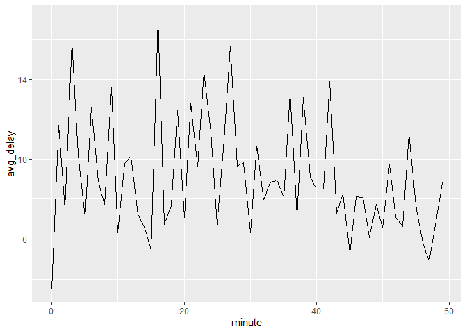

# Chapter 17, Dates and Times


``` r
library(tidyverse)
```

    ── Attaching core tidyverse packages ──────────────────────── tidyverse 2.0.0 ──
    ✔ dplyr     1.1.4     ✔ readr     2.1.5
    ✔ forcats   1.0.0     ✔ stringr   1.5.1
    ✔ ggplot2   3.5.2     ✔ tibble    3.3.0
    ✔ lubridate 1.9.4     ✔ tidyr     1.3.1
    ✔ purrr     1.0.4     
    ── Conflicts ────────────────────────────────────────── tidyverse_conflicts() ──
    ✖ dplyr::filter() masks stats::filter()
    ✖ dplyr::lag()    masks stats::lag()
    ℹ Use the conflicted package (<http://conflicted.r-lib.org/>) to force all conflicts to become errors

``` r
library(nycflights13)
```

# Creating Date/Times

Three types of date/time data that refer to an instant in time:

A date. Tibbles print this as . A time within a day. Tibbles print this
as . A date-time is a date plus a time: it uniquely identifies an
instant in time (typically to the nearest second). Tibbles print this as

To get the current date or date-time you can use today() or now():

``` r
today()
```

    [1] "2025-08-06"

``` r
now()
```

    [1] "2025-08-06 15:10:32 PDT"

# Creating date/time During Import

``` r
csv <- "
  date,datetime
  2022-01-02,2022-01-02 05:12
"
read_csv(csv)
```

    Rows: 1 Columns: 2
    ── Column specification ────────────────────────────────────────────────────────
    Delimiter: ","
    dttm (1): datetime
    date (1): date

    ℹ Use `spec()` to retrieve the full column specification for this data.
    ℹ Specify the column types or set `show_col_types = FALSE` to quiet this message.

    # A tibble: 1 × 2
      date       datetime           
      <date>     <dttm>             
    1 2022-01-02 2022-01-02 05:12:00

``` r
csv <- "
  date
  01/02/15
"

read_csv(csv, col_types = cols(date = col_date("%m/%d/%y")))
```

    # A tibble: 1 × 1
      date      
      <date>    
    1 2015-01-02

``` r
read_csv(csv, col_types = cols(date = col_date("%d/%m/%y")))
```

    # A tibble: 1 × 1
      date      
      <date>    
    1 2015-02-01

``` r
read_csv(csv, col_types = cols(date = col_date("%y/%m/%d")))
```

    # A tibble: 1 × 1
      date      
      <date>    
    1 2001-02-15

# Creating date/time From Strings

``` r
ymd("2017-01-31")
```

    [1] "2017-01-31"

``` r
mdy("January 31st, 2017")
```

    [1] "2017-01-31"

``` r
dmy("31-Jan-2017")
```

    [1] "2017-01-31"

``` r
ymd_hms("2017-01-31 20:11:59")
```

    [1] "2017-01-31 20:11:59 UTC"

``` r
mdy_hm("01/31/2017 08:01")
```

    [1] "2017-01-31 08:01:00 UTC"

``` r
ymd("2017-01-31", tz = "UTC")
```

    [1] "2017-01-31 UTC"

# Creating date/time From Individual Components

``` r
flights |> 
  select(year, month, day, hour, minute)
```

    # A tibble: 336,776 × 5
        year month   day  hour minute
       <int> <int> <int> <dbl>  <dbl>
     1  2013     1     1     5     15
     2  2013     1     1     5     29
     3  2013     1     1     5     40
     4  2013     1     1     5     45
     5  2013     1     1     6      0
     6  2013     1     1     5     58
     7  2013     1     1     6      0
     8  2013     1     1     6      0
     9  2013     1     1     6      0
    10  2013     1     1     6      0
    # ℹ 336,766 more rows

``` r
flights |> 
  select(year, month, day, hour, minute) |> 
  mutate(departure = make_datetime(year, month, day, hour, minute))
```

    # A tibble: 336,776 × 6
        year month   day  hour minute departure          
       <int> <int> <int> <dbl>  <dbl> <dttm>             
     1  2013     1     1     5     15 2013-01-01 05:15:00
     2  2013     1     1     5     29 2013-01-01 05:29:00
     3  2013     1     1     5     40 2013-01-01 05:40:00
     4  2013     1     1     5     45 2013-01-01 05:45:00
     5  2013     1     1     6      0 2013-01-01 06:00:00
     6  2013     1     1     5     58 2013-01-01 05:58:00
     7  2013     1     1     6      0 2013-01-01 06:00:00
     8  2013     1     1     6      0 2013-01-01 06:00:00
     9  2013     1     1     6      0 2013-01-01 06:00:00
    10  2013     1     1     6      0 2013-01-01 06:00:00
    # ℹ 336,766 more rows

``` r
make_datetime_100 <- function(year, month, day, time) {
  make_datetime(year, month, day, time %/% 100, time %% 100)
}

flights_dt <- flights |> 
  filter(!is.na(dep_time), !is.na(arr_time)) |> 
  mutate(
    dep_time = make_datetime_100(year, month, day, dep_time),
    arr_time = make_datetime_100(year, month, day, arr_time),
    sched_dep_time = make_datetime_100(year, month, day, sched_dep_time),
    sched_arr_time = make_datetime_100(year, month, day, sched_arr_time)
  ) |> 
  select(origin, dest, ends_with("delay"), ends_with("time"))

flights_dt
```

    # A tibble: 328,063 × 9
       origin dest  dep_delay arr_delay dep_time            sched_dep_time     
       <chr>  <chr>     <dbl>     <dbl> <dttm>              <dttm>             
     1 EWR    IAH           2        11 2013-01-01 05:17:00 2013-01-01 05:15:00
     2 LGA    IAH           4        20 2013-01-01 05:33:00 2013-01-01 05:29:00
     3 JFK    MIA           2        33 2013-01-01 05:42:00 2013-01-01 05:40:00
     4 JFK    BQN          -1       -18 2013-01-01 05:44:00 2013-01-01 05:45:00
     5 LGA    ATL          -6       -25 2013-01-01 05:54:00 2013-01-01 06:00:00
     6 EWR    ORD          -4        12 2013-01-01 05:54:00 2013-01-01 05:58:00
     7 EWR    FLL          -5        19 2013-01-01 05:55:00 2013-01-01 06:00:00
     8 LGA    IAD          -3       -14 2013-01-01 05:57:00 2013-01-01 06:00:00
     9 JFK    MCO          -3        -8 2013-01-01 05:57:00 2013-01-01 06:00:00
    10 LGA    ORD          -2         8 2013-01-01 05:58:00 2013-01-01 06:00:00
    # ℹ 328,053 more rows
    # ℹ 3 more variables: arr_time <dttm>, sched_arr_time <dttm>, air_time <dbl>

``` r
flights_dt |> 
  ggplot(aes(x = dep_time)) + 
  geom_freqpoly(binwidth = 86400) # 86400 seconds = 1 day
```


``` r
flights_dt |> 
  filter(dep_time < ymd(20130102)) |> 
  ggplot(aes(x = dep_time)) + 
  geom_freqpoly(binwidth = 600) # 600 s = 10 minutes
```


as_datetime() and as_date() switch between date-time and a date:

``` r
as_datetime(today())
```

    [1] "2025-08-06 UTC"

``` r
as_date(now())
```

    [1] "2025-08-06"

# Exercises pt 1 of 3

1.  

``` r
ymd(c("2010-10-10", "bananas"))
```

    Warning: 1 failed to parse.

    [1] "2010-10-10" NA          

It gives a warning code: 1 failed to parese. 2.

``` r
today(tzone = "EST")
```

    [1] "2025-08-06"

It gives the date based on the time zone. 3.

``` r
library(readr)
library(lubridate)

d1 <- mdy("January 1, 2010", tz = "UTC")         
d2 <- ymd("2015-Mar-07", tz = "UTC")             
d3 <- dmy("06-Jun-2017", tz = "UTC")            
d4 <- mdy(c("August 19, 2015", "July 1, 2015"), tz = "UTC") 
d5 <- mdy("12/30/14", tz = "UTC")                

# Times
t1 <- hms("17:05:00", tz = "UTC")             
```

    Warning in .parse_hms(..., order = "HMS", quiet = quiet): Some strings failed
    to parse

``` r
t2 <- hms("23:15:10.12", tz = "UTC")            
```

    Warning in .parse_hms(..., order = "HMS", quiet = quiet): Some strings failed
    to parse

# Gettings Date-time Components

Pull out individual parts of the date with the accessor functions
year(), month(), mday() (day of the month), yday() (day of the year),
wday() (day of the week), hour(), minute(), and second()

``` r
datetime <- ymd_hms("2026-07-08 12:34:56")

year(datetime)
```

    [1] 2026

``` r
month(datetime)
```

    [1] 7

``` r
mday(datetime)
```

    [1] 8

``` r
yday(datetime)
```

    [1] 189

``` r
wday(datetime)
```

    [1] 4

``` r
month(datetime, label = TRUE)
```

    [1] Jul
    12 Levels: Jan < Feb < Mar < Apr < May < Jun < Jul < Aug < Sep < ... < Dec

``` r
wday(datetime, label = TRUE, abbr = FALSE)
```

    [1] Wednesday
    7 Levels: Sunday < Monday < Tuesday < Wednesday < Thursday < ... < Saturday

``` r
flights_dt |> 
  mutate(wday = wday(dep_time, label = TRUE)) |> 
  ggplot(aes(x = wday)) +
  geom_bar()
```


``` r
flights_dt |> 
  mutate(minute = minute(dep_time)) |> 
  group_by(minute) |> 
  summarize(
    avg_delay = mean(dep_delay, na.rm = TRUE),
    n = n()
  ) |> 
  ggplot(aes(x = minute, y = avg_delay)) +
  geom_line()
```


``` r
sched_dep <- flights_dt |> 
  mutate(minute = minute(sched_dep_time)) |> 
  group_by(minute) |> 
  summarize(
    avg_delay = mean(arr_delay, na.rm = TRUE),
    n = n()
  )

ggplot(sched_dep, aes(x = minute, y = avg_delay)) +
  geom_line()
```



# Rounding

Round the date to a nearby unit of time, with floor_date(),
round_date(), and ceiling_date()

``` r
flights_dt |> 
  count(week = floor_date(dep_time, "week")) |> 
  ggplot(aes(x = week, y = n)) +
  geom_line() + 
  geom_point()
```


``` r
flights_dt |> 
  mutate(dep_hour = dep_time - floor_date(dep_time, "day")) |> 
  ggplot(aes(x = dep_hour)) +
  geom_freqpoly(binwidth = 60 * 30)
```

    Don't know how to automatically pick scale for object of type <difftime>.
    Defaulting to continuous.


``` r
flights_dt |> 
  mutate(dep_hour = hms::as_hms(dep_time - floor_date(dep_time, "day"))) |> 
  ggplot(aes(x = dep_hour)) +
  geom_freqpoly(binwidth = 60 * 30)
```


# Modifying Components

``` r
(datetime <- ymd_hms("2026-07-08 12:34:56"))
```

    [1] "2026-07-08 12:34:56 UTC"

``` r
year(datetime) <- 2030
datetime
```

    [1] "2030-07-08 12:34:56 UTC"

``` r
month(datetime) <- 01
datetime
```

    [1] "2030-01-08 12:34:56 UTC"

``` r
hour(datetime) <- hour(datetime) + 1
datetime
```

    [1] "2030-01-08 13:34:56 UTC"

``` r
update(datetime, year = 2030, month = 2, mday = 2, hour = 2)
```

    [1] "2030-02-02 02:34:56 UTC"

# Exercises pt 2 of 3

1.  

``` r
flights_hourly <- flights |> 
  filter(!is.na(dep_time)) |> 
  mutate(
    dep_hour = dep_time %/% 100,  # Convert HHMM to hour
    month = factor(month, levels = 1:12, labels = month.name)
  )

ggplot(flights_hourly, aes(x = dep_hour)) +
  geom_histogram(binwidth = 1, fill = "steelblue", color = "white") +
  facet_wrap(~ month, ncol = 3) +
  labs(
    title = "Distribution of Departure Times by Hour Across Months",
    x = "Departure Hour",
    y = "Number of Flights"
  ) +
  theme_minimal()
```


2.  

``` r
flights |> 
  filter(!is.na(dep_time), !is.na(sched_dep_time), !is.na(dep_delay)) |> 
  mutate(
    dep_mins  = (dep_time %/% 100) * 60 + (dep_time %% 100),
    sched_mins = (sched_dep_time %/% 100) * 60 + (sched_dep_time %% 100),
    diff = dep_mins - sched_mins
  ) |> 
  summarize(
    mean_diff = mean(diff - dep_delay),
    max_diff  = max(diff - dep_delay),
    min_diff  = min(diff - dep_delay)
  )
```

    # A tibble: 1 × 3
      mean_diff max_diff min_diff
          <dbl>    <dbl>    <dbl>
    1     -5.29        0    -1440

3.  

``` r
flights |> 
  filter(!is.na(dep_time), !is.na(arr_time), !is.na(air_time)) |> 
  mutate(
    dep_mins = (dep_time %/% 100) * 60 + (dep_time %% 100),
    arr_mins = (arr_time %/% 100) * 60 + (arr_time %% 100),
    duration = if_else(arr_mins < dep_mins, arr_mins + 1440 - dep_mins, arr_mins - dep_mins),
    diff = duration - air_time
  ) |> 
  summarize(
    mean_diff = mean(diff),
    min_diff  = min(diff),
    max_diff  = max(diff)
  )
```

    # A tibble: 1 × 3
      mean_diff min_diff max_diff
          <dbl>    <dbl>    <dbl>
    1     -13.4     -345      204

``` r
flights |> 
  filter(!is.na(sched_dep_time), !is.na(dep_delay)) |> 
  mutate(
    sched_hour = sched_dep_time %/% 100
  ) |> 
  group_by(sched_hour) |> 
  summarize(
    avg_delay = mean(dep_delay, na.rm = TRUE)
  ) |> 
  ggplot(aes(x = sched_hour, y = avg_delay)) +
  geom_line(color = "firebrick", linewidth = 1.2) +
  labs(
    title = "Average Departure Delay by Scheduled Hour",
    x = "Scheduled Departure Hour",
    y = "Average Delay (minutes)"
  ) +
  theme_minimal()
```


The average delay increases throughout the day peaking at hr 18:00

5.  

``` r
flights_weekday <- flights |> 
  filter(!is.na(dep_delay)) |> 
  mutate(
    date = as.Date(paste(year, month, day, sep = "-")),
    weekday = weekdays(date)
  )
flights_weekday |> 
  group_by(weekday) |> 
  summarize(avg_delay = mean(dep_delay)) |> 
  arrange(avg_delay)
```

    # A tibble: 7 × 2
      weekday   avg_delay
      <chr>         <dbl>
    1 Saturday       7.65
    2 Tuesday       10.6 
    3 Sunday        11.6 
    4 Wednesday     11.8 
    5 Friday        14.7 
    6 Monday        14.8 
    7 Thursday      16.1 

Saturday has the lowest average delay

6.  Both distributions show strong peaks at “preferred” values in carat
    values, and round clock times

``` r
library(ggplot2)

ggplot(diamonds, aes(x = carat)) +
  geom_histogram(binwidth = 0.01, fill = "skyblue") +
  labs(title = "Distribution of Diamond Carat Sizes")
```


``` r
flights |> 
  filter(!is.na(sched_dep_time)) |> 
  mutate(hour = sched_dep_time %/% 100) |> 
  ggplot(aes(x = hour)) +
  geom_histogram(binwidth = 0.5, fill = "salmon") +
  labs(title = "Distribution of Scheduled Departure Hours")
```


7.  

``` r
flights |> 
  filter(!is.na(dep_time), !is.na(sched_dep_time)) |> 
  mutate(
    dep_min   = dep_time %% 100,
    sched_min = sched_dep_time %% 100,
    early     = dep_delay < 0,
    target_bin = dep_min %in% c(20:29, 50:59)
  ) |> 
  filter(target_bin) |> 
  count(early) |> 
  mutate(pct = n / sum(n))
```

    # A tibble: 2 × 3
      early     n   pct
      <lgl> <int> <dbl>
    1 FALSE 44878 0.318
    2 TRUE  96265 0.682

# Durations

``` r
age <- today() - ymd("1979-10-14")
age
```

    Time difference of 16733 days

``` r
as.duration(age)
```

    [1] "1445731200s (~45.81 years)"

``` r
dseconds(15)
```

    [1] "15s"

``` r
dminutes(10)
```

    [1] "600s (~10 minutes)"

``` r
dhours(c(12, 24))
```

    [1] "43200s (~12 hours)" "86400s (~1 days)"  

``` r
ddays(0:5)
```

    [1] "0s"                "86400s (~1 days)"  "172800s (~2 days)"
    [4] "259200s (~3 days)" "345600s (~4 days)" "432000s (~5 days)"

``` r
dweeks(3)
```

    [1] "1814400s (~3 weeks)"

``` r
dyears(1)
```

    [1] "31557600s (~1 years)"

``` r
2 * dyears(1)
```

    [1] "63115200s (~2 years)"

``` r
dyears(1) + dweeks(12) + dhours(15)
```

    [1] "38869200s (~1.23 years)"

``` r
tomorrow <- today() + ddays(1)
last_year <- today() - dyears(1)
```

``` r
one_am <- ymd_hms("2026-03-08 01:00:00", tz = "America/New_York")

one_am
```

    [1] "2026-03-08 01:00:00 EST"

``` r
one_am + ddays(1)
```

    [1] "2026-03-09 02:00:00 EDT"

# Period

``` r
one_am
```

    [1] "2026-03-08 01:00:00 EST"

``` r
one_am + days(1)
```

    [1] "2026-03-09 01:00:00 EDT"

``` r
hours(c(12, 24))
```

    [1] "12H 0M 0S" "24H 0M 0S"

``` r
days(7)
```

    [1] "7d 0H 0M 0S"

``` r
months(1:6)
```

    [1] "1m 0d 0H 0M 0S" "2m 0d 0H 0M 0S" "3m 0d 0H 0M 0S" "4m 0d 0H 0M 0S"
    [5] "5m 0d 0H 0M 0S" "6m 0d 0H 0M 0S"

``` r
10 * (months(6) + days(1))
```

    [1] "60m 10d 0H 0M 0S"

``` r
days(50) + hours(25) + minutes(2)
```

    [1] "50d 25H 2M 0S"

``` r
# A leap year
ymd("2024-01-01") + dyears(1)
```

    [1] "2024-12-31 06:00:00 UTC"

``` r
ymd("2024-01-01") + years(1)
```

    [1] "2025-01-01"

``` r
# Daylight saving time
one_am + ddays(1)
```

    [1] "2026-03-09 02:00:00 EDT"

``` r
one_am + days(1)
```

    [1] "2026-03-09 01:00:00 EDT"

``` r
flights_dt |> 
  filter(arr_time < dep_time) 
```

    # A tibble: 10,633 × 9
       origin dest  dep_delay arr_delay dep_time            sched_dep_time     
       <chr>  <chr>     <dbl>     <dbl> <dttm>              <dttm>             
     1 EWR    BQN           9        -4 2013-01-01 19:29:00 2013-01-01 19:20:00
     2 JFK    DFW          59        NA 2013-01-01 19:39:00 2013-01-01 18:40:00
     3 EWR    TPA          -2         9 2013-01-01 20:58:00 2013-01-01 21:00:00
     4 EWR    SJU          -6       -12 2013-01-01 21:02:00 2013-01-01 21:08:00
     5 EWR    SFO          11       -14 2013-01-01 21:08:00 2013-01-01 20:57:00
     6 LGA    FLL         -10        -2 2013-01-01 21:20:00 2013-01-01 21:30:00
     7 EWR    MCO          41        43 2013-01-01 21:21:00 2013-01-01 20:40:00
     8 JFK    LAX          -7       -24 2013-01-01 21:28:00 2013-01-01 21:35:00
     9 EWR    FLL          49        28 2013-01-01 21:34:00 2013-01-01 20:45:00
    10 EWR    FLL          -9       -14 2013-01-01 21:36:00 2013-01-01 21:45:00
    # ℹ 10,623 more rows
    # ℹ 3 more variables: arr_time <dttm>, sched_arr_time <dttm>, air_time <dbl>

``` r
flights_dt <- flights_dt |> 
  mutate(
    overnight = arr_time < dep_time,
    arr_time = arr_time + days(overnight),
    sched_arr_time = sched_arr_time + days(overnight)
  )
```

``` r
flights_dt |> 
  filter(arr_time < dep_time) 
```

    # A tibble: 0 × 10
    # ℹ 10 variables: origin <chr>, dest <chr>, dep_delay <dbl>, arr_delay <dbl>,
    #   dep_time <dttm>, sched_dep_time <dttm>, arr_time <dttm>,
    #   sched_arr_time <dttm>, air_time <dbl>, overnight <lgl>

# Intervals

``` r
years(1) / days(1)
```

    [1] 365.25

``` r
y2023 <- ymd("2023-01-01") %--% ymd("2024-01-01")
y2024 <- ymd("2024-01-01") %--% ymd("2025-01-01")

y2023
```

    [1] 2023-01-01 UTC--2024-01-01 UTC

``` r
y2024
```

    [1] 2024-01-01 UTC--2025-01-01 UTC

``` r
y2023 / days(1)
```

    [1] 365

``` r
y2024 / days(1)
```

    [1] 366

# Exercises pt 3 of 3

1.  The ! in front of overnight flips the logical values, so anything
    true for overnight is false for !overnight.
2.  

``` r
first_days_2015 <- seq(from = as.Date("2015-01-01"),
                       to   = as.Date("2015-12-01"),
                       by   = "month")
first_days_2015
```

     [1] "2015-01-01" "2015-02-01" "2015-03-01" "2015-04-01" "2015-05-01"
     [6] "2015-06-01" "2015-07-01" "2015-08-01" "2015-09-01" "2015-10-01"
    [11] "2015-11-01" "2015-12-01"

``` r
library(lubridate)

current_year <- year(Sys.Date())

first_days_current <- seq(from = as.Date(paste0(current_year, "-01-01")),
                          to   = as.Date(paste0(current_year, "-12-01")),
                          by   = "month")
first_days_current
```

     [1] "2025-01-01" "2025-02-01" "2025-03-01" "2025-04-01" "2025-05-01"
     [6] "2025-06-01" "2025-07-01" "2025-08-01" "2025-09-01" "2025-10-01"
    [11] "2025-11-01" "2025-12-01"

3.  

``` r
bday <- dmy("02, 09, 2004")
bday
```

    [1] "2004-09-02"

``` r
age <- today() - bday
age
```

    Time difference of 7643 days

``` r
as.duration(age)
```

    [1] "660355200s (~20.93 years)"

4.  You’re trying to divide an interval by a duration, months are not
    fixed units, so R doesn’t know how many “months” fit into that
    interval.
