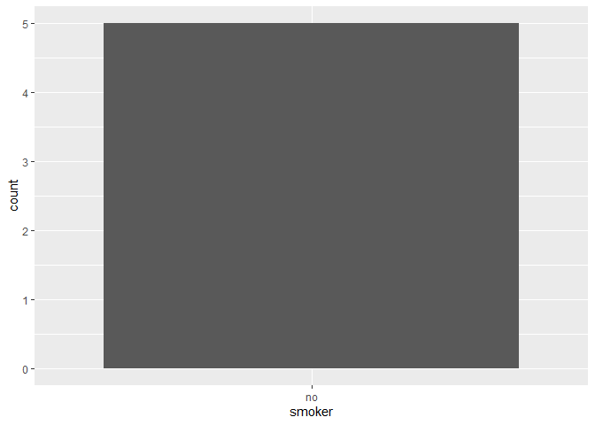
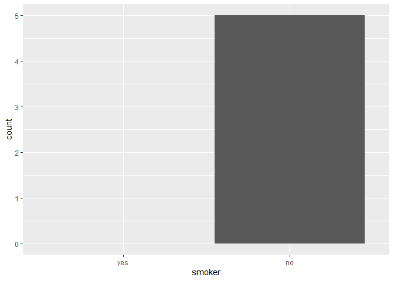

# Chapter 18, Missing Values


``` r
library(tidyverse)
```

    ── Attaching core tidyverse packages ──────────────────────── tidyverse 2.0.0 ──
    ✔ dplyr     1.1.4     ✔ readr     2.1.5
    ✔ forcats   1.0.0     ✔ stringr   1.5.1
    ✔ ggplot2   3.5.2     ✔ tibble    3.3.0
    ✔ lubridate 1.9.4     ✔ tidyr     1.3.1
    ✔ purrr     1.0.4     
    ── Conflicts ────────────────────────────────────────── tidyverse_conflicts() ──
    ✖ dplyr::filter() masks stats::filter()
    ✖ dplyr::lag()    masks stats::lag()
    ℹ Use the conflicted package (<http://conflicted.r-lib.org/>) to force all conflicts to become errors

# Last Observation Carried Forward

``` r
treatment <- tribble(
  ~person,           ~treatment, ~response,
  "Derrick Whitmore", 1,         7,
  NA,                 2,         10,
  NA,                 3,         NA,
  "Katherine Burke",  1,         4
)
```

“last observation carried forward”: You can fill in these missing values
with tidyr::fill()

``` r
treatment |>
  fill(everything())
```

    # A tibble: 4 × 3
      person           treatment response
      <chr>                <dbl>    <dbl>
    1 Derrick Whitmore         1        7
    2 Derrick Whitmore         2       10
    3 Derrick Whitmore         3       10
    4 Katherine Burke          1        4

# Fixed Values

use dplyr::coalesce() to replace missing values that represent some
fixed and known value:

``` r
x <- c(1, 4, 5, 7, NA)
coalesce(x, 0)
```

    [1] 1 4 5 7 0

``` r
x <- c(1, 4, 5, 7, -99)
na_if(x, -99)
```

    [1]  1  4  5  7 NA

# NaN

NaN (pronounced “nan”), or not a number

``` r
x <- c(NA, NaN)
x * 10
```

    [1]  NA NaN

``` r
x == 1
```

    [1] NA NA

``` r
is.na(x)
```

    [1] TRUE TRUE

If you need to distinguish an NA from a NaN, you can use is.nan(x)

``` r
0 / 0 
```

    [1] NaN

``` r
0 * Inf
```

    [1] NaN

``` r
Inf - Inf
```

    [1] NaN

``` r
sqrt(-1)
```

    Warning in sqrt(-1): NaNs produced

    [1] NaN

# Implicit Missing Values

``` r
stocks <- tibble(
  year  = c(2020, 2020, 2020, 2020, 2021, 2021, 2021),
  qtr   = c(   1,    2,    3,    4,    2,    3,    4),
  price = c(1.88, 0.59, 0.35,   NA, 0.92, 0.17, 2.66)
)
```

# Pivoting

``` r
stocks |>
  pivot_wider(
    names_from = qtr, 
    values_from = price
  )
```

    # A tibble: 2 × 5
       year   `1`   `2`   `3`   `4`
      <dbl> <dbl> <dbl> <dbl> <dbl>
    1  2020  1.88  0.59  0.35 NA   
    2  2021 NA     0.92  0.17  2.66

# Complete

complete() allows you to generate explicit missing values by providing a
set of variables that define the combination of rows that should exist:

``` r
stocks |>
  complete(year, qtr)
```

    # A tibble: 8 × 3
       year   qtr price
      <dbl> <dbl> <dbl>
    1  2020     1  1.88
    2  2020     2  0.59
    3  2020     3  0.35
    4  2020     4 NA   
    5  2021     1 NA   
    6  2021     2  0.92
    7  2021     3  0.17
    8  2021     4  2.66

``` r
stocks |>
  complete(year = 2019:2021, qtr)
```

    # A tibble: 12 × 3
        year   qtr price
       <dbl> <dbl> <dbl>
     1  2019     1 NA   
     2  2019     2 NA   
     3  2019     3 NA   
     4  2019     4 NA   
     5  2020     1  1.88
     6  2020     2  0.59
     7  2020     3  0.35
     8  2020     4 NA   
     9  2021     1 NA   
    10  2021     2  0.92
    11  2021     3  0.17
    12  2021     4  2.66

# Joins

anti_join(x, y) is a particularly useful tool here because it selects
only the rows in x that don’t have a match in y

``` r
library(nycflights13)

flights |> 
  distinct(faa = dest) |> 
  anti_join(airports)
```

    Joining with `by = join_by(faa)`

    # A tibble: 4 × 1
      faa  
      <chr>
    1 BQN  
    2 SJU  
    3 STT  
    4 PSE  

``` r
flights |> 
  distinct(tailnum) |> 
  anti_join(planes)
```

    Joining with `by = join_by(tailnum)`

    # A tibble: 722 × 1
       tailnum
       <chr>  
     1 N3ALAA 
     2 N3DUAA 
     3 N542MQ 
     4 N730MQ 
     5 N9EAMQ 
     6 N532UA 
     7 N3EMAA 
     8 N518MQ 
     9 N3BAAA 
    10 N3CYAA 
    # ℹ 712 more rows

# Exercises pt 1 of 1

``` r
missing_planes <- flights |> 
  anti_join(planes, by = "tailnum")

missing_planes
```

    # A tibble: 52,606 × 19
        year month   day dep_time sched_dep_time dep_delay arr_time sched_arr_time
       <int> <int> <int>    <int>          <int>     <dbl>    <int>          <int>
     1  2013     1     1      558            600        -2      753            745
     2  2013     1     1      559            600        -1      941            910
     3  2013     1     1      600            600         0      837            825
     4  2013     1     1      602            605        -3      821            805
     5  2013     1     1      608            600         8      807            735
     6  2013     1     1      611            600        11      945            931
     7  2013     1     1      623            610        13      920            915
     8  2013     1     1      624            630        -6      840            830
     9  2013     1     1      628            630        -2     1137           1140
    10  2013     1     1      629            630        -1      824            810
    # ℹ 52,596 more rows
    # ℹ 11 more variables: arr_delay <dbl>, carrier <chr>, flight <int>,
    #   tailnum <chr>, origin <chr>, dest <chr>, air_time <dbl>, distance <dbl>,
    #   hour <dbl>, minute <dbl>, time_hour <dttm>

``` r
missing_planes |> 
  count(carrier, sort = TRUE)
```

    # A tibble: 10 × 2
       carrier     n
       <chr>   <int>
     1 MQ      25397
     2 AA      22558
     3 UA       1693
     4 9E       1044
     5 B6        830
     6 US        699
     7 FL        187
     8 DL        110
     9 F9         50
    10 WN         38

Some carriers (like MQ or US) may have more missing planes than others.

# Factors and Empty Groups

``` r
health <- tibble(
  name   = c("Ikaia", "Oletta", "Leriah", "Dashay", "Tresaun"),
  smoker = factor(c("no", "no", "no", "no", "no"), levels = c("yes", "no")),
  age    = c(34, 88, 75, 47, 56),
)
```

``` r
health |> count(smoker)
```

    # A tibble: 1 × 2
      smoker     n
      <fct>  <int>
    1 no         5

``` r
health |> count(smoker, .drop = FALSE)
```

    # A tibble: 2 × 2
      smoker     n
      <fct>  <int>
    1 yes        0
    2 no         5

``` r
ggplot(health, aes(x = smoker)) +
  geom_bar() +
  scale_x_discrete()
```



``` r
ggplot(health, aes(x = smoker)) +
  geom_bar() +
  scale_x_discrete(drop = FALSE)
```



``` r
health |> 
  group_by(smoker, .drop = FALSE) |> 
  summarize(
    n = n(),
    mean_age = mean(age),
    min_age = min(age),
    max_age = max(age),
    sd_age = sd(age)
  )
```

    Warning: There were 2 warnings in `summarize()`.
    The first warning was:
    ℹ In argument: `min_age = min(age)`.
    ℹ In group 1: `smoker = yes`.
    Caused by warning in `min()`:
    ! no non-missing arguments to min; returning Inf
    ℹ Run `dplyr::last_dplyr_warnings()` to see the 1 remaining warning.

    # A tibble: 2 × 6
      smoker     n mean_age min_age max_age sd_age
      <fct>  <int>    <dbl>   <dbl>   <dbl>  <dbl>
    1 yes        0      NaN     Inf    -Inf   NA  
    2 no         5       60      34      88   21.6

``` r
# A vector containing two missing values
x1 <- c(NA, NA)
length(x1)
```

    [1] 2

``` r
# A vector containing nothing
x2 <- numeric()
length(x2)
```

    [1] 0

``` r
health |> 
  group_by(smoker) |> 
  summarize(
    n = n(),
    mean_age = mean(age),
    min_age = min(age),
    max_age = max(age),
    sd_age = sd(age)
  ) |> 
  complete(smoker)
```

    # A tibble: 2 × 6
      smoker     n mean_age min_age max_age sd_age
      <fct>  <int>    <dbl>   <dbl>   <dbl>  <dbl>
    1 yes       NA       NA      NA      NA   NA  
    2 no         5       60      34      88   21.6
