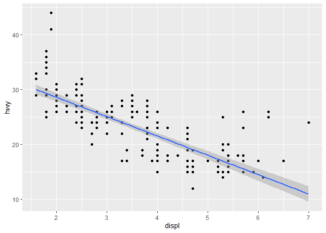

# Chpater_2, Workflow: basics


# Coding Basics

``` r
1 / 200 * 30
```

    [1] 0.15

``` r
(59 + 73 + 2) / 3
```

    [1] 44.66667

``` r
sin(pi / 2)
```

    [1] 1

``` r
x <- 3 * 4
print(x)
```

    [1] 12

You can combine multiple elements into a vector with c():

``` r
primes <- c(2, 3, 5, 7, 11, 13)
```

``` r
primes * 2
```

    [1]  4  6 10 14 22 26

``` r
primes - 1
```

    [1]  1  2  4  6 10 12

All R statements where you create objects, assignment statements, have
the same form:

object_name \<- value

Use \_ for spaces, object names must start with a letter and can not use
numbers \# Comments Anything after \# is ignored in a line, allows
someone to document work and communicate to read

# Calling Functions

``` r
seq(from = 1, to = 10)
```

     [1]  1  2  3  4  5  6  7  8  9 10

``` r
seq(1, 10)
```

     [1]  1  2  3  4  5  6  7  8  9 10

# Exercises pt 1 of 1

# Question 1

You have to put “my_variable” in an argument that would display the
object like print()

# Question 2

``` r
library(tidyverse)
```

    ── Attaching core tidyverse packages ──────────────────────── tidyverse 2.0.0 ──
    ✔ dplyr     1.1.4     ✔ readr     2.1.5
    ✔ forcats   1.0.0     ✔ stringr   1.5.1
    ✔ ggplot2   3.5.2     ✔ tibble    3.3.0
    ✔ lubridate 1.9.4     ✔ tidyr     1.3.1
    ✔ purrr     1.0.4     
    ── Conflicts ────────────────────────────────────────── tidyverse_conflicts() ──
    ✖ dplyr::filter() masks stats::filter()
    ✖ dplyr::lag()    masks stats::lag()
    ℹ Use the conflicted package (<http://conflicted.r-lib.org/>) to force all conflicts to become errors

``` r
ggplot(mpg, aes(x = displ, y = hwy)) + 
  geom_point(aes(x = displ, y = hwy)) +
  geom_smooth(method = "lm")
```

    `geom_smooth()` using formula = 'y ~ x'



# Question 3

The keyboard shortcut reference commands are displayed, you can find the
same information the the “Tools” tab.

# Question 4

``` r
my_bar_plot <- ggplot(mpg, aes(x = class)) +
  geom_bar() 

my_scatter_plot <- ggplot(mpg, aes(x = cty, y = hwy)) +
  geom_point() 

ggsave(filename = "mpg-plot.png", plot = my_bar_plot)
```

    Saving 7 x 5 in image

The first plot, because its associated with the object name
“my_bar_plot”
