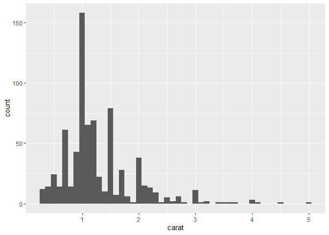

# Chapter 26, Iteration


``` r
library(tidyverse)
```

    ── Attaching core tidyverse packages ──────────────────────── tidyverse 2.0.0 ──
    ✔ dplyr     1.1.4     ✔ readr     2.1.5
    ✔ forcats   1.0.0     ✔ stringr   1.5.1
    ✔ ggplot2   3.5.2     ✔ tibble    3.3.0
    ✔ lubridate 1.9.4     ✔ tidyr     1.3.1
    ✔ purrr     1.0.4     
    ── Conflicts ────────────────────────────────────────── tidyverse_conflicts() ──
    ✖ dplyr::filter() masks stats::filter()
    ✖ dplyr::lag()    masks stats::lag()
    ℹ Use the conflicted package (<http://conflicted.r-lib.org/>) to force all conflicts to become errors

# Modifying Multiple Columns

``` r
df <- tibble(
  a = rnorm(10),
  b = rnorm(10),
  c = rnorm(10),
  d = rnorm(10)
)
```

``` r
df |> summarize(
  n = n(),
  a = median(a),
  b = median(b),
  c = median(c),
  d = median(d),
)
```

    # A tibble: 1 × 5
          n       a     b     c      d
      <int>   <dbl> <dbl> <dbl>  <dbl>
    1    10 -0.0863 0.102 0.341 -0.155

``` r
df |> summarize(
  n = n(),
  across(a:d, median),
)
```

    # A tibble: 1 × 5
          n       a     b     c      d
      <int>   <dbl> <dbl> <dbl>  <dbl>
    1    10 -0.0863 0.102 0.341 -0.155

across(): .cols: specifies which columns you want to iterate over .fns:
specifies what to do with each column .names: controls names of output
columns

# Selecting Columns with .cols

across(everything()): selects every (non-grouping) column

where() allows you to select columns based on their type:
where(is.numeric) selects all numeric columns. where(is.character)
selects all string columns. where(is.Date) selects all date columns.
where(is.POSIXct) selects all date-time columns. where(is.logical)
selects all logical columns.

``` r
df <- tibble(
  grp = sample(2, 10, replace = TRUE),
  a = rnorm(10),
  b = rnorm(10),
  c = rnorm(10),
  d = rnorm(10)
)

df |> 
  group_by(grp) |> 
  summarize(across(everything(), median))
```

    # A tibble: 2 × 5
        grp      a      b       c      d
      <int>  <dbl>  <dbl>   <dbl>  <dbl>
    1     1  1.15  -0.282 0.323    0.487
    2     2 -0.717 -0.552 0.00733 -0.604

# Calling a Single Function

``` r
df |> 
  group_by(grp) |> 
  summarize(across(everything(), median))
```

    # A tibble: 2 × 5
        grp      a      b       c      d
      <int>  <dbl>  <dbl>   <dbl>  <dbl>
    1     1  1.15  -0.282 0.323    0.487
    2     2 -0.717 -0.552 0.00733 -0.604

# Calling Multiple Functions

``` r
rnorm_na <- function(n, n_na, mean = 0, sd = 1) {
  sample(c(rnorm(n - n_na, mean = mean, sd = sd), rep(NA, n_na)))
}

df_miss <- tibble(
  a = rnorm_na(5, 1),
  b = rnorm_na(5, 1),
  c = rnorm_na(5, 2),
  d = rnorm(5)
)
df_miss |> 
  summarize(
    across(a:d, median),
    n = n()
  )
```

    # A tibble: 1 × 5
          a     b     c      d     n
      <dbl> <dbl> <dbl>  <dbl> <int>
    1    NA    NA    NA -0.165     5

``` r
df_miss |> 
  summarize(
    across(a:d, function(x) median(x, na.rm = TRUE)),
    n = n()
  )
```

    # A tibble: 1 × 5
             a      b     c      d     n
         <dbl>  <dbl> <dbl>  <dbl> <int>
    1 -0.00332 0.0296 0.719 -0.165     5

``` r
df_miss |> 
  summarize(
    across(a:d, \(x) median(x, na.rm = TRUE)),
    n = n()
  )
```

    # A tibble: 1 × 5
             a      b     c      d     n
         <dbl>  <dbl> <dbl>  <dbl> <int>
    1 -0.00332 0.0296 0.719 -0.165     5

``` r
df_miss |> 
  summarize(
    a = median(a, na.rm = TRUE),
    b = median(b, na.rm = TRUE),
    c = median(c, na.rm = TRUE),
    d = median(d, na.rm = TRUE),
    n = n()
  )
```

    # A tibble: 1 × 5
             a      b     c      d     n
         <dbl>  <dbl> <dbl>  <dbl> <int>
    1 -0.00332 0.0296 0.719 -0.165     5

``` r
df_miss |> 
  summarize(
    across(a:d, list(
      median = \(x) median(x, na.rm = TRUE),
      n_miss = \(x) sum(is.na(x))
    )),
    n = n()
  )
```

    # A tibble: 1 × 9
      a_median a_n_miss b_median b_n_miss c_median c_n_miss d_median d_n_miss     n
         <dbl>    <int>    <dbl>    <int>    <dbl>    <int>    <dbl>    <int> <int>
    1 -0.00332        1   0.0296        1    0.719        2   -0.165        0     5

# Column Names

``` r
df_miss |> 
  summarize(
    across(
      a:d,
      list(
        median = \(x) median(x, na.rm = TRUE),
        n_miss = \(x) sum(is.na(x))
      ),
      .names = "{.fn}_{.col}"
    ),
    n = n(),
  )
```

    # A tibble: 1 × 9
      median_a n_miss_a median_b n_miss_b median_c n_miss_c median_d n_miss_d     n
         <dbl>    <int>    <dbl>    <int>    <dbl>    <int>    <dbl>    <int> <int>
    1 -0.00332        1   0.0296        1    0.719        2   -0.165        0     5

``` r
df_miss |> 
  mutate(
    across(a:d, \(x) coalesce(x, 0))
  )
```

    # A tibble: 5 × 4
           a       b     c        d
       <dbl>   <dbl> <dbl>    <dbl>
    1  1.16  -1.05   0.719 -0.165  
    2  0      1.68   0      0.00902
    3 -0.243 -0.0181 0.276 -0.430  
    4  0.236  0      1.79   0.446  
    5 -1.36   0.0774 0     -0.538  

``` r
df_miss |> 
  mutate(
    across(a:d, \(x) coalesce(x, 0), .names = "{.col}_na_zero")
  )
```

    # A tibble: 5 × 8
           a       b      c        d a_na_zero b_na_zero c_na_zero d_na_zero
       <dbl>   <dbl>  <dbl>    <dbl>     <dbl>     <dbl>     <dbl>     <dbl>
    1  1.16  -1.05    0.719 -0.165       1.16    -1.05       0.719  -0.165  
    2 NA      1.68   NA      0.00902     0        1.68       0       0.00902
    3 -0.243 -0.0181  0.276 -0.430      -0.243   -0.0181     0.276  -0.430  
    4  0.236 NA       1.79   0.446       0.236    0          1.79    0.446  
    5 -1.36   0.0774 NA     -0.538      -1.36     0.0774     0      -0.538  

# Filtering

``` r
# same as df_miss |> filter(is.na(a) | is.na(b) | is.na(c) | is.na(d))
df_miss |> filter(if_any(a:d, is.na))
```

    # A tibble: 3 × 4
           a       b     c        d
       <dbl>   <dbl> <dbl>    <dbl>
    1 NA      1.68   NA     0.00902
    2  0.236 NA       1.79  0.446  
    3 -1.36   0.0774 NA    -0.538  

``` r
# same as df_miss |> filter(is.na(a) & is.na(b) & is.na(c) & is.na(d))
df_miss |> filter(if_all(a:d, is.na))
```

    # A tibble: 0 × 4
    # ℹ 4 variables: a <dbl>, b <dbl>, c <dbl>, d <dbl>

# across() in Functions

``` r
expand_dates <- function(df) {
  df |> 
    mutate(
      across(where(is.Date), list(year = year, month = month, day = mday))
    )
}

df_date <- tibble(
  name = c("Amy", "Bob"),
  date = ymd(c("2009-08-03", "2010-01-16"))
)

df_date |> 
  expand_dates()
```

    # A tibble: 2 × 5
      name  date       date_year date_month date_day
      <chr> <date>         <dbl>      <dbl>    <int>
    1 Amy   2009-08-03      2009          8        3
    2 Bob   2010-01-16      2010          1       16

``` r
summarize_means <- function(df, summary_vars = where(is.numeric)) {
  df |> 
    summarize(
      across({{ summary_vars }}, \(x) mean(x, na.rm = TRUE)),
      n = n(),
      .groups = "drop"
    )
}
diamonds |> 
  group_by(cut) |> 
  summarize_means()
```

    # A tibble: 5 × 9
      cut       carat depth table price     x     y     z     n
      <ord>     <dbl> <dbl> <dbl> <dbl> <dbl> <dbl> <dbl> <int>
    1 Fair      1.05   64.0  59.1 4359.  6.25  6.18  3.98  1610
    2 Good      0.849  62.4  58.7 3929.  5.84  5.85  3.64  4906
    3 Very Good 0.806  61.8  58.0 3982.  5.74  5.77  3.56 12082
    4 Premium   0.892  61.3  58.7 4584.  5.97  5.94  3.65 13791
    5 Ideal     0.703  61.7  56.0 3458.  5.51  5.52  3.40 21551

``` r
diamonds |> 
  group_by(cut) |> 
  summarize_means(c(carat, x:z))
```

    # A tibble: 5 × 6
      cut       carat     x     y     z     n
      <ord>     <dbl> <dbl> <dbl> <dbl> <int>
    1 Fair      1.05   6.25  6.18  3.98  1610
    2 Good      0.849  5.84  5.85  3.64  4906
    3 Very Good 0.806  5.74  5.77  3.56 12082
    4 Premium   0.892  5.97  5.94  3.65 13791
    5 Ideal     0.703  5.51  5.52  3.40 21551

# Compare with pivot_longer()

``` r
df |> 
  summarize(across(a:d, list(median = median, mean = mean)))
```

    # A tibble: 1 × 8
      a_median a_mean b_median  b_mean c_median c_mean d_median d_mean
         <dbl>  <dbl>    <dbl>   <dbl>    <dbl>  <dbl>    <dbl>  <dbl>
    1    0.170  0.347   -0.552 -0.0698    0.323  0.272   0.0570  0.115

``` r
long <- df |> 
  pivot_longer(a:d) |> 
  group_by(name) |> 
  summarize(
    median = median(value),
    mean = mean(value)
  )
long
```

    # A tibble: 4 × 3
      name   median    mean
      <chr>   <dbl>   <dbl>
    1 a      0.170   0.347 
    2 b     -0.552  -0.0698
    3 c      0.323   0.272 
    4 d      0.0570  0.115 

``` r
long |> 
  pivot_wider(
    names_from = name,
    values_from = c(median, mean),
    names_vary = "slowest",
    names_glue = "{name}_{.value}"
  )
```

    # A tibble: 1 × 8
      a_median a_mean b_median  b_mean c_median c_mean d_median d_mean
         <dbl>  <dbl>    <dbl>   <dbl>    <dbl>  <dbl>    <dbl>  <dbl>
    1    0.170  0.347   -0.552 -0.0698    0.323  0.272   0.0570  0.115

``` r
df_paired <- tibble(
  a_val = rnorm(10),
  a_wts = runif(10),
  b_val = rnorm(10),
  b_wts = runif(10),
  c_val = rnorm(10),
  c_wts = runif(10),
  d_val = rnorm(10),
  d_wts = runif(10)
)
```

``` r
df_long <- df_paired |> 
  pivot_longer(
    everything(), 
    names_to = c("group", ".value"), 
    names_sep = "_"
  )
df_long
```

    # A tibble: 40 × 3
       group    val    wts
       <chr>  <dbl>  <dbl>
     1 a     -0.757 0.917 
     2 b      0.735 0.0809
     3 c     -0.904 0.315 
     4 d     -1.07  0.213 
     5 a     -1.78  0.950 
     6 b      0.412 0.547 
     7 c      0.464 0.331 
     8 d     -0.321 0.603 
     9 a      1.53  0.0604
    10 b     -0.548 0.652 
    # ℹ 30 more rows

``` r
df_long |> 
  group_by(group) |> 
  summarize(mean = weighted.mean(val, wts))
```

    # A tibble: 4 × 2
      group   mean
      <chr>  <dbl>
    1 a     -0.494
    2 b      0.527
    3 c     -0.279
    4 d     -0.207

# Exercises pt 1 of 1

1.  

<!-- -->

1.  

``` r
library(dplyr)
library(palmerpenguins)
```


    Attaching package: 'palmerpenguins'

    The following objects are masked from 'package:datasets':

        penguins, penguins_raw

``` r
penguins |> 
  summarise(across(everything(), ~ n_distinct(.)))
```

    # A tibble: 1 × 8
      species island bill_length_mm bill_depth_mm flipper_length_mm body_mass_g
        <int>  <int>          <int>         <int>             <int>       <int>
    1       3      3            165            81                56          95
    # ℹ 2 more variables: sex <int>, year <int>

2.  

``` r
mtcars |> 
  summarise(across(everything(), mean))
```

           mpg    cyl     disp       hp     drat      wt     qsec     vs      am
    1 20.09062 6.1875 230.7219 146.6875 3.596563 3.21725 17.84875 0.4375 0.40625
        gear   carb
    1 3.6875 2.8125

3.  

``` r
diamonds |> 
  group_by(cut, clarity, color) |> 
  summarise(
    n = n(),
    across(where(is.numeric), mean),
    .groups = "drop"
  )
```

    # A tibble: 276 × 11
       cut   clarity color     n carat depth table price     x     y     z
       <ord> <ord>   <ord> <dbl> <dbl> <dbl> <dbl> <dbl> <dbl> <dbl> <dbl>
     1 Fair  I1      D         4 1.88   65.6  56.8 7383   7.52  7.42  4.90
     2 Fair  I1      E         9 0.969  65.6  58.1 2095.  6.17  6.06  4.01
     3 Fair  I1      F        35 1.02   65.7  58.4 2544.  6.14  6.04  4.00
     4 Fair  I1      G        53 1.23   65.3  57.7 3187.  6.52  6.43  4.23
     5 Fair  I1      H        52 1.50   65.8  58.4 4213.  6.96  6.86  4.55
     6 Fair  I1      I        34 1.32   65.7  58.4 3501   6.76  6.65  4.41
     7 Fair  I1      J        23 1.99   66.5  57.9 5795.  7.55  7.46  4.99
     8 Fair  SI2     D        56 1.02   64.7  58.6 4355.  6.24  6.17  4.01
     9 Fair  SI2     E        78 1.02   63.4  59.5 4172.  6.28  6.22  3.96
    10 Fair  SI2     F        89 1.08   63.8  59.5 4520.  6.36  6.30  4.04
    # ℹ 266 more rows

2.  

``` r
# example
mtcars |> 
  summarise(across(mpg:hp, list(mean, sd)))
```

         mpg_1    mpg_2  cyl_1    cyl_2   disp_1   disp_2     hp_1     hp_2
    1 20.09062 6.026948 6.1875 1.785922 230.7219 123.9387 146.6875 68.56287

The columns just get named “variable_1 or 2” 3.

``` r
expand_dates <- function(data, date_col) {
  date_col <- enquo(date_col)
  
  data |> 
    mutate(
      year  = lubridate::year(!!date_col),
      month = lubridate::month(!!date_col),
      day   = lubridate::day(!!date_col)
    ) |> 
    select(-!!date_col)
}

df <- tibble(timestamp = ymd("2020-01-01") + days(0:2))
expand_dates(df, timestamp)
```

    # A tibble: 3 × 3
       year month   day
      <dbl> <dbl> <int>
    1  2020     1     1
    2  2020     1     2
    3  2020     1     3

4.  group_by(pick({{ group_vars }}))

- groups the data by the variables you pass

summarize(across(…, (x) sum(is.na(x)))) - Computes the number of missing
values in each column for each group

.groups = “drop” - ungroups the result after the summary

select(where((x) any(x \> 0))) - Selects only columns where at least one
group has missing values

This expression of where() only keeps columns with values that are
greater than 0

# Reading Multiple Files

use dplyr::bind_rows() to combine files together ex:

data \<- bind_rows(data2019, data2020, data2021, data2022)

# Listing Files in a Directory

list.files() lists the files in a directory. Three arguments:

The first argument, path, is the directory to look in. pattern is a
regular expression used to filter the file names. The most common
pattern is something like \[.\]xlsx\$ or \[.\]csv\$ to find all files
with a specified extension. full.names determines whether or not the
directory name should be included in the output. You almost always want
this to be TRUE.

``` r
paths <- list.files("data/gapminder", pattern = "[.]xlsx$", full.names = TRUE)
paths
```

    character(0)

# purrr::map() and list_rbind()

use purrr::list_rbind() to combine that list of data frames into a
single data frame

# Data in the Path

``` r
paths |> set_names(basename) 
```

    named character(0)

``` r
files <- paths |> 
  set_names(basename) |> 
  map(readxl::read_excel)
```

Unable to run code without files

# Many Simple Iterations

``` r
process_file <- function(path) {
  df <- read_csv(path)
  
  df |> 
    filter(!is.na(id)) |> 
    mutate(id = tolower(id)) |> 
    pivot_longer(jan:dec, names_to = "month")
}

paths |> 
  map(process_file) |> 
  list_rbind()
```

    data frame with 0 columns and 0 rows

``` r
paths |> 
  map(read_csv) |> 
  map(\(df) df |> filter(!is.na(id))) |> 
  map(\(df) df |> mutate(id = tolower(id))) |> 
  map(\(df) df |> pivot_longer(jan:dec, names_to = "month")) |> 
  list_rbind()
```

    data frame with 0 columns and 0 rows

# Handling Failures

possibly() takes a function and returns a function with modified
behavior by changing a function from erroring to returning a value that
you specify

``` r
files <- paths |> 
  map(possibly(\(path) readxl::read_excel(path), NULL))

data <- files |> list_rbind()
```

``` r
failed <- map_vec(files, is.null)
paths[failed]
```

    character(0)

# Writing to a Database

duckdb_read_csv(): takes a vector of paths and loads them all into the
database

use DBI::dbCreateTable() to turn our template into a database table

# Writing csv Files

``` r
by_clarity <- diamonds |> 
  group_nest(clarity)

by_clarity
```

    # A tibble: 8 × 2
      clarity               data
      <ord>   <list<tibble[,9]>>
    1 I1               [741 × 9]
    2 SI2            [9,194 × 9]
    3 SI1           [13,065 × 9]
    4 VS2           [12,258 × 9]
    5 VS1            [8,171 × 9]
    6 VVS2           [5,066 × 9]
    7 VVS1           [3,655 × 9]
    8 IF             [1,790 × 9]

``` r
by_clarity$data[[1]]
```

    # A tibble: 741 × 9
       carat cut       color depth table price     x     y     z
       <dbl> <ord>     <ord> <dbl> <dbl> <int> <dbl> <dbl> <dbl>
     1  0.32 Premium   E      60.9    58   345  4.38  4.42  2.68
     2  1.17 Very Good J      60.2    61  2774  6.83  6.9   4.13
     3  1.01 Premium   F      61.8    60  2781  6.39  6.36  3.94
     4  1.01 Fair      E      64.5    58  2788  6.29  6.21  4.03
     5  0.96 Ideal     F      60.7    55  2801  6.37  6.41  3.88
     6  1.04 Premium   G      62.2    58  2801  6.46  6.41  4   
     7  1    Fair      G      66.4    59  2808  6.16  6.09  4.07
     8  1.2  Fair      F      64.6    56  2809  6.73  6.66  4.33
     9  0.43 Very Good E      58.4    62   555  4.94  5     2.9 
    10  1.02 Premium   G      60.3    58  2815  6.55  6.5   3.94
    # ℹ 731 more rows

``` r
by_clarity <- by_clarity |> 
  mutate(path = str_glue("diamonds-{clarity}.csv"))

by_clarity
```

    # A tibble: 8 × 3
      clarity               data path             
      <ord>   <list<tibble[,9]>> <glue>           
    1 I1               [741 × 9] diamonds-I1.csv  
    2 SI2            [9,194 × 9] diamonds-SI2.csv 
    3 SI1           [13,065 × 9] diamonds-SI1.csv 
    4 VS2           [12,258 × 9] diamonds-VS2.csv 
    5 VS1            [8,171 × 9] diamonds-VS1.csv 
    6 VVS2           [5,066 × 9] diamonds-VVS2.csv
    7 VVS1           [3,655 × 9] diamonds-VVS1.csv
    8 IF             [1,790 × 9] diamonds-IF.csv  

``` r
walk2(by_clarity$data, by_clarity$path, write_csv)
```

# Saving Plots

``` r
carat_histogram <- function(df) {
  ggplot(df, aes(x = carat)) + geom_histogram(binwidth = 0.1)  
}

carat_histogram(by_clarity$data[[1]])
```



``` r
by_clarity <- by_clarity |> 
  mutate(
    plot = map(data, carat_histogram),
    path = str_glue("clarity-{clarity}.png")
  )
```

``` r
walk2(
  by_clarity$path,
  by_clarity$plot,
  \(path, plot) ggsave(path, plot, width = 6, height = 6)
)
```
