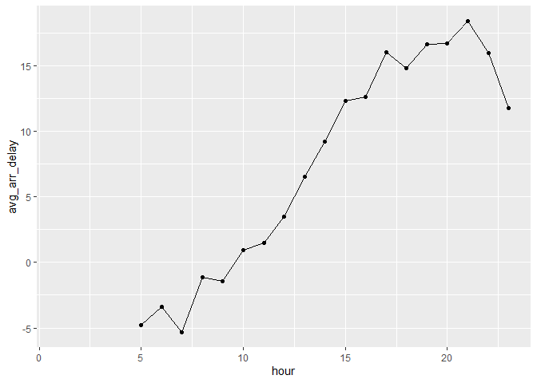

# Chapter_3, Data Transformation


``` r
library(dplyr)
```


    Attaching package: 'dplyr'

    The following objects are masked from 'package:stats':

        filter, lag

    The following objects are masked from 'package:base':

        intersect, setdiff, setequal, union

``` r
library(nycflights13)
library(tidyverse)
```

    ── Attaching core tidyverse packages ──────────────────────── tidyverse 2.0.0 ──
    ✔ forcats   1.0.0     ✔ readr     2.1.5
    ✔ ggplot2   3.5.2     ✔ stringr   1.5.1
    ✔ lubridate 1.9.4     ✔ tibble    3.3.0
    ✔ purrr     1.0.4     ✔ tidyr     1.3.1

    ── Conflicts ────────────────────────────────────────── tidyverse_conflicts() ──
    ✖ dplyr::filter() masks stats::filter()
    ✖ dplyr::lag()    masks stats::lag()
    ℹ Use the conflicted package (<http://conflicted.r-lib.org/>) to force all conflicts to become errors

glimpse(flights)

Use glimpse() to inspect data in a package

# dplyr Basics

The first argument is always a data frame. The subsequent arguments
typically describe which columns to operate on using the variable names
(without quotes). The output is always a new data frame. A pipe can
combine multiple verbs (\|\>) which stand as “then” when reading
function

``` r
flights |>
  filter(dest == "IAH") |> 
  group_by(year, month, day) |> 
  summarize(
    arr_delay = mean(arr_delay, na.rm = TRUE)
  )
```

    `summarise()` has grouped output by 'year', 'month'. You can override using the
    `.groups` argument.

    # A tibble: 365 × 4
    # Groups:   year, month [12]
        year month   day arr_delay
       <int> <int> <int>     <dbl>
     1  2013     1     1     17.8 
     2  2013     1     2      7   
     3  2013     1     3     18.3 
     4  2013     1     4     -3.2 
     5  2013     1     5     20.2 
     6  2013     1     6      9.28
     7  2013     1     7     -7.74
     8  2013     1     8      7.79
     9  2013     1     9     18.1 
    10  2013     1    10      6.68
    # ℹ 355 more rows

# Rows

filter() changes which rows are present without changing their order,
allows you to keep rows based on their values arrange() changes the
order of the rows without changing which are present distinct() finds
rows with unique values

``` r
flights |> 
  filter(dep_delay > 120)
```

    # A tibble: 9,723 × 19
        year month   day dep_time sched_dep_time dep_delay arr_time sched_arr_time
       <int> <int> <int>    <int>          <int>     <dbl>    <int>          <int>
     1  2013     1     1      848           1835       853     1001           1950
     2  2013     1     1      957            733       144     1056            853
     3  2013     1     1     1114            900       134     1447           1222
     4  2013     1     1     1540           1338       122     2020           1825
     5  2013     1     1     1815           1325       290     2120           1542
     6  2013     1     1     1842           1422       260     1958           1535
     7  2013     1     1     1856           1645       131     2212           2005
     8  2013     1     1     1934           1725       129     2126           1855
     9  2013     1     1     1938           1703       155     2109           1823
    10  2013     1     1     1942           1705       157     2124           1830
    # ℹ 9,713 more rows
    # ℹ 11 more variables: arr_delay <dbl>, carrier <chr>, flight <int>,
    #   tailnum <chr>, origin <chr>, dest <chr>, air_time <dbl>, distance <dbl>,
    #   hour <dbl>, minute <dbl>, time_hour <dttm>

!= (not equal to) == (equal to) & or , to indicate “and” \| to indicate
“or” (check for either condition)

``` r
# Flights that departed on January 1
flights |> 
  filter(month == 2 & day == 1)
```

    # A tibble: 926 × 19
        year month   day dep_time sched_dep_time dep_delay arr_time sched_arr_time
       <int> <int> <int>    <int>          <int>     <dbl>    <int>          <int>
     1  2013     2     1      456            500        -4      652            648
     2  2013     2     1      520            525        -5      816            820
     3  2013     2     1      527            530        -3      837            829
     4  2013     2     1      532            540        -8     1007           1017
     5  2013     2     1      540            540         0      859            850
     6  2013     2     1      552            600        -8      714            715
     7  2013     2     1      552            600        -8      919            910
     8  2013     2     1      552            600        -8      655            709
     9  2013     2     1      553            600        -7      833            815
    10  2013     2     1      553            600        -7      821            825
    # ℹ 916 more rows
    # ℹ 11 more variables: arr_delay <dbl>, carrier <chr>, flight <int>,
    #   tailnum <chr>, origin <chr>, dest <chr>, air_time <dbl>, distance <dbl>,
    #   hour <dbl>, minute <dbl>, time_hour <dttm>

``` r
# Flights that departed in January or February
flights |> 
  filter(month == 1 | month == 2)
```

    # A tibble: 51,955 × 19
        year month   day dep_time sched_dep_time dep_delay arr_time sched_arr_time
       <int> <int> <int>    <int>          <int>     <dbl>    <int>          <int>
     1  2013     1     1      517            515         2      830            819
     2  2013     1     1      533            529         4      850            830
     3  2013     1     1      542            540         2      923            850
     4  2013     1     1      544            545        -1     1004           1022
     5  2013     1     1      554            600        -6      812            837
     6  2013     1     1      554            558        -4      740            728
     7  2013     1     1      555            600        -5      913            854
     8  2013     1     1      557            600        -3      709            723
     9  2013     1     1      557            600        -3      838            846
    10  2013     1     1      558            600        -2      753            745
    # ℹ 51,945 more rows
    # ℹ 11 more variables: arr_delay <dbl>, carrier <chr>, flight <int>,
    #   tailnum <chr>, origin <chr>, dest <chr>, air_time <dbl>, distance <dbl>,
    #   hour <dbl>, minute <dbl>, time_hour <dttm>

``` r
# A shorter way to select flights that departed in January or February
flights |> 
  filter(month %in% c(1, 2))
```

    # A tibble: 51,955 × 19
        year month   day dep_time sched_dep_time dep_delay arr_time sched_arr_time
       <int> <int> <int>    <int>          <int>     <dbl>    <int>          <int>
     1  2013     1     1      517            515         2      830            819
     2  2013     1     1      533            529         4      850            830
     3  2013     1     1      542            540         2      923            850
     4  2013     1     1      544            545        -1     1004           1022
     5  2013     1     1      554            600        -6      812            837
     6  2013     1     1      554            558        -4      740            728
     7  2013     1     1      555            600        -5      913            854
     8  2013     1     1      557            600        -3      709            723
     9  2013     1     1      557            600        -3      838            846
    10  2013     1     1      558            600        -2      753            745
    # ℹ 51,945 more rows
    # ℹ 11 more variables: arr_delay <dbl>, carrier <chr>, flight <int>,
    #   tailnum <chr>, origin <chr>, dest <chr>, air_time <dbl>, distance <dbl>,
    #   hour <dbl>, minute <dbl>, time_hour <dttm>

``` r
jan1 <- flights |> 
  filter(month == 1 & day == 1)
```

``` r
flights |> 
  arrange(year, month, day, dep_time)
```

    # A tibble: 336,776 × 19
        year month   day dep_time sched_dep_time dep_delay arr_time sched_arr_time
       <int> <int> <int>    <int>          <int>     <dbl>    <int>          <int>
     1  2013     1     1      517            515         2      830            819
     2  2013     1     1      533            529         4      850            830
     3  2013     1     1      542            540         2      923            850
     4  2013     1     1      544            545        -1     1004           1022
     5  2013     1     1      554            600        -6      812            837
     6  2013     1     1      554            558        -4      740            728
     7  2013     1     1      555            600        -5      913            854
     8  2013     1     1      557            600        -3      709            723
     9  2013     1     1      557            600        -3      838            846
    10  2013     1     1      558            600        -2      753            745
    # ℹ 336,766 more rows
    # ℹ 11 more variables: arr_delay <dbl>, carrier <chr>, flight <int>,
    #   tailnum <chr>, origin <chr>, dest <chr>, air_time <dbl>, distance <dbl>,
    #   hour <dbl>, minute <dbl>, time_hour <dttm>

``` r
# Remove duplicate rows, if any
flights |> 
  distinct()
```

    # A tibble: 336,776 × 19
        year month   day dep_time sched_dep_time dep_delay arr_time sched_arr_time
       <int> <int> <int>    <int>          <int>     <dbl>    <int>          <int>
     1  2013     1     1      517            515         2      830            819
     2  2013     1     1      533            529         4      850            830
     3  2013     1     1      542            540         2      923            850
     4  2013     1     1      544            545        -1     1004           1022
     5  2013     1     1      554            600        -6      812            837
     6  2013     1     1      554            558        -4      740            728
     7  2013     1     1      555            600        -5      913            854
     8  2013     1     1      557            600        -3      709            723
     9  2013     1     1      557            600        -3      838            846
    10  2013     1     1      558            600        -2      753            745
    # ℹ 336,766 more rows
    # ℹ 11 more variables: arr_delay <dbl>, carrier <chr>, flight <int>,
    #   tailnum <chr>, origin <chr>, dest <chr>, air_time <dbl>, distance <dbl>,
    #   hour <dbl>, minute <dbl>, time_hour <dttm>

``` r
flights |>
  count(origin, dest, sort = TRUE)
```

    # A tibble: 224 × 3
       origin dest      n
       <chr>  <chr> <int>
     1 JFK    LAX   11262
     2 LGA    ATL   10263
     3 LGA    ORD    8857
     4 JFK    SFO    8204
     5 LGA    CLT    6168
     6 EWR    ORD    6100
     7 JFK    BOS    5898
     8 LGA    MIA    5781
     9 JFK    MCO    5464
    10 EWR    BOS    5327
    # ℹ 214 more rows

# Exercises pt 1 of 3

# Question 1

``` r
flights |>
  filter(arr_time >= 120 ) 
```

    # A tibble: 319,999 × 19
        year month   day dep_time sched_dep_time dep_delay arr_time sched_arr_time
       <int> <int> <int>    <int>          <int>     <dbl>    <int>          <int>
     1  2013     1     1      517            515         2      830            819
     2  2013     1     1      533            529         4      850            830
     3  2013     1     1      542            540         2      923            850
     4  2013     1     1      544            545        -1     1004           1022
     5  2013     1     1      554            600        -6      812            837
     6  2013     1     1      554            558        -4      740            728
     7  2013     1     1      555            600        -5      913            854
     8  2013     1     1      557            600        -3      709            723
     9  2013     1     1      557            600        -3      838            846
    10  2013     1     1      558            600        -2      753            745
    # ℹ 319,989 more rows
    # ℹ 11 more variables: arr_delay <dbl>, carrier <chr>, flight <int>,
    #   tailnum <chr>, origin <chr>, dest <chr>, air_time <dbl>, distance <dbl>,
    #   hour <dbl>, minute <dbl>, time_hour <dttm>

``` r
flights |>
  filter(month %in% c(7, 8, 9))
```

    # A tibble: 86,326 × 19
        year month   day dep_time sched_dep_time dep_delay arr_time sched_arr_time
       <int> <int> <int>    <int>          <int>     <dbl>    <int>          <int>
     1  2013     7     1        1           2029       212      236           2359
     2  2013     7     1        2           2359         3      344            344
     3  2013     7     1       29           2245       104      151              1
     4  2013     7     1       43           2130       193      322             14
     5  2013     7     1       44           2150       174      300            100
     6  2013     7     1       46           2051       235      304           2358
     7  2013     7     1       48           2001       287      308           2305
     8  2013     7     1       58           2155       183      335             43
     9  2013     7     1      100           2146       194      327             30
    10  2013     7     1      100           2245       135      337            135
    # ℹ 86,316 more rows
    # ℹ 11 more variables: arr_delay <dbl>, carrier <chr>, flight <int>,
    #   tailnum <chr>, origin <chr>, dest <chr>, air_time <dbl>, distance <dbl>,
    #   hour <dbl>, minute <dbl>, time_hour <dttm>

``` r
flights |>
  filter(carrier %in% c("UA", "AA", "DL"))
```

    # A tibble: 139,504 × 19
        year month   day dep_time sched_dep_time dep_delay arr_time sched_arr_time
       <int> <int> <int>    <int>          <int>     <dbl>    <int>          <int>
     1  2013     1     1      517            515         2      830            819
     2  2013     1     1      533            529         4      850            830
     3  2013     1     1      542            540         2      923            850
     4  2013     1     1      554            600        -6      812            837
     5  2013     1     1      554            558        -4      740            728
     6  2013     1     1      558            600        -2      753            745
     7  2013     1     1      558            600        -2      924            917
     8  2013     1     1      558            600        -2      923            937
     9  2013     1     1      559            600        -1      941            910
    10  2013     1     1      559            600        -1      854            902
    # ℹ 139,494 more rows
    # ℹ 11 more variables: arr_delay <dbl>, carrier <chr>, flight <int>,
    #   tailnum <chr>, origin <chr>, dest <chr>, air_time <dbl>, distance <dbl>,
    #   hour <dbl>, minute <dbl>, time_hour <dttm>

``` r
flights |>
  filter(arr_delay > 120, dep_delay <= 0)
```

    # A tibble: 29 × 19
        year month   day dep_time sched_dep_time dep_delay arr_time sched_arr_time
       <int> <int> <int>    <int>          <int>     <dbl>    <int>          <int>
     1  2013     1    27     1419           1420        -1     1754           1550
     2  2013    10     7     1350           1350         0     1736           1526
     3  2013    10     7     1357           1359        -2     1858           1654
     4  2013    10    16      657            700        -3     1258           1056
     5  2013    11     1      658            700        -2     1329           1015
     6  2013     3    18     1844           1847        -3       39           2219
     7  2013     4    17     1635           1640        -5     2049           1845
     8  2013     4    18      558            600        -2     1149            850
     9  2013     4    18      655            700        -5     1213            950
    10  2013     5    22     1827           1830        -3     2217           2010
    # ℹ 19 more rows
    # ℹ 11 more variables: arr_delay <dbl>, carrier <chr>, flight <int>,
    #   tailnum <chr>, origin <chr>, dest <chr>, air_time <dbl>, distance <dbl>,
    #   hour <dbl>, minute <dbl>, time_hour <dttm>

``` r
flights |>
  filter(dep_delay >= 60, dep_delay - arr_delay > 30)
```

    # A tibble: 1,844 × 19
        year month   day dep_time sched_dep_time dep_delay arr_time sched_arr_time
       <int> <int> <int>    <int>          <int>     <dbl>    <int>          <int>
     1  2013     1     1     2205           1720       285       46           2040
     2  2013     1     1     2326           2130       116      131             18
     3  2013     1     3     1503           1221       162     1803           1555
     4  2013     1     3     1839           1700        99     2056           1950
     5  2013     1     3     1850           1745        65     2148           2120
     6  2013     1     3     1941           1759       102     2246           2139
     7  2013     1     3     1950           1845        65     2228           2227
     8  2013     1     3     2015           1915        60     2135           2111
     9  2013     1     3     2257           2000       177       45           2224
    10  2013     1     4     1917           1700       137     2135           1950
    # ℹ 1,834 more rows
    # ℹ 11 more variables: arr_delay <dbl>, carrier <chr>, flight <int>,
    #   tailnum <chr>, origin <chr>, dest <chr>, air_time <dbl>, distance <dbl>,
    #   hour <dbl>, minute <dbl>, time_hour <dttm>

# Question 2

``` r
flights |> 
  arrange(desc(dep_delay))
```

    # A tibble: 336,776 × 19
        year month   day dep_time sched_dep_time dep_delay arr_time sched_arr_time
       <int> <int> <int>    <int>          <int>     <dbl>    <int>          <int>
     1  2013     1     9      641            900      1301     1242           1530
     2  2013     6    15     1432           1935      1137     1607           2120
     3  2013     1    10     1121           1635      1126     1239           1810
     4  2013     9    20     1139           1845      1014     1457           2210
     5  2013     7    22      845           1600      1005     1044           1815
     6  2013     4    10     1100           1900       960     1342           2211
     7  2013     3    17     2321            810       911      135           1020
     8  2013     6    27      959           1900       899     1236           2226
     9  2013     7    22     2257            759       898      121           1026
    10  2013    12     5      756           1700       896     1058           2020
    # ℹ 336,766 more rows
    # ℹ 11 more variables: arr_delay <dbl>, carrier <chr>, flight <int>,
    #   tailnum <chr>, origin <chr>, dest <chr>, air_time <dbl>, distance <dbl>,
    #   hour <dbl>, minute <dbl>, time_hour <dttm>

# Question 3

``` r
flights |> 
  mutate(speed = distance / (air_time / 60)) |> 
  arrange(desc(speed))
```

    # A tibble: 336,776 × 20
        year month   day dep_time sched_dep_time dep_delay arr_time sched_arr_time
       <int> <int> <int>    <int>          <int>     <dbl>    <int>          <int>
     1  2013     5    25     1709           1700         9     1923           1937
     2  2013     7     2     1558           1513        45     1745           1719
     3  2013     5    13     2040           2025        15     2225           2226
     4  2013     3    23     1914           1910         4     2045           2043
     5  2013     1    12     1559           1600        -1     1849           1917
     6  2013    11    17      650            655        -5     1059           1150
     7  2013     2    21     2355           2358        -3      412            438
     8  2013    11    17      759            800        -1     1212           1255
     9  2013    11    16     2003           1925        38       17             36
    10  2013    11    16     2349           2359       -10      402            440
    # ℹ 336,766 more rows
    # ℹ 12 more variables: arr_delay <dbl>, carrier <chr>, flight <int>,
    #   tailnum <chr>, origin <chr>, dest <chr>, air_time <dbl>, distance <dbl>,
    #   hour <dbl>, minute <dbl>, time_hour <dttm>, speed <dbl>

# Question 4

``` r
nrow(distinct(flights, year, month, day)) == 365
```

    [1] TRUE

Yes there was a flight every day of 2013.

# Question 5

``` r
flights |> 
  arrange(desc(distance))
```

    # A tibble: 336,776 × 19
        year month   day dep_time sched_dep_time dep_delay arr_time sched_arr_time
       <int> <int> <int>    <int>          <int>     <dbl>    <int>          <int>
     1  2013     1     1      857            900        -3     1516           1530
     2  2013     1     2      909            900         9     1525           1530
     3  2013     1     3      914            900        14     1504           1530
     4  2013     1     4      900            900         0     1516           1530
     5  2013     1     5      858            900        -2     1519           1530
     6  2013     1     6     1019            900        79     1558           1530
     7  2013     1     7     1042            900       102     1620           1530
     8  2013     1     8      901            900         1     1504           1530
     9  2013     1     9      641            900      1301     1242           1530
    10  2013     1    10      859            900        -1     1449           1530
    # ℹ 336,766 more rows
    # ℹ 11 more variables: arr_delay <dbl>, carrier <chr>, flight <int>,
    #   tailnum <chr>, origin <chr>, dest <chr>, air_time <dbl>, distance <dbl>,
    #   hour <dbl>, minute <dbl>, time_hour <dttm>

``` r
flights |> 
  arrange((distance))
```

    # A tibble: 336,776 × 19
        year month   day dep_time sched_dep_time dep_delay arr_time sched_arr_time
       <int> <int> <int>    <int>          <int>     <dbl>    <int>          <int>
     1  2013     7    27       NA            106        NA       NA            245
     2  2013     1     3     2127           2129        -2     2222           2224
     3  2013     1     4     1240           1200        40     1333           1306
     4  2013     1     4     1829           1615       134     1937           1721
     5  2013     1     4     2128           2129        -1     2218           2224
     6  2013     1     5     1155           1200        -5     1241           1306
     7  2013     1     6     2125           2129        -4     2224           2224
     8  2013     1     7     2124           2129        -5     2212           2224
     9  2013     1     8     2127           2130        -3     2304           2225
    10  2013     1     9     2126           2129        -3     2217           2224
    # ℹ 336,766 more rows
    # ℹ 11 more variables: arr_delay <dbl>, carrier <chr>, flight <int>,
    #   tailnum <chr>, origin <chr>, dest <chr>, air_time <dbl>, distance <dbl>,
    #   hour <dbl>, minute <dbl>, time_hour <dttm>

# Question 6

The final result does not change regardless of the order you place the
arguments filter() and arrange() but filtering first is normally
preferred.

# Columns

mutate() creates new columns that are derived from the existing columns
-By default, mutate() adds new columns on the right-hand side of your
dataset - .before argument to instead add the variables to the left-hand
side - use .after to add after a variable select() changes which columns
are present rename() changes the names of the columns relocate() changes
the positions of the columns

``` r
flights |> 
  mutate(
    gain = dep_delay - arr_delay,
    speed = distance / air_time * 60
  )
```

    # A tibble: 336,776 × 21
        year month   day dep_time sched_dep_time dep_delay arr_time sched_arr_time
       <int> <int> <int>    <int>          <int>     <dbl>    <int>          <int>
     1  2013     1     1      517            515         2      830            819
     2  2013     1     1      533            529         4      850            830
     3  2013     1     1      542            540         2      923            850
     4  2013     1     1      544            545        -1     1004           1022
     5  2013     1     1      554            600        -6      812            837
     6  2013     1     1      554            558        -4      740            728
     7  2013     1     1      555            600        -5      913            854
     8  2013     1     1      557            600        -3      709            723
     9  2013     1     1      557            600        -3      838            846
    10  2013     1     1      558            600        -2      753            745
    # ℹ 336,766 more rows
    # ℹ 13 more variables: arr_delay <dbl>, carrier <chr>, flight <int>,
    #   tailnum <chr>, origin <chr>, dest <chr>, air_time <dbl>, distance <dbl>,
    #   hour <dbl>, minute <dbl>, time_hour <dttm>, gain <dbl>, speed <dbl>

``` r
flights |> 
  mutate(
    gain = dep_delay - arr_delay,
    speed = distance / air_time * 60,
    .before = 1
  )
```

    # A tibble: 336,776 × 21
        gain speed  year month   day dep_time sched_dep_time dep_delay arr_time
       <dbl> <dbl> <int> <int> <int>    <int>          <int>     <dbl>    <int>
     1    -9  370.  2013     1     1      517            515         2      830
     2   -16  374.  2013     1     1      533            529         4      850
     3   -31  408.  2013     1     1      542            540         2      923
     4    17  517.  2013     1     1      544            545        -1     1004
     5    19  394.  2013     1     1      554            600        -6      812
     6   -16  288.  2013     1     1      554            558        -4      740
     7   -24  404.  2013     1     1      555            600        -5      913
     8    11  259.  2013     1     1      557            600        -3      709
     9     5  405.  2013     1     1      557            600        -3      838
    10   -10  319.  2013     1     1      558            600        -2      753
    # ℹ 336,766 more rows
    # ℹ 12 more variables: sched_arr_time <int>, arr_delay <dbl>, carrier <chr>,
    #   flight <int>, tailnum <chr>, origin <chr>, dest <chr>, air_time <dbl>,
    #   distance <dbl>, hour <dbl>, minute <dbl>, time_hour <dttm>

``` r
flights |> 
  mutate(
    gain = dep_delay - arr_delay,
    speed = distance / air_time * 60,
    .after = day
  )
```

    # A tibble: 336,776 × 21
        year month   day  gain speed dep_time sched_dep_time dep_delay arr_time
       <int> <int> <int> <dbl> <dbl>    <int>          <int>     <dbl>    <int>
     1  2013     1     1    -9  370.      517            515         2      830
     2  2013     1     1   -16  374.      533            529         4      850
     3  2013     1     1   -31  408.      542            540         2      923
     4  2013     1     1    17  517.      544            545        -1     1004
     5  2013     1     1    19  394.      554            600        -6      812
     6  2013     1     1   -16  288.      554            558        -4      740
     7  2013     1     1   -24  404.      555            600        -5      913
     8  2013     1     1    11  259.      557            600        -3      709
     9  2013     1     1     5  405.      557            600        -3      838
    10  2013     1     1   -10  319.      558            600        -2      753
    # ℹ 336,766 more rows
    # ℹ 12 more variables: sched_arr_time <int>, arr_delay <dbl>, carrier <chr>,
    #   flight <int>, tailnum <chr>, origin <chr>, dest <chr>, air_time <dbl>,
    #   distance <dbl>, hour <dbl>, minute <dbl>, time_hour <dttm>

``` r
flights |> 
  mutate(
    gain = dep_delay - arr_delay,
    hours = air_time / 60,
    gain_per_hour = gain / hours,
    .keep = "used"
  )
```

    # A tibble: 336,776 × 6
       dep_delay arr_delay air_time  gain hours gain_per_hour
           <dbl>     <dbl>    <dbl> <dbl> <dbl>         <dbl>
     1         2        11      227    -9 3.78          -2.38
     2         4        20      227   -16 3.78          -4.23
     3         2        33      160   -31 2.67         -11.6 
     4        -1       -18      183    17 3.05           5.57
     5        -6       -25      116    19 1.93           9.83
     6        -4        12      150   -16 2.5           -6.4 
     7        -5        19      158   -24 2.63          -9.11
     8        -3       -14       53    11 0.883         12.5 
     9        -3        -8      140     5 2.33           2.14
    10        -2         8      138   -10 2.3           -4.35
    # ℹ 336,766 more rows

``` r
flights |> 
  select(year, month, day)
```

    # A tibble: 336,776 × 3
        year month   day
       <int> <int> <int>
     1  2013     1     1
     2  2013     1     1
     3  2013     1     1
     4  2013     1     1
     5  2013     1     1
     6  2013     1     1
     7  2013     1     1
     8  2013     1     1
     9  2013     1     1
    10  2013     1     1
    # ℹ 336,766 more rows

``` r
flights |> 
  select(year:day)
```

    # A tibble: 336,776 × 3
        year month   day
       <int> <int> <int>
     1  2013     1     1
     2  2013     1     1
     3  2013     1     1
     4  2013     1     1
     5  2013     1     1
     6  2013     1     1
     7  2013     1     1
     8  2013     1     1
     9  2013     1     1
    10  2013     1     1
    # ℹ 336,766 more rows

``` r
flights |> 
  select(!year:day)
```

    # A tibble: 336,776 × 16
       dep_time sched_dep_time dep_delay arr_time sched_arr_time arr_delay carrier
          <int>          <int>     <dbl>    <int>          <int>     <dbl> <chr>  
     1      517            515         2      830            819        11 UA     
     2      533            529         4      850            830        20 UA     
     3      542            540         2      923            850        33 AA     
     4      544            545        -1     1004           1022       -18 B6     
     5      554            600        -6      812            837       -25 DL     
     6      554            558        -4      740            728        12 UA     
     7      555            600        -5      913            854        19 B6     
     8      557            600        -3      709            723       -14 EV     
     9      557            600        -3      838            846        -8 B6     
    10      558            600        -2      753            745         8 AA     
    # ℹ 336,766 more rows
    # ℹ 9 more variables: flight <int>, tailnum <chr>, origin <chr>, dest <chr>,
    #   air_time <dbl>, distance <dbl>, hour <dbl>, minute <dbl>, time_hour <dttm>

``` r
flights |> 
  select(where(is.character))
```

    # A tibble: 336,776 × 4
       carrier tailnum origin dest 
       <chr>   <chr>   <chr>  <chr>
     1 UA      N14228  EWR    IAH  
     2 UA      N24211  LGA    IAH  
     3 AA      N619AA  JFK    MIA  
     4 B6      N804JB  JFK    BQN  
     5 DL      N668DN  LGA    ATL  
     6 UA      N39463  EWR    ORD  
     7 B6      N516JB  EWR    FLL  
     8 EV      N829AS  LGA    IAD  
     9 B6      N593JB  JFK    MCO  
    10 AA      N3ALAA  LGA    ORD  
    # ℹ 336,766 more rows

Functions for select() -starts_with(“abc”): matches names that begin
with “abc”.

-ends_with(“xyz”): matches names that end with “xyz”.

-contains(“ijk”): matches names that contain “ijk”.

-num_range(“x”, 1:3): matches x1, x2 and x3.

``` r
flights |> 
  rename(tail_num = tailnum)
```

    # A tibble: 336,776 × 19
        year month   day dep_time sched_dep_time dep_delay arr_time sched_arr_time
       <int> <int> <int>    <int>          <int>     <dbl>    <int>          <int>
     1  2013     1     1      517            515         2      830            819
     2  2013     1     1      533            529         4      850            830
     3  2013     1     1      542            540         2      923            850
     4  2013     1     1      544            545        -1     1004           1022
     5  2013     1     1      554            600        -6      812            837
     6  2013     1     1      554            558        -4      740            728
     7  2013     1     1      555            600        -5      913            854
     8  2013     1     1      557            600        -3      709            723
     9  2013     1     1      557            600        -3      838            846
    10  2013     1     1      558            600        -2      753            745
    # ℹ 336,766 more rows
    # ℹ 11 more variables: arr_delay <dbl>, carrier <chr>, flight <int>,
    #   tail_num <chr>, origin <chr>, dest <chr>, air_time <dbl>, distance <dbl>,
    #   hour <dbl>, minute <dbl>, time_hour <dttm>

``` r
flights |> 
  relocate(time_hour, air_time)
```

    # A tibble: 336,776 × 19
       time_hour           air_time  year month   day dep_time sched_dep_time
       <dttm>                 <dbl> <int> <int> <int>    <int>          <int>
     1 2013-01-01 05:00:00      227  2013     1     1      517            515
     2 2013-01-01 05:00:00      227  2013     1     1      533            529
     3 2013-01-01 05:00:00      160  2013     1     1      542            540
     4 2013-01-01 05:00:00      183  2013     1     1      544            545
     5 2013-01-01 06:00:00      116  2013     1     1      554            600
     6 2013-01-01 05:00:00      150  2013     1     1      554            558
     7 2013-01-01 06:00:00      158  2013     1     1      555            600
     8 2013-01-01 06:00:00       53  2013     1     1      557            600
     9 2013-01-01 06:00:00      140  2013     1     1      557            600
    10 2013-01-01 06:00:00      138  2013     1     1      558            600
    # ℹ 336,766 more rows
    # ℹ 12 more variables: dep_delay <dbl>, arr_time <int>, sched_arr_time <int>,
    #   arr_delay <dbl>, carrier <chr>, flight <int>, tailnum <chr>, origin <chr>,
    #   dest <chr>, distance <dbl>, hour <dbl>, minute <dbl>

``` r
flights |> 
  relocate(year:dep_time, .after = time_hour)
```

    # A tibble: 336,776 × 19
       sched_dep_time dep_delay arr_time sched_arr_time arr_delay carrier flight
                <int>     <dbl>    <int>          <int>     <dbl> <chr>    <int>
     1            515         2      830            819        11 UA        1545
     2            529         4      850            830        20 UA        1714
     3            540         2      923            850        33 AA        1141
     4            545        -1     1004           1022       -18 B6         725
     5            600        -6      812            837       -25 DL         461
     6            558        -4      740            728        12 UA        1696
     7            600        -5      913            854        19 B6         507
     8            600        -3      709            723       -14 EV        5708
     9            600        -3      838            846        -8 B6          79
    10            600        -2      753            745         8 AA         301
    # ℹ 336,766 more rows
    # ℹ 12 more variables: tailnum <chr>, origin <chr>, dest <chr>, air_time <dbl>,
    #   distance <dbl>, hour <dbl>, minute <dbl>, time_hour <dttm>, year <int>,
    #   month <int>, day <int>, dep_time <int>

``` r
flights |> 
  relocate(starts_with("arr"), .before = dep_time)
```

    # A tibble: 336,776 × 19
        year month   day arr_time arr_delay dep_time sched_dep_time dep_delay
       <int> <int> <int>    <int>     <dbl>    <int>          <int>     <dbl>
     1  2013     1     1      830        11      517            515         2
     2  2013     1     1      850        20      533            529         4
     3  2013     1     1      923        33      542            540         2
     4  2013     1     1     1004       -18      544            545        -1
     5  2013     1     1      812       -25      554            600        -6
     6  2013     1     1      740        12      554            558        -4
     7  2013     1     1      913        19      555            600        -5
     8  2013     1     1      709       -14      557            600        -3
     9  2013     1     1      838        -8      557            600        -3
    10  2013     1     1      753         8      558            600        -2
    # ℹ 336,766 more rows
    # ℹ 11 more variables: sched_arr_time <int>, carrier <chr>, flight <int>,
    #   tailnum <chr>, origin <chr>, dest <chr>, air_time <dbl>, distance <dbl>,
    #   hour <dbl>, minute <dbl>, time_hour <dttm>

# Exercises pt 2 of 3

# Question 1

``` r
flights |> 
  select(dep_time:dep_delay)
```

    # A tibble: 336,776 × 3
       dep_time sched_dep_time dep_delay
          <int>          <int>     <dbl>
     1      517            515         2
     2      533            529         4
     3      542            540         2
     4      544            545        -1
     5      554            600        -6
     6      554            558        -4
     7      555            600        -5
     8      557            600        -3
     9      557            600        -3
    10      558            600        -2
    # ℹ 336,766 more rows

# Question 3

``` r
flights |> 
  select(dep_delay, dep_delay)
```

    # A tibble: 336,776 × 1
       dep_delay
           <dbl>
     1         2
     2         4
     3         2
     4        -1
     5        -6
     6        -4
     7        -5
     8        -3
     9        -3
    10        -2
    # ℹ 336,766 more rows

# Question 4

any_of() selects columns present in your character vector

``` r
q_four <- c("year", "month", "day", "dep_delay", "arr_delay")

flights |>
  select(any_of(q_four))
```

    # A tibble: 336,776 × 5
        year month   day dep_delay arr_delay
       <int> <int> <int>     <dbl>     <dbl>
     1  2013     1     1         2        11
     2  2013     1     1         4        20
     3  2013     1     1         2        33
     4  2013     1     1        -1       -18
     5  2013     1     1        -6       -25
     6  2013     1     1        -4        12
     7  2013     1     1        -5        19
     8  2013     1     1        -3       -14
     9  2013     1     1        -3        -8
    10  2013     1     1        -2         8
    # ℹ 336,766 more rows

# Question 5

``` r
flights |> select(contains("TIME"))
```

    # A tibble: 336,776 × 6
       dep_time sched_dep_time arr_time sched_arr_time air_time time_hour          
          <int>          <int>    <int>          <int>    <dbl> <dttm>             
     1      517            515      830            819      227 2013-01-01 05:00:00
     2      533            529      850            830      227 2013-01-01 05:00:00
     3      542            540      923            850      160 2013-01-01 05:00:00
     4      544            545     1004           1022      183 2013-01-01 05:00:00
     5      554            600      812            837      116 2013-01-01 06:00:00
     6      554            558      740            728      150 2013-01-01 05:00:00
     7      555            600      913            854      158 2013-01-01 06:00:00
     8      557            600      709            723       53 2013-01-01 06:00:00
     9      557            600      838            846      140 2013-01-01 06:00:00
    10      558            600      753            745      138 2013-01-01 06:00:00
    # ℹ 336,766 more rows

the select helps don’t care about upper or lowercase?

# Question 6

``` r
flights |>
  rename(air_time_min = air_time)
```

    # A tibble: 336,776 × 19
        year month   day dep_time sched_dep_time dep_delay arr_time sched_arr_time
       <int> <int> <int>    <int>          <int>     <dbl>    <int>          <int>
     1  2013     1     1      517            515         2      830            819
     2  2013     1     1      533            529         4      850            830
     3  2013     1     1      542            540         2      923            850
     4  2013     1     1      544            545        -1     1004           1022
     5  2013     1     1      554            600        -6      812            837
     6  2013     1     1      554            558        -4      740            728
     7  2013     1     1      555            600        -5      913            854
     8  2013     1     1      557            600        -3      709            723
     9  2013     1     1      557            600        -3      838            846
    10  2013     1     1      558            600        -2      753            745
    # ℹ 336,766 more rows
    # ℹ 11 more variables: arr_delay <dbl>, carrier <chr>, flight <int>,
    #   tailnum <chr>, origin <chr>, dest <chr>, air_time_min <dbl>,
    #   distance <dbl>, hour <dbl>, minute <dbl>, time_hour <dttm>

# Question 7

``` r
flights |> 
  arrange(arr_delay) |> 
  select(tailnum)
```

    # A tibble: 336,776 × 1
       tailnum
       <chr>  
     1 N843VA 
     2 N840VA 
     3 N851UA 
     4 N3KCAA 
     5 N551AS 
     6 N24212 
     7 N3760C 
     8 N806UA 
     9 N805JB 
    10 N855VA 
    # ℹ 336,766 more rows

Arrange must come before select

# The Pipe

Use group_by() to divide your dataset into groups meaningful for your
analysis

``` r
flights |> 
  group_by(month)
```

    # A tibble: 336,776 × 19
    # Groups:   month [12]
        year month   day dep_time sched_dep_time dep_delay arr_time sched_arr_time
       <int> <int> <int>    <int>          <int>     <dbl>    <int>          <int>
     1  2013     1     1      517            515         2      830            819
     2  2013     1     1      533            529         4      850            830
     3  2013     1     1      542            540         2      923            850
     4  2013     1     1      544            545        -1     1004           1022
     5  2013     1     1      554            600        -6      812            837
     6  2013     1     1      554            558        -4      740            728
     7  2013     1     1      555            600        -5      913            854
     8  2013     1     1      557            600        -3      709            723
     9  2013     1     1      557            600        -3      838            846
    10  2013     1     1      558            600        -2      753            745
    # ℹ 336,766 more rows
    # ℹ 11 more variables: arr_delay <dbl>, carrier <chr>, flight <int>,
    #   tailnum <chr>, origin <chr>, dest <chr>, air_time <dbl>, distance <dbl>,
    #   hour <dbl>, minute <dbl>, time_hour <dttm>

summarize() reduces the data frame to have a single row for each group

``` r
flights |> 
  group_by(month) |> 
  summarize(
    avg_delay = mean(dep_delay)
  )
```

    # A tibble: 12 × 2
       month avg_delay
       <int>     <dbl>
     1     1        NA
     2     2        NA
     3     3        NA
     4     4        NA
     5     5        NA
     6     6        NA
     7     7        NA
     8     8        NA
     9     9        NA
    10    10        NA
    11    11        NA
    12    12        NA

``` r
flights |> 
  group_by(month) |> 
  summarize(
    avg_delay = mean(dep_delay, na.rm = TRUE)
  )
```

    # A tibble: 12 × 2
       month avg_delay
       <int>     <dbl>
     1     1     10.0 
     2     2     10.8 
     3     3     13.2 
     4     4     13.9 
     5     5     13.0 
     6     6     20.8 
     7     7     21.7 
     8     8     12.6 
     9     9      6.72
    10    10      6.24
    11    11      5.44
    12    12     16.6 

``` r
flights |> 
  group_by(month) |> 
  summarize(
    avg_delay = mean(dep_delay, na.rm = TRUE), 
    n = n()
  )
```

    # A tibble: 12 × 3
       month avg_delay     n
       <int>     <dbl> <int>
     1     1     10.0  27004
     2     2     10.8  24951
     3     3     13.2  28834
     4     4     13.9  28330
     5     5     13.0  28796
     6     6     20.8  28243
     7     7     21.7  29425
     8     8     12.6  29327
     9     9      6.72 27574
    10    10      6.24 28889
    11    11      5.44 27268
    12    12     16.6  28135

There are five handy functions that allow you to extract specific rows
within each group:

-df \|\> slice_head(n = 1) takes the first row from each group.

-df \|\> slice_tail(n = 1) takes the last row in each group.

-df \|\> slice_min(x, n = 1) takes the row with the smallest value of
column x.

-df \|\> slice_max(x, n = 1) takes the row with the largest value of
column x.

-df \|\> slice_sample(n = 1) takes one random row.

``` r
daily <- flights |>  
  group_by(year, month, day)
daily
```

    # A tibble: 336,776 × 19
    # Groups:   year, month, day [365]
        year month   day dep_time sched_dep_time dep_delay arr_time sched_arr_time
       <int> <int> <int>    <int>          <int>     <dbl>    <int>          <int>
     1  2013     1     1      517            515         2      830            819
     2  2013     1     1      533            529         4      850            830
     3  2013     1     1      542            540         2      923            850
     4  2013     1     1      544            545        -1     1004           1022
     5  2013     1     1      554            600        -6      812            837
     6  2013     1     1      554            558        -4      740            728
     7  2013     1     1      555            600        -5      913            854
     8  2013     1     1      557            600        -3      709            723
     9  2013     1     1      557            600        -3      838            846
    10  2013     1     1      558            600        -2      753            745
    # ℹ 336,766 more rows
    # ℹ 11 more variables: arr_delay <dbl>, carrier <chr>, flight <int>,
    #   tailnum <chr>, origin <chr>, dest <chr>, air_time <dbl>, distance <dbl>,
    #   hour <dbl>, minute <dbl>, time_hour <dttm>

``` r
daily |> 
  ungroup()
```

    # A tibble: 336,776 × 19
        year month   day dep_time sched_dep_time dep_delay arr_time sched_arr_time
       <int> <int> <int>    <int>          <int>     <dbl>    <int>          <int>
     1  2013     1     1      517            515         2      830            819
     2  2013     1     1      533            529         4      850            830
     3  2013     1     1      542            540         2      923            850
     4  2013     1     1      544            545        -1     1004           1022
     5  2013     1     1      554            600        -6      812            837
     6  2013     1     1      554            558        -4      740            728
     7  2013     1     1      555            600        -5      913            854
     8  2013     1     1      557            600        -3      709            723
     9  2013     1     1      557            600        -3      838            846
    10  2013     1     1      558            600        -2      753            745
    # ℹ 336,766 more rows
    # ℹ 11 more variables: arr_delay <dbl>, carrier <chr>, flight <int>,
    #   tailnum <chr>, origin <chr>, dest <chr>, air_time <dbl>, distance <dbl>,
    #   hour <dbl>, minute <dbl>, time_hour <dttm>

``` r
flights |> 
  summarize(
    delay = mean(dep_delay, na.rm = TRUE), 
    n = n(),
    .by = month
  )
```

    # A tibble: 12 × 3
       month delay     n
       <int> <dbl> <int>
     1     1 10.0  27004
     2    10  6.24 28889
     3    11  5.44 27268
     4    12 16.6  28135
     5     2 10.8  24951
     6     3 13.2  28834
     7     4 13.9  28330
     8     5 13.0  28796
     9     6 20.8  28243
    10     7 21.7  29425
    11     8 12.6  29327
    12     9  6.72 27574

``` r
flights |> 
  summarize(
    delay = mean(dep_delay, na.rm = TRUE), 
    n = n(),
    .by = c(origin, dest)
  )
```

    # A tibble: 224 × 4
       origin dest  delay     n
       <chr>  <chr> <dbl> <int>
     1 EWR    IAH   11.8   3973
     2 LGA    IAH    9.06  2951
     3 JFK    MIA    9.34  3314
     4 JFK    BQN    6.67   599
     5 LGA    ATL   11.4  10263
     6 EWR    ORD   14.6   6100
     7 EWR    FLL   13.5   3793
     8 LGA    IAD   16.7   1803
     9 JFK    MCO   10.6   5464
    10 LGA    ORD   10.7   8857
    # ℹ 214 more rows

# Exercises pt 3 of 3

# Question 1

``` r
flights |> 
  summarize(
    delay = mean(dep_delay, na.rm = TRUE), 
    n = n(),
    .by = carrier
  )
```

    # A tibble: 16 × 3
       carrier delay     n
       <chr>   <dbl> <int>
     1 UA      12.1  58665
     2 AA       8.59 32729
     3 B6      13.0  54635
     4 DL       9.26 48110
     5 EV      20.0  54173
     6 MQ      10.6  26397
     7 US       3.78 20536
     8 WN      17.7  12275
     9 VX      12.9   5162
    10 FL      18.7   3260
    11 AS       5.80   714
    12 9E      16.7  18460
    13 F9      20.2    685
    14 HA       4.90   342
    15 YV      19.0    601
    16 OO      12.6     32

``` r
flights |> 
  group_by(carrier, dest) |> 
  summarize(n())
```

    `summarise()` has grouped output by 'carrier'. You can override using the
    `.groups` argument.

    # A tibble: 314 × 3
    # Groups:   carrier [16]
       carrier dest  `n()`
       <chr>   <chr> <int>
     1 9E      ATL      59
     2 9E      AUS       2
     3 9E      AVL      10
     4 9E      BGR       1
     5 9E      BNA     474
     6 9E      BOS     914
     7 9E      BTV       2
     8 9E      BUF     833
     9 9E      BWI     856
    10 9E      CAE       3
    # ℹ 304 more rows

# Question 2

``` r
flights |> 
  summarize(
    delay = mean(dep_delay, na.rm = TRUE), 
    n = n(),
    .by = dest
  )
```

    # A tibble: 105 × 3
       dest  delay     n
       <chr> <dbl> <int>
     1 IAH   10.8   7198
     2 MIA    8.88 11728
     3 BQN   12.4    896
     4 ATL   12.5  17215
     5 ORD   13.6  17283
     6 FLL   12.7  12055
     7 IAD   17.0   5700
     8 MCO   11.3  14082
     9 PBI   13.0   6554
    10 TPA   12.1   7466
    # ℹ 95 more rows

# Question 3

``` r
by_hour <- flights %>%
  mutate(hour = sched_dep_time %/% 100) %>%
  group_by(hour) %>%
  summarise(
    avg_arr_delay = mean(arr_delay, na.rm = TRUE),
    n = n()
  )


ggplot(by_hour, aes(x = hour, y = avg_arr_delay)) +
  geom_line() +
  geom_point() 
```

    Warning: Removed 1 row containing missing values or values outside the scale range
    (`geom_line()`).

    Warning: Removed 1 row containing missing values or values outside the scale range
    (`geom_point()`).



# Question 4

It drops the n rows specified, keeping the rest

# Question 5

count() groups data by variables and summarizes the number of rows in
each group by adding a count column sort orders the output by frequency,
most-frequent groups first.

# Question 6a

a, b, a, a, b \# Question 6b same as above \# Question 6c Produces the
mean number of times a and b are listed in y; pipeline allows the use of
multiple verb arguments \# Question 6d Produces the mean number of times
each letter is used in their categories
