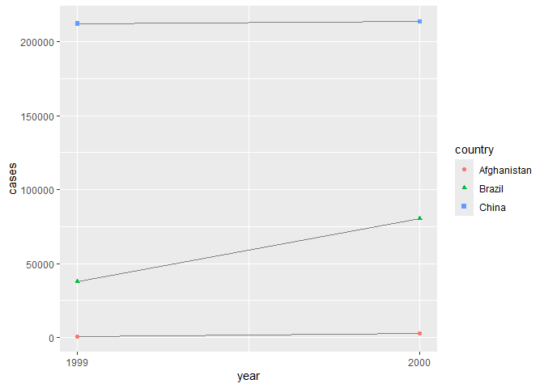
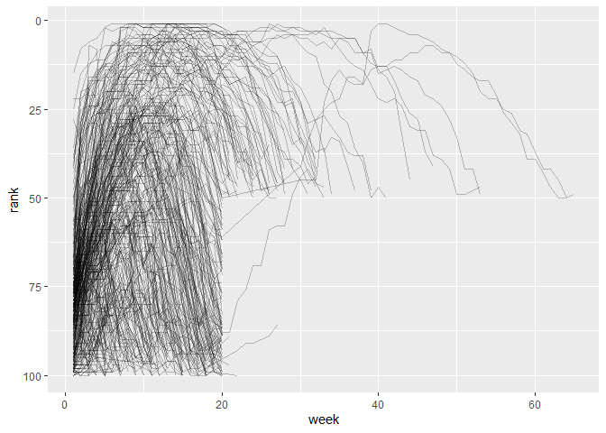

# Chapter 5, Data Tidying


``` r
 library(tidyverse)
```

    ── Attaching core tidyverse packages ──────────────────────── tidyverse 2.0.0 ──
    ✔ dplyr     1.1.4     ✔ readr     2.1.5
    ✔ forcats   1.0.0     ✔ stringr   1.5.1
    ✔ ggplot2   3.5.2     ✔ tibble    3.3.0
    ✔ lubridate 1.9.4     ✔ tidyr     1.3.1
    ✔ purrr     1.0.4     
    ── Conflicts ────────────────────────────────────────── tidyverse_conflicts() ──
    ✖ dplyr::filter() masks stats::filter()
    ✖ dplyr::lag()    masks stats::lag()
    ℹ Use the conflicted package (<http://conflicted.r-lib.org/>) to force all conflicts to become errors

# Tidy Data

Three Rules That Make a Dataset Tidy 1. Each variable is a column; each
column is a variable. 2. Each observation is a row; each row is an
observation. 3. Each value is a cell; each cell is a single value.

``` r
# Compute rate per 10,000
table1 |>
  mutate(rate = cases / population * 10000)
```

    # A tibble: 6 × 5
      country      year  cases population  rate
      <chr>       <dbl>  <dbl>      <dbl> <dbl>
    1 Afghanistan  1999    745   19987071 0.373
    2 Afghanistan  2000   2666   20595360 1.29 
    3 Brazil       1999  37737  172006362 2.19 
    4 Brazil       2000  80488  174504898 4.61 
    5 China        1999 212258 1272915272 1.67 
    6 China        2000 213766 1280428583 1.67 

``` r
# Compute total cases per year
table1 |> 
  group_by(year) |> 
  summarize(total_cases = sum(cases))
```

    # A tibble: 2 × 2
       year total_cases
      <dbl>       <dbl>
    1  1999      250740
    2  2000      296920

``` r
# Visualize changes over time
ggplot(table1, aes(x = year, y = cases)) +
  geom_line(aes(group = country), color = "grey50") +
  geom_point(aes(color = country, shape = country)) +
  scale_x_continuous(breaks = c(1999, 2000)) # x-axis breaks at 1999 and 2000
```



# Exercises pt 1 of 1

# Question 1

The number of TB cases documented by the World Health Organization in
Afghanistan, Brazil, and China between 1999 and 2000. \# Question 2

``` r
table2 |>
 select(country, year, count)
```

    # A tibble: 12 × 3
       country      year      count
       <chr>       <dbl>      <dbl>
     1 Afghanistan  1999        745
     2 Afghanistan  1999   19987071
     3 Afghanistan  2000       2666
     4 Afghanistan  2000   20595360
     5 Brazil       1999      37737
     6 Brazil       1999  172006362
     7 Brazil       2000      80488
     8 Brazil       2000  174504898
     9 China        1999     212258
    10 China        1999 1272915272
    11 China        2000     213766
    12 China        2000 1280428583

``` r
# For table2 (long format: country, year, type, count)
table2_cases <- table2 %>% filter(type == "cases")
table2_pop <- table2 %>% filter(type == "population")
merged <- left_join(table2_cases, table2_pop, by = c("country", "year"), suffix = c("_cases", "_pop"))
merged <- merged %>% mutate(rate = (count_cases / count_pop) * 10000)

print(table2_cases)
```

    # A tibble: 6 × 4
      country      year type   count
      <chr>       <dbl> <chr>  <dbl>
    1 Afghanistan  1999 cases    745
    2 Afghanistan  2000 cases   2666
    3 Brazil       1999 cases  37737
    4 Brazil       2000 cases  80488
    5 China        1999 cases 212258
    6 China        2000 cases 213766

``` r
print(table2_pop)
```

    # A tibble: 6 × 4
      country      year type            count
      <chr>       <dbl> <chr>           <dbl>
    1 Afghanistan  1999 population   19987071
    2 Afghanistan  2000 population   20595360
    3 Brazil       1999 population  172006362
    4 Brazil       2000 population  174504898
    5 China        1999 population 1272915272
    6 China        2000 population 1280428583

# Lengthening Data

``` r
billboard
```

    # A tibble: 317 × 79
       artist     track date.entered   wk1   wk2   wk3   wk4   wk5   wk6   wk7   wk8
       <chr>      <chr> <date>       <dbl> <dbl> <dbl> <dbl> <dbl> <dbl> <dbl> <dbl>
     1 2 Pac      Baby… 2000-02-26      87    82    72    77    87    94    99    NA
     2 2Ge+her    The … 2000-09-02      91    87    92    NA    NA    NA    NA    NA
     3 3 Doors D… Kryp… 2000-04-08      81    70    68    67    66    57    54    53
     4 3 Doors D… Loser 2000-10-21      76    76    72    69    67    65    55    59
     5 504 Boyz   Wobb… 2000-04-15      57    34    25    17    17    31    36    49
     6 98^0       Give… 2000-08-19      51    39    34    26    26    19     2     2
     7 A*Teens    Danc… 2000-07-08      97    97    96    95   100    NA    NA    NA
     8 Aaliyah    I Do… 2000-01-29      84    62    51    41    38    35    35    38
     9 Aaliyah    Try … 2000-03-18      59    53    38    28    21    18    16    14
    10 Adams, Yo… Open… 2000-08-26      76    76    74    69    68    67    61    58
    # ℹ 307 more rows
    # ℹ 68 more variables: wk9 <dbl>, wk10 <dbl>, wk11 <dbl>, wk12 <dbl>,
    #   wk13 <dbl>, wk14 <dbl>, wk15 <dbl>, wk16 <dbl>, wk17 <dbl>, wk18 <dbl>,
    #   wk19 <dbl>, wk20 <dbl>, wk21 <dbl>, wk22 <dbl>, wk23 <dbl>, wk24 <dbl>,
    #   wk25 <dbl>, wk26 <dbl>, wk27 <dbl>, wk28 <dbl>, wk29 <dbl>, wk30 <dbl>,
    #   wk31 <dbl>, wk32 <dbl>, wk33 <dbl>, wk34 <dbl>, wk35 <dbl>, wk36 <dbl>,
    #   wk37 <dbl>, wk38 <dbl>, wk39 <dbl>, wk40 <dbl>, wk41 <dbl>, wk42 <dbl>, …

``` r
billboard |> 
  pivot_longer(
    cols = starts_with("wk"), 
    names_to = "week", 
    values_to = "rank"
  )
```

    # A tibble: 24,092 × 5
       artist track                   date.entered week   rank
       <chr>  <chr>                   <date>       <chr> <dbl>
     1 2 Pac  Baby Don't Cry (Keep... 2000-02-26   wk1      87
     2 2 Pac  Baby Don't Cry (Keep... 2000-02-26   wk2      82
     3 2 Pac  Baby Don't Cry (Keep... 2000-02-26   wk3      72
     4 2 Pac  Baby Don't Cry (Keep... 2000-02-26   wk4      77
     5 2 Pac  Baby Don't Cry (Keep... 2000-02-26   wk5      87
     6 2 Pac  Baby Don't Cry (Keep... 2000-02-26   wk6      94
     7 2 Pac  Baby Don't Cry (Keep... 2000-02-26   wk7      99
     8 2 Pac  Baby Don't Cry (Keep... 2000-02-26   wk8      NA
     9 2 Pac  Baby Don't Cry (Keep... 2000-02-26   wk9      NA
    10 2 Pac  Baby Don't Cry (Keep... 2000-02-26   wk10     NA
    # ℹ 24,082 more rows

``` r
billboard |> 
  pivot_longer(
    cols = starts_with("wk"), 
    names_to = "week", 
    values_to = "rank",
    values_drop_na = TRUE
  )
```

    # A tibble: 5,307 × 5
       artist  track                   date.entered week   rank
       <chr>   <chr>                   <date>       <chr> <dbl>
     1 2 Pac   Baby Don't Cry (Keep... 2000-02-26   wk1      87
     2 2 Pac   Baby Don't Cry (Keep... 2000-02-26   wk2      82
     3 2 Pac   Baby Don't Cry (Keep... 2000-02-26   wk3      72
     4 2 Pac   Baby Don't Cry (Keep... 2000-02-26   wk4      77
     5 2 Pac   Baby Don't Cry (Keep... 2000-02-26   wk5      87
     6 2 Pac   Baby Don't Cry (Keep... 2000-02-26   wk6      94
     7 2 Pac   Baby Don't Cry (Keep... 2000-02-26   wk7      99
     8 2Ge+her The Hardest Part Of ... 2000-09-02   wk1      91
     9 2Ge+her The Hardest Part Of ... 2000-09-02   wk2      87
    10 2Ge+her The Hardest Part Of ... 2000-09-02   wk3      92
    # ℹ 5,297 more rows

``` r
billboard_longer <- billboard |> 
  pivot_longer(
    cols = starts_with("wk"), 
    names_to = "week", 
    values_to = "rank",
    values_drop_na = TRUE
  ) |> 
  mutate(
    week = parse_number(week)
  )
billboard_longer
```

    # A tibble: 5,307 × 5
       artist  track                   date.entered  week  rank
       <chr>   <chr>                   <date>       <dbl> <dbl>
     1 2 Pac   Baby Don't Cry (Keep... 2000-02-26       1    87
     2 2 Pac   Baby Don't Cry (Keep... 2000-02-26       2    82
     3 2 Pac   Baby Don't Cry (Keep... 2000-02-26       3    72
     4 2 Pac   Baby Don't Cry (Keep... 2000-02-26       4    77
     5 2 Pac   Baby Don't Cry (Keep... 2000-02-26       5    87
     6 2 Pac   Baby Don't Cry (Keep... 2000-02-26       6    94
     7 2 Pac   Baby Don't Cry (Keep... 2000-02-26       7    99
     8 2Ge+her The Hardest Part Of ... 2000-09-02       1    91
     9 2Ge+her The Hardest Part Of ... 2000-09-02       2    87
    10 2Ge+her The Hardest Part Of ... 2000-09-02       3    92
    # ℹ 5,297 more rows

``` r
billboard_longer |> 
  ggplot(aes(x = week, y = rank, group = track)) + 
  geom_line(alpha = 0.25) + 
  scale_y_reverse()
```



# How Does Pivoting Work?

``` r
df <- tribble(
  ~id,  ~bp1, ~bp2,
   "A",  100,  120,
   "B",  140,  115,
   "C",  120,  125
)
```

``` r
df |> 
  pivot_longer(
    cols = bp1:bp2,
    names_to = "measurement",
    values_to = "value"
  )
```

    # A tibble: 6 × 3
      id    measurement value
      <chr> <chr>       <dbl>
    1 A     bp1           100
    2 A     bp2           120
    3 B     bp1           140
    4 B     bp2           115
    5 C     bp1           120
    6 C     bp2           125

# Variables In Column Names

``` r
who2
```

    # A tibble: 7,240 × 58
       country      year sp_m_014 sp_m_1524 sp_m_2534 sp_m_3544 sp_m_4554 sp_m_5564
       <chr>       <dbl>    <dbl>     <dbl>     <dbl>     <dbl>     <dbl>     <dbl>
     1 Afghanistan  1980       NA        NA        NA        NA        NA        NA
     2 Afghanistan  1981       NA        NA        NA        NA        NA        NA
     3 Afghanistan  1982       NA        NA        NA        NA        NA        NA
     4 Afghanistan  1983       NA        NA        NA        NA        NA        NA
     5 Afghanistan  1984       NA        NA        NA        NA        NA        NA
     6 Afghanistan  1985       NA        NA        NA        NA        NA        NA
     7 Afghanistan  1986       NA        NA        NA        NA        NA        NA
     8 Afghanistan  1987       NA        NA        NA        NA        NA        NA
     9 Afghanistan  1988       NA        NA        NA        NA        NA        NA
    10 Afghanistan  1989       NA        NA        NA        NA        NA        NA
    # ℹ 7,230 more rows
    # ℹ 50 more variables: sp_m_65 <dbl>, sp_f_014 <dbl>, sp_f_1524 <dbl>,
    #   sp_f_2534 <dbl>, sp_f_3544 <dbl>, sp_f_4554 <dbl>, sp_f_5564 <dbl>,
    #   sp_f_65 <dbl>, sn_m_014 <dbl>, sn_m_1524 <dbl>, sn_m_2534 <dbl>,
    #   sn_m_3544 <dbl>, sn_m_4554 <dbl>, sn_m_5564 <dbl>, sn_m_65 <dbl>,
    #   sn_f_014 <dbl>, sn_f_1524 <dbl>, sn_f_2534 <dbl>, sn_f_3544 <dbl>,
    #   sn_f_4554 <dbl>, sn_f_5564 <dbl>, sn_f_65 <dbl>, ep_m_014 <dbl>, …

``` r
who2 |> 
  pivot_longer(
    cols = !(country:year),
    names_to = c("diagnosis", "gender", "age"), 
    names_sep = "_",
    values_to = "count"
  )
```

    # A tibble: 405,440 × 6
       country      year diagnosis gender age   count
       <chr>       <dbl> <chr>     <chr>  <chr> <dbl>
     1 Afghanistan  1980 sp        m      014      NA
     2 Afghanistan  1980 sp        m      1524     NA
     3 Afghanistan  1980 sp        m      2534     NA
     4 Afghanistan  1980 sp        m      3544     NA
     5 Afghanistan  1980 sp        m      4554     NA
     6 Afghanistan  1980 sp        m      5564     NA
     7 Afghanistan  1980 sp        m      65       NA
     8 Afghanistan  1980 sp        f      014      NA
     9 Afghanistan  1980 sp        f      1524     NA
    10 Afghanistan  1980 sp        f      2534     NA
    # ℹ 405,430 more rows

# Data and Variable Names in the Column Headers

``` r
household
```

    # A tibble: 5 × 5
      family dob_child1 dob_child2 name_child1 name_child2
       <int> <date>     <date>     <chr>       <chr>      
    1      1 1998-11-26 2000-01-29 Susan       Jose       
    2      2 1996-06-22 NA         Mark        <NA>       
    3      3 2002-07-11 2004-04-05 Sam         Seth       
    4      4 2004-10-10 2009-08-27 Craig       Khai       
    5      5 2000-12-05 2005-02-28 Parker      Gracie     

``` r
household |> 
  pivot_longer(
    cols = !family, 
    names_to = c(".value", "child"), 
    names_sep = "_", 
    values_drop_na = TRUE
  )
```

    # A tibble: 9 × 4
      family child  dob        name  
       <int> <chr>  <date>     <chr> 
    1      1 child1 1998-11-26 Susan 
    2      1 child2 2000-01-29 Jose  
    3      2 child1 1996-06-22 Mark  
    4      3 child1 2002-07-11 Sam   
    5      3 child2 2004-04-05 Seth  
    6      4 child1 2004-10-10 Craig 
    7      4 child2 2009-08-27 Khai  
    8      5 child1 2000-12-05 Parker
    9      5 child2 2005-02-28 Gracie

# Widening Data

pivot_wider() makes datasets wider by increasing columns and reducing
rows and helps when one observation is spread across multiple rows - we
need to provide the existing columns that define the values
(values_from) and the column name (names_from)

``` r
cms_patient_experience
```

    # A tibble: 500 × 5
       org_pac_id org_nm                           measure_cd measure_title prf_rate
       <chr>      <chr>                            <chr>      <chr>            <dbl>
     1 0446157747 USC CARE MEDICAL GROUP INC       CAHPS_GRP… CAHPS for MI…       63
     2 0446157747 USC CARE MEDICAL GROUP INC       CAHPS_GRP… CAHPS for MI…       87
     3 0446157747 USC CARE MEDICAL GROUP INC       CAHPS_GRP… CAHPS for MI…       86
     4 0446157747 USC CARE MEDICAL GROUP INC       CAHPS_GRP… CAHPS for MI…       57
     5 0446157747 USC CARE MEDICAL GROUP INC       CAHPS_GRP… CAHPS for MI…       85
     6 0446157747 USC CARE MEDICAL GROUP INC       CAHPS_GRP… CAHPS for MI…       24
     7 0446162697 ASSOCIATION OF UNIVERSITY PHYSI… CAHPS_GRP… CAHPS for MI…       59
     8 0446162697 ASSOCIATION OF UNIVERSITY PHYSI… CAHPS_GRP… CAHPS for MI…       85
     9 0446162697 ASSOCIATION OF UNIVERSITY PHYSI… CAHPS_GRP… CAHPS for MI…       83
    10 0446162697 ASSOCIATION OF UNIVERSITY PHYSI… CAHPS_GRP… CAHPS for MI…       63
    # ℹ 490 more rows

``` r
cms_patient_experience |> 
  distinct(measure_cd, measure_title)
```

    # A tibble: 6 × 2
      measure_cd   measure_title                                                    
      <chr>        <chr>                                                            
    1 CAHPS_GRP_1  CAHPS for MIPS SSM: Getting Timely Care, Appointments, and Infor…
    2 CAHPS_GRP_2  CAHPS for MIPS SSM: How Well Providers Communicate               
    3 CAHPS_GRP_3  CAHPS for MIPS SSM: Patient's Rating of Provider                 
    4 CAHPS_GRP_5  CAHPS for MIPS SSM: Health Promotion and Education               
    5 CAHPS_GRP_8  CAHPS for MIPS SSM: Courteous and Helpful Office Staff           
    6 CAHPS_GRP_12 CAHPS for MIPS SSM: Stewardship of Patient Resources             

``` r
cms_patient_experience |> 
  pivot_wider(
    names_from = measure_cd,
    values_from = prf_rate
  )
```

    # A tibble: 500 × 9
       org_pac_id org_nm           measure_title CAHPS_GRP_1 CAHPS_GRP_2 CAHPS_GRP_3
       <chr>      <chr>            <chr>               <dbl>       <dbl>       <dbl>
     1 0446157747 USC CARE MEDICA… CAHPS for MI…          63          NA          NA
     2 0446157747 USC CARE MEDICA… CAHPS for MI…          NA          87          NA
     3 0446157747 USC CARE MEDICA… CAHPS for MI…          NA          NA          86
     4 0446157747 USC CARE MEDICA… CAHPS for MI…          NA          NA          NA
     5 0446157747 USC CARE MEDICA… CAHPS for MI…          NA          NA          NA
     6 0446157747 USC CARE MEDICA… CAHPS for MI…          NA          NA          NA
     7 0446162697 ASSOCIATION OF … CAHPS for MI…          59          NA          NA
     8 0446162697 ASSOCIATION OF … CAHPS for MI…          NA          85          NA
     9 0446162697 ASSOCIATION OF … CAHPS for MI…          NA          NA          83
    10 0446162697 ASSOCIATION OF … CAHPS for MI…          NA          NA          NA
    # ℹ 490 more rows
    # ℹ 3 more variables: CAHPS_GRP_5 <dbl>, CAHPS_GRP_8 <dbl>, CAHPS_GRP_12 <dbl>

``` r
cms_patient_experience |> 
  pivot_wider(
    names_from = measure_cd,
    values_from = prf_rate
  )
```

    # A tibble: 500 × 9
       org_pac_id org_nm           measure_title CAHPS_GRP_1 CAHPS_GRP_2 CAHPS_GRP_3
       <chr>      <chr>            <chr>               <dbl>       <dbl>       <dbl>
     1 0446157747 USC CARE MEDICA… CAHPS for MI…          63          NA          NA
     2 0446157747 USC CARE MEDICA… CAHPS for MI…          NA          87          NA
     3 0446157747 USC CARE MEDICA… CAHPS for MI…          NA          NA          86
     4 0446157747 USC CARE MEDICA… CAHPS for MI…          NA          NA          NA
     5 0446157747 USC CARE MEDICA… CAHPS for MI…          NA          NA          NA
     6 0446157747 USC CARE MEDICA… CAHPS for MI…          NA          NA          NA
     7 0446162697 ASSOCIATION OF … CAHPS for MI…          59          NA          NA
     8 0446162697 ASSOCIATION OF … CAHPS for MI…          NA          85          NA
     9 0446162697 ASSOCIATION OF … CAHPS for MI…          NA          NA          83
    10 0446162697 ASSOCIATION OF … CAHPS for MI…          NA          NA          NA
    # ℹ 490 more rows
    # ℹ 3 more variables: CAHPS_GRP_5 <dbl>, CAHPS_GRP_8 <dbl>, CAHPS_GRP_12 <dbl>

``` r
cms_patient_experience |> 
  pivot_wider(
    id_cols = starts_with("org"),
    names_from = measure_cd,
    values_from = prf_rate
  )
```

    # A tibble: 95 × 8
       org_pac_id org_nm CAHPS_GRP_1 CAHPS_GRP_2 CAHPS_GRP_3 CAHPS_GRP_5 CAHPS_GRP_8
       <chr>      <chr>        <dbl>       <dbl>       <dbl>       <dbl>       <dbl>
     1 0446157747 USC C…          63          87          86          57          85
     2 0446162697 ASSOC…          59          85          83          63          88
     3 0547164295 BEAVE…          49          NA          75          44          73
     4 0749333730 CAPE …          67          84          85          65          82
     5 0840104360 ALLIA…          66          87          87          64          87
     6 0840109864 REX H…          73          87          84          67          91
     7 0840513552 SCL H…          58          83          76          58          78
     8 0941545784 GRITM…          46          86          81          54          NA
     9 1052612785 COMMU…          65          84          80          58          87
    10 1254237779 OUR L…          61          NA          NA          65          NA
    # ℹ 85 more rows
    # ℹ 1 more variable: CAHPS_GRP_12 <dbl>

# How Does pivot_wider() Work?

``` r
df <- tribble(
  ~id, ~measurement, ~value,
  "A",        "bp1",    100,
  "B",        "bp1",    140,
  "B",        "bp2",    115, 
  "A",        "bp2",    120,
  "A",        "bp3",    105
)
```

``` r
df |> 
  pivot_wider(
    names_from = measurement,
    values_from = value
  )
```

    # A tibble: 2 × 4
      id      bp1   bp2   bp3
      <chr> <dbl> <dbl> <dbl>
    1 A       100   120   105
    2 B       140   115    NA

``` r
df |> 
  distinct(measurement) |> 
  pull()
```

    [1] "bp1" "bp2" "bp3"

``` r
df |> 
  select(-measurement, -value) |> 
  distinct()
```

    # A tibble: 2 × 1
      id   
      <chr>
    1 A    
    2 B    

``` r
df |> 
  select(-measurement, -value) |> 
  distinct() |> 
  mutate(x = NA, y = NA, z = NA)
```

    # A tibble: 2 × 4
      id    x     y     z    
      <chr> <lgl> <lgl> <lgl>
    1 A     NA    NA    NA   
    2 B     NA    NA    NA   

``` r
df <- tribble(
  ~id, ~measurement, ~value,
  "A",        "bp1",    100,
  "A",        "bp1",    102,
  "A",        "bp2",    120,
  "B",        "bp1",    140, 
  "B",        "bp2",    115
)
```

``` r
df |>
  pivot_wider(
    names_from = measurement,
    values_from = value
  )
```

    Warning: Values from `value` are not uniquely identified; output will contain list-cols.
    • Use `values_fn = list` to suppress this warning.
    • Use `values_fn = {summary_fun}` to summarise duplicates.
    • Use the following dplyr code to identify duplicates.
      {data} |>
      dplyr::summarise(n = dplyr::n(), .by = c(id, measurement)) |>
      dplyr::filter(n > 1L)

    # A tibble: 2 × 3
      id    bp1       bp2      
      <chr> <list>    <list>   
    1 A     <dbl [2]> <dbl [1]>
    2 B     <dbl [1]> <dbl [1]>

``` r
df |> 
  group_by(id, measurement) |> 
  summarize(n = n(), .groups = "drop") |> 
  filter(n > 1)
```

    # A tibble: 1 × 3
      id    measurement     n
      <chr> <chr>       <int>
    1 A     bp1             2
