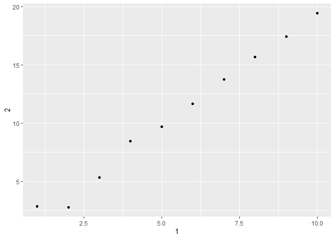

# Chapter 7, Data Import


``` r
library(tidyverse)
```

    ── Attaching core tidyverse packages ──────────────────────── tidyverse 2.0.0 ──
    ✔ dplyr     1.1.4     ✔ readr     2.1.5
    ✔ forcats   1.0.0     ✔ stringr   1.5.1
    ✔ ggplot2   3.5.2     ✔ tibble    3.3.0
    ✔ lubridate 1.9.4     ✔ tidyr     1.3.1
    ✔ purrr     1.0.4     
    ── Conflicts ────────────────────────────────────────── tidyverse_conflicts() ──
    ✖ dplyr::filter() masks stats::filter()
    ✖ dplyr::lag()    masks stats::lag()
    ℹ Use the conflicted package (<http://conflicted.r-lib.org/>) to force all conflicts to become errors

# Reading Data From A File

CSV (comma-separated values) file: - First Row (header): gives column
names - Six rows after header provide data - Columns are separated by
commas

CSV files are read in R studio using read_csv()

``` r
students <- read_csv("https://pos.it/r4ds-students-csv")
```

    Rows: 6 Columns: 5
    ── Column specification ────────────────────────────────────────────────────────
    Delimiter: ","
    chr (4): Full Name, favourite.food, mealPlan, AGE
    dbl (1): Student ID

    ℹ Use `spec()` to retrieve the full column specification for this data.
    ℹ Specify the column types or set `show_col_types = FALSE` to quiet this message.

# Practical Advice

``` r
students
```

    # A tibble: 6 × 5
      `Student ID` `Full Name`      favourite.food     mealPlan            AGE  
             <dbl> <chr>            <chr>              <chr>               <chr>
    1            1 Sunil Huffmann   Strawberry yoghurt Lunch only          4    
    2            2 Barclay Lynn     French fries       Lunch only          5    
    3            3 Jayendra Lyne    N/A                Breakfast and lunch 7    
    4            4 Leon Rossini     Anchovies          Lunch only          <NA> 
    5            5 Chidiegwu Dunkel Pizza              Breakfast and lunch five 
    6            6 Güvenç Attila    Ice cream          Lunch only          6    

To only recognizes empty strings (““) in this dataset as NAs:

``` r
students <- read_csv("https://pos.it/r4ds-students-csv", na = c("N/A", ""))
```

    Rows: 6 Columns: 5
    ── Column specification ────────────────────────────────────────────────────────
    Delimiter: ","
    chr (4): Full Name, favourite.food, mealPlan, AGE
    dbl (1): Student ID

    ℹ Use `spec()` to retrieve the full column specification for this data.
    ℹ Specify the column types or set `show_col_types = FALSE` to quiet this message.

``` r
students
```

    # A tibble: 6 × 5
      `Student ID` `Full Name`      favourite.food     mealPlan            AGE  
             <dbl> <chr>            <chr>              <chr>               <chr>
    1            1 Sunil Huffmann   Strawberry yoghurt Lunch only          4    
    2            2 Barclay Lynn     French fries       Lunch only          5    
    3            3 Jayendra Lyne    <NA>               Breakfast and lunch 7    
    4            4 Leon Rossini     Anchovies          Lunch only          <NA> 
    5            5 Chidiegwu Dunkel Pizza              Breakfast and lunch five 
    6            6 Güvenç Attila    Ice cream          Lunch only          6    

``` r
students |> 
  rename(
    student_id = `Student ID`,
    full_name = `Full Name`
  )
```

    # A tibble: 6 × 5
      student_id full_name        favourite.food     mealPlan            AGE  
           <dbl> <chr>            <chr>              <chr>               <chr>
    1          1 Sunil Huffmann   Strawberry yoghurt Lunch only          4    
    2          2 Barclay Lynn     French fries       Lunch only          5    
    3          3 Jayendra Lyne    <NA>               Breakfast and lunch 7    
    4          4 Leon Rossini     Anchovies          Lunch only          <NA> 
    5          5 Chidiegwu Dunkel Pizza              Breakfast and lunch five 
    6          6 Güvenç Attila    Ice cream          Lunch only          6    

``` r
students |> 
  mutate(mealpPlan = factor(mealPlan))
```

    # A tibble: 6 × 6
      `Student ID` `Full Name`      favourite.food     mealPlan      AGE   mealpPlan
             <dbl> <chr>            <chr>              <chr>         <chr> <fct>    
    1            1 Sunil Huffmann   Strawberry yoghurt Lunch only    4     Lunch on…
    2            2 Barclay Lynn     French fries       Lunch only    5     Lunch on…
    3            3 Jayendra Lyne    <NA>               Breakfast an… 7     Breakfas…
    4            4 Leon Rossini     Anchovies          Lunch only    <NA>  Lunch on…
    5            5 Chidiegwu Dunkel Pizza              Breakfast an… five  Breakfas…
    6            6 Güvenç Attila    Ice cream          Lunch only    6     Lunch on…

``` r
students <- students |>
  mutate(
    AGE = parse_number(if_else(AGE == "five", "5", AGE))
  )

students
```

    # A tibble: 6 × 5
      `Student ID` `Full Name`      favourite.food     mealPlan              AGE
             <dbl> <chr>            <chr>              <chr>               <dbl>
    1            1 Sunil Huffmann   Strawberry yoghurt Lunch only              4
    2            2 Barclay Lynn     French fries       Lunch only              5
    3            3 Jayendra Lyne    <NA>               Breakfast and lunch     7
    4            4 Leon Rossini     Anchovies          Lunch only             NA
    5            5 Chidiegwu Dunkel Pizza              Breakfast and lunch     5
    6            6 Güvenç Attila    Ice cream          Lunch only              6

# Other Arguments

read_csv() can read text strings that you’ve created and formatted like
a CSV file:

``` r
read_csv(
  "a,b,c
  1,2,3
  4,5,6"
)
```

    Rows: 2 Columns: 3
    ── Column specification ────────────────────────────────────────────────────────
    Delimiter: ","
    dbl (3): a, b, c

    ℹ Use `spec()` to retrieve the full column specification for this data.
    ℹ Specify the column types or set `show_col_types = FALSE` to quiet this message.

    # A tibble: 2 × 3
          a     b     c
      <dbl> <dbl> <dbl>
    1     1     2     3
    2     4     5     6

You can use skip = n to skip the first n lines or use comment = “\#” to
drop all lines that start with (e.g.) \#:

``` r
read_csv(
  "The first line of metadata
  The second line of metadata
  x,y,z
  1,2,3",
  skip = 2
)
```

    Rows: 1 Columns: 3
    ── Column specification ────────────────────────────────────────────────────────
    Delimiter: ","
    dbl (3): x, y, z

    ℹ Use `spec()` to retrieve the full column specification for this data.
    ℹ Specify the column types or set `show_col_types = FALSE` to quiet this message.

    # A tibble: 1 × 3
          x     y     z
      <dbl> <dbl> <dbl>
    1     1     2     3

``` r
read_csv(
  "# A comment I want to skip
  x,y,z
  1,2,3",
  comment = "#"
)
```

    Rows: 1 Columns: 3
    ── Column specification ────────────────────────────────────────────────────────
    Delimiter: ","
    dbl (3): x, y, z

    ℹ Use `spec()` to retrieve the full column specification for this data.
    ℹ Specify the column types or set `show_col_types = FALSE` to quiet this message.

    # A tibble: 1 × 3
          x     y     z
      <dbl> <dbl> <dbl>
    1     1     2     3

use col_names = FALSE to tell read_csv() not to treat the first row as
headings and instead label them sequentially from X1 to Xn

``` r
read_csv(
  "1,2,3
  4,5,6",
  col_names = FALSE
)
```

    Rows: 2 Columns: 3
    ── Column specification ────────────────────────────────────────────────────────
    Delimiter: ","
    dbl (3): X1, X2, X3

    ℹ Use `spec()` to retrieve the full column specification for this data.
    ℹ Specify the column types or set `show_col_types = FALSE` to quiet this message.

    # A tibble: 2 × 3
         X1    X2    X3
      <dbl> <dbl> <dbl>
    1     1     2     3
    2     4     5     6

``` r
read_csv(
  "1,2,3
  4,5,6",
  col_names = c("x", "y", "z")
)
```

    Rows: 2 Columns: 3
    ── Column specification ────────────────────────────────────────────────────────
    Delimiter: ","
    dbl (3): x, y, z

    ℹ Use `spec()` to retrieve the full column specification for this data.
    ℹ Specify the column types or set `show_col_types = FALSE` to quiet this message.

    # A tibble: 2 × 3
          x     y     z
      <dbl> <dbl> <dbl>
    1     1     2     3
    2     4     5     6

# Exercises pt 1 of 1

# Question 1

read_delim() \# Question 2 col_names, col_types, na, col_select,
quoted_na, locale, progress, and more are all shared by read_csv() and
read_tsv() \# Question 3 file, col_positions, col_names \# Question 4
read_csv(“x,y,‘a,b’”, quote = “’”) \# Question 5 The files have too many
fields, mismatched row lengths, have unmatched quotes, repeated headers,
and incorrect delimiters, respectively. This will lead to error codes in
the output. \# Question 6

``` r
library(dplyr)
library(ggplot2)

annoying <- tibble(
  `1` = 1:10,
  `2` = `1` * 2 + rnorm(length(`1`))
)

# 1. Extract the variable called "1"
# You can extract it as a vector like this:
var_1 <- annoying$`1`
print(var_1)
```

     [1]  1  2  3  4  5  6  7  8  9 10

``` r
# 2. Plot a scatterplot of "1" vs. "2"
ggplot(annoying, aes(x = `1`, y = `2`)) +
  geom_point() +
  labs(x = "1", y = "2")
```



``` r
# 3. Create a new column "3", which is 2 divided by 1
annoying2 <- annoying %>%
  mutate(`3` = `2` / `1`)

print(annoying2)
```

    # A tibble: 10 × 3
         `1`   `2`   `3`
       <int> <dbl> <dbl>
     1     1  2.85  2.85
     2     2  2.79  1.40
     3     3  5.33  1.78
     4     4  8.46  2.12
     5     5  9.69  1.94
     6     6 11.7   1.95
     7     7 13.8   1.97
     8     8 15.7   1.96
     9     9 17.4   1.94
    10    10 19.4   1.94

``` r
# 4. Rename the columns to "one", "two", and "three"
annoying_renamed <- annoying2 %>%
  rename(
    one = `1`,
    two = `2`,
    three = `3`
  )

print(annoying_renamed)
```

    # A tibble: 10 × 3
         one   two three
       <int> <dbl> <dbl>
     1     1  2.85  2.85
     2     2  2.79  1.40
     3     3  5.33  1.78
     4     4  8.46  2.12
     5     5  9.69  1.94
     6     6 11.7   1.95
     7     7 13.8   1.97
     8     8 15.7   1.96
     9     9 17.4   1.94
    10    10 19.4   1.94

# Missing Values, Column Types, and Problems

``` r
simple_csv <- "
  x
  10
  .
  20
  30"
```

``` r
read_csv(simple_csv)
```

    Rows: 4 Columns: 1
    ── Column specification ────────────────────────────────────────────────────────
    Delimiter: ","
    chr (1): x

    ℹ Use `spec()` to retrieve the full column specification for this data.
    ℹ Specify the column types or set `show_col_types = FALSE` to quiet this message.

    # A tibble: 4 × 1
      x    
      <chr>
    1 10   
    2 .    
    3 20   
    4 30   

``` r
read_csv(simple_csv)
```

    Rows: 4 Columns: 1
    ── Column specification ────────────────────────────────────────────────────────
    Delimiter: ","
    chr (1): x

    ℹ Use `spec()` to retrieve the full column specification for this data.
    ℹ Specify the column types or set `show_col_types = FALSE` to quiet this message.

    # A tibble: 4 × 1
      x    
      <chr>
    1 10   
    2 .    
    3 20   
    4 30   

``` r
df <- read_csv(
  simple_csv, 
  col_types = list(x = col_double())
)
```

    Warning: One or more parsing issues, call `problems()` on your data frame for details,
    e.g.:
      dat <- vroom(...)
      problems(dat)

``` r
problems(df)
```

    # A tibble: 1 × 5
        row   col expected actual file                                              
      <int> <int> <chr>    <chr>  <chr>                                             
    1     3     1 a double .      C:/Users/sport/AppData/Local/Temp/RtmpcNggR6/file…

``` r
read_csv(simple_csv, na = ".")
```

    Rows: 4 Columns: 1
    ── Column specification ────────────────────────────────────────────────────────
    Delimiter: ","
    dbl (1): x

    ℹ Use `spec()` to retrieve the full column specification for this data.
    ℹ Specify the column types or set `show_col_types = FALSE` to quiet this message.

    # A tibble: 4 × 1
          x
      <dbl>
    1    10
    2    NA
    3    20
    4    30

# Column Types

``` r
another_csv <- "
x,y,z
1,2,3"

read_csv(
  another_csv, 
  col_types = cols(.default = col_character())
)
```

    # A tibble: 1 × 3
      x     y     z    
      <chr> <chr> <chr>
    1 1     2     3    

``` r
read_csv(
  another_csv,
  col_types = cols_only(x = col_character())
)
```

    # A tibble: 1 × 1
      x    
      <chr>
    1 1    

# Reading Data from Multiple Files

``` r
sales_files <- c(
  "https://pos.it/r4ds-01-sales",
  "https://pos.it/r4ds-02-sales",
  "https://pos.it/r4ds-03-sales"
)
read_csv(sales_files, id = "file")
```

    Rows: 19 Columns: 6
    ── Column specification ────────────────────────────────────────────────────────
    Delimiter: ","
    chr (1): month
    dbl (4): year, brand, item, n

    ℹ Use `spec()` to retrieve the full column specification for this data.
    ℹ Specify the column types or set `show_col_types = FALSE` to quiet this message.

    # A tibble: 19 × 6
       file                         month     year brand  item     n
       <chr>                        <chr>    <dbl> <dbl> <dbl> <dbl>
     1 https://pos.it/r4ds-01-sales January   2019     1  1234     3
     2 https://pos.it/r4ds-01-sales January   2019     1  8721     9
     3 https://pos.it/r4ds-01-sales January   2019     1  1822     2
     4 https://pos.it/r4ds-01-sales January   2019     2  3333     1
     5 https://pos.it/r4ds-01-sales January   2019     2  2156     9
     6 https://pos.it/r4ds-01-sales January   2019     2  3987     6
     7 https://pos.it/r4ds-01-sales January   2019     2  3827     6
     8 https://pos.it/r4ds-02-sales February  2019     1  1234     8
     9 https://pos.it/r4ds-02-sales February  2019     1  8721     2
    10 https://pos.it/r4ds-02-sales February  2019     1  1822     3
    11 https://pos.it/r4ds-02-sales February  2019     2  3333     1
    12 https://pos.it/r4ds-02-sales February  2019     2  2156     3
    13 https://pos.it/r4ds-02-sales February  2019     2  3987     6
    14 https://pos.it/r4ds-03-sales March     2019     1  1234     3
    15 https://pos.it/r4ds-03-sales March     2019     1  3627     1
    16 https://pos.it/r4ds-03-sales March     2019     1  8820     3
    17 https://pos.it/r4ds-03-sales March     2019     2  7253     1
    18 https://pos.it/r4ds-03-sales March     2019     2  8766     3
    19 https://pos.it/r4ds-03-sales March     2019     2  8288     6

``` r
sales_files <- list.files("data", pattern = "sales\\.csv$", full.names = TRUE)
sales_files
```

    character(0)

# Writing a File

``` r
write_csv(students, "students.csv")
```

``` r
students
```

    # A tibble: 6 × 5
      `Student ID` `Full Name`      favourite.food     mealPlan              AGE
             <dbl> <chr>            <chr>              <chr>               <dbl>
    1            1 Sunil Huffmann   Strawberry yoghurt Lunch only              4
    2            2 Barclay Lynn     French fries       Lunch only              5
    3            3 Jayendra Lyne    <NA>               Breakfast and lunch     7
    4            4 Leon Rossini     Anchovies          Lunch only             NA
    5            5 Chidiegwu Dunkel Pizza              Breakfast and lunch     5
    6            6 Güvenç Attila    Ice cream          Lunch only              6

``` r
write_rds(students, "students.rds")
read_rds("students.rds")
```

    # A tibble: 6 × 5
      `Student ID` `Full Name`      favourite.food     mealPlan              AGE
             <dbl> <chr>            <chr>              <chr>               <dbl>
    1            1 Sunil Huffmann   Strawberry yoghurt Lunch only              4
    2            2 Barclay Lynn     French fries       Lunch only              5
    3            3 Jayendra Lyne    <NA>               Breakfast and lunch     7
    4            4 Leon Rossini     Anchovies          Lunch only             NA
    5            5 Chidiegwu Dunkel Pizza              Breakfast and lunch     5
    6            6 Güvenç Attila    Ice cream          Lunch only              6
